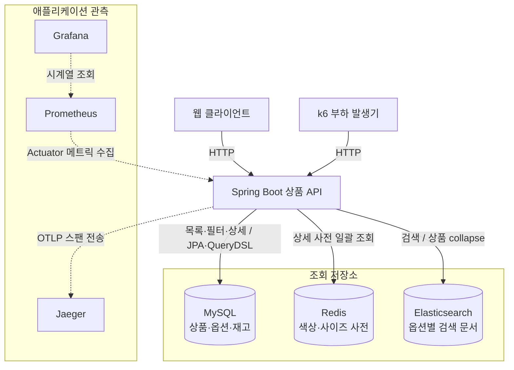
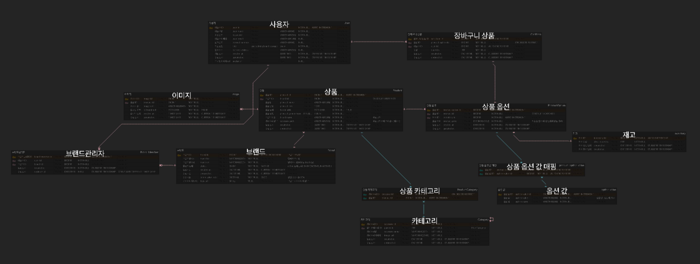
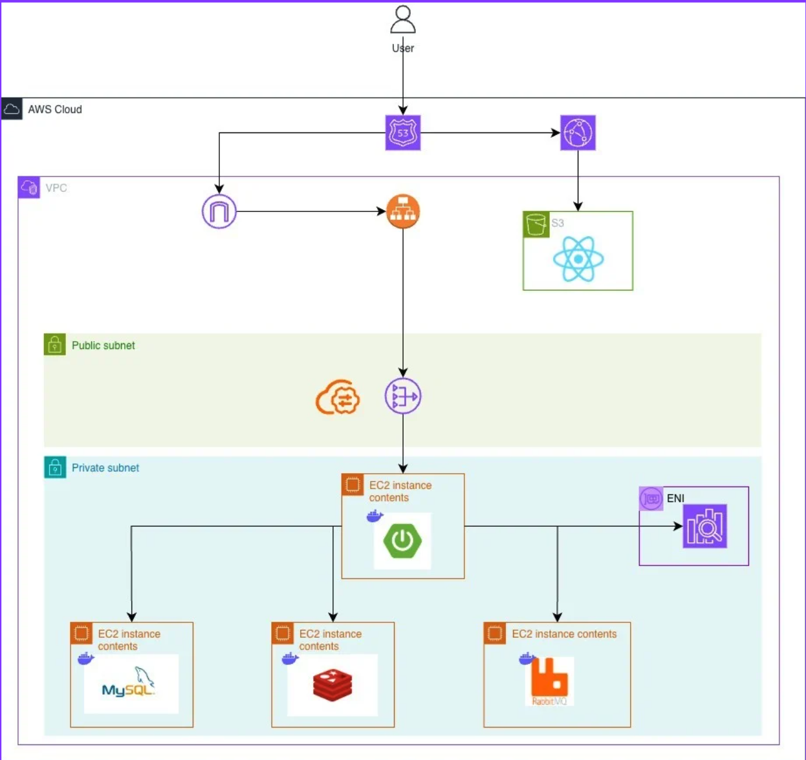
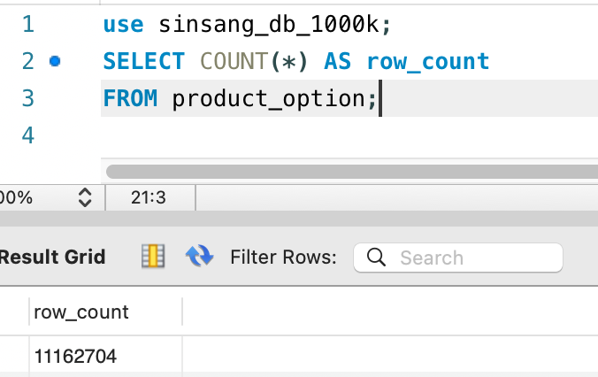
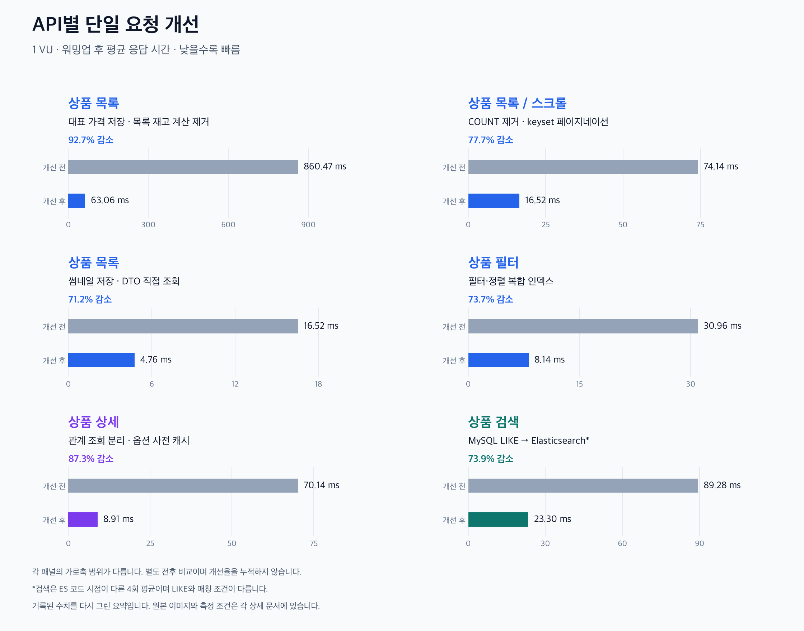

  <h1>Musinsa · 상품 조회 및 검색 최적화</h1>
  
상품마다 필요한 정보를 어떻게 읽고 검색할지 설계하고, 그 선택을 데이터로 검증한 백엔드 프로젝트.

  

    
    
    
  

  
<a href="./README.md">English</a> · <strong>한국어</strong>

  

    <a href="#시연">시연</a> ·
    <a href="#프로젝트-소개">소개·기여</a> ·
    <a href="#핵심-요약">핵심 요약</a> ·
    <a href="#기술-스택">기술·선택 이유</a> ·
    <a href="#아키텍처">아키텍처</a> ·
    <a href="#측정-환경과-시나리오">환경·시나리오</a> ·
    <a href="#단일-요청-개선">주요 사례</a> ·
    <a href="#트러블슈팅">트러블슈팅</a> ·
    <a href="#한계와-후속-계획">후속 계획</a>
  

---

## 시연

<h3 align="center"><a href="https://youtu.be/oC8-prv8Qdo">시연 영상 보기</a></h3>

---

## 프로젝트 소개

무신사를 모델로 한 이커머스 팀 프로젝트이다. 
상품마다 수십 개의 옵션이 연결된 데이터에서 화면에 필요한 정보를 어떻게 읽고 검색할지, 부하가 커지면 요청이 어디서 기다리는지를 다룬다.

### 담당 역할

상품 목록·필터·상세·검색의 조회 설계와 구현, 쿼리·응답 구조 개선, k6 측정과 연결 풀·스레드·검색 병목 분석을 담당했다. 
아래 사례는 팀 서비스 중 이 상품 조회 영역의 작업과 검증을 정리한 것이다.

---

## 핵심 요약

| 문제 | 설계 판단 | 결과 | 근거 |
| --- | --- | --- | --- |
| 목록 가격 계산을 위한 옵션·재고 관계 탐색 | 대표 가격 저장·목록 재고 계산 제거 | 평균 860.47→63.06ms | [대표 가격](docs/ko/improvements/list-price.md) |
| 전체 페이지 수를 위한 COUNT와 OFFSET 비용 | COUNT 제거·keyset 페이지네이션 적용 | 평균 74.14→16.52ms | [페이지네이션](docs/ko/improvements/list-keyset.md) |
| 상세 응답을 위한 반복 조회 | 관계에 따른 조회 분리·옵션 사전 일괄 조회 | 평균 70.14→8.91ms | [상세 조회](docs/ko/improvements/product-detail.md) |
| 상품명에 없는 색상·종류의 검색 의도 | 옵션 단위 ES 문서·다중 필드 매칭·관련도 정렬 적용 | LIKE에서 놓친 ‘블랙 스커트’ 결과 반환 | [검색 설계](docs/ko/improvements/product-search.md) |
| 고부하에서 늘어나는 요청 대기 | 기준 부하 확인 후 연결 풀·스레드·검색 경로 조사 | 4개 API 각각 단독으로 1,000 RPS 유지. 상세·검색의 대기 경로 확인 | [기준 결과](#고부하-결과) · [병목 조사](#트러블슈팅) |

각 상세 문서에 반복 측정표·증거 이미지와 설계 판단·트레이드오프를 정리했다.

---

## 기술 스택

| 영역 | 기술 |
| --- | --- |
| Backend | Java 21, Spring Boot 3.5.6, Spring Data JPA, QueryDSL |
| 데이터·검색 | MySQL, Redis, Elasticsearch |
| 측정 | k6, Prometheus, Grafana, Jaeger, ES Profile / hot threads |
| 인프라·테스트 | Docker, AWS, JUnit, Spring Boot Test |

### 기술 선택 이유

| 기술 | 비교 대상 | 선택 이유 |
| --- | --- | --- |
| QueryDSL | JPA 파생 메서드·`@Query`/JPQL·Specification | 선택적인 필터·정렬·커서 조건과 DTO 조회를 코드로 조합·재사용 |
| MySQL | PostgreSQL | 관계형 조회 요구를 충족하면서 팀의 사용 경험과 도입·운영 학습 부담을 고려 |
| Redis | 로컬 캐시·DB 직접 조회(버퍼풀 활용) | 반복되는 옵션 값을 여러 서버에서 공유할 수 있는 사전으로 분리하고 일괄 조회 |
| Elasticsearch | 기존 LIKE·MySQL FULLTEXT | 여러 속성의 검색 의도·동의어·관련도 가중치를 함께 표현 |
| 부하 테스트·모니터링 | 기본 애플리케이션 로그·IDE 프로파일러 중심의 조사 | 목표 부하·자원 지표·요청 내부 구간을 연결해 지연과 대기 원인 조사 |

> **[기술 선택 이유 자세히 보기 →](docs/ko/technology-decisions.md)**

---

## 아키텍처

목록은 대표 정보와 다음 페이지 여부, 상세는 옵션·재고, 검색은 다중 속성 매칭과 관련도 정렬에 맞춰 조회 모델을 나눴다. 
아래는 상품 조회·검색과 애플리케이션 관측의 구성이다.

전체 ERD

AWS 배포 구조

팀 서비스 배포 당시의 AWS 구성이며, 현재는 운영하지 않는다. 
아래 성능 측정은 로컬에서 진행했으며, 실행 조건은 측정 환경 문서에 정리했다.

---

## 측정 환경과 시나리오

실제 상품 데이터로 조회와 검색을 검증하고 싶어 [네이버 쇼핑 검색 API](https://developers.naver.com/docs/serviceapi/search/shopping/shopping.md)로 상품 정보를 수집했다. 
수집한 약 15만 개 상품에 색상·사이즈 옵션을 조합해 1,000만 건 규모의 상품 옵션 데이터로 확장했다. 
이는 [쿠팡처럼 옵션을 최소 상품 단위로 다루는 방식](https://developers.coupang.com/ko/getting-started/coupang-open-api)에서 영감을 받은 선택이다.

최종적으로 상품 155,036개를 바탕으로 상품 옵션 11,162,704개를 구성했다.

이 상품 데이터에서 1 VU 전후 비교와 API별 단계 부하를 진행했다. 
데이터 분포, 로컬 실행 환경, k6 시나리오 선정 이유와 1,000 RPS 산정·판정 기준은 상세 문서에 정리했다.

> **[데이터 구성·측정 환경·k6 시나리오 상세 →](docs/ko/environment.md)**

---

## 단일 요청 개선

워밍업 후 1 VU에서 변경 전후의 평균 API 응답시간을 비교했다.

| API | 변경과 상세 문서 | 변경 전 평균 | 변경 후 평균 | 감소 |
| --- | --- | ---: | ---: | ---: |
| 상품 목록 | [대표 가격 저장·목록 재고 계산 제거 →](docs/ko/improvements/list-price.md) | 860.47ms | 63.06ms | 92.7% |
| 상품 목록·스크롤 | [COUNT 제거·keyset 페이지네이션 →](docs/ko/improvements/list-keyset.md) | 74.14ms | 16.52ms | 77.7% |
| 상품 목록 | [썸네일 저장·DTO 직접 조회 →](docs/ko/improvements/list-thumbnail-dto.md) | 16.52ms | 4.76ms | 71.2% |
| 상품 필터 | [필터·정렬 복합 인덱스 →](docs/ko/improvements/filter-indexes.md) | 30.96ms | 8.14ms | 73.7% |
| 상품 상세 | [관계 조회 분리·옵션 사전 캐시 →](docs/ko/improvements/product-detail.md) | 70.14ms | 8.91ms | 87.3% |
| 상품 검색 | [MySQL LIKE → ES 검색 모델 →](docs/ko/improvements/product-search.md) | 89.28ms | 23.30ms | 73.9% |

각 행은 별도 비교이며, 앞의 다섯 항목은 추가 3회, 검색은 최초 1회와 추가 3회의 평균이다. 
검색은 최초·추가 실행의 ES 코드 버전과 LIKE·ES의 매칭·정렬 방식이 달라, 검색 기능 변경 과정의 응답성 관측으로 해석한다.

---

## 고부하 결과

각 API의 기준 부하 테스트에서 최종 실행 1회를 정리했다. 
각 문서에 단계별·조건별 표, 자원 관측, k6·Spring Boot/Hikari·Jaeger 원본 이미지를 함께 정리했다.

| API와 상세 결과 | 완료한 유지 구간 | 유지 평균 | 유지 p95 | 결과                 |
| --- | --- | ---: | ---: |--------------------|
| [상품 목록 →](docs/ko/load-tests/product-list.md) | 1,000 RPS · 120초 | 2.64ms | 4.26ms | HTTP 실패·drop 기록 없음 |
| [상품 스크롤 →](docs/ko/load-tests/product-scroll.md) | 1,000 RPS · 120초 | 2.44ms | 3.95ms | HTTP 실패·drop 기록 없음 |
| [상품 필터 →](docs/ko/load-tests/product-filter.md) | 1,000 RPS · 120초 | 3.05ms | 5.03ms | HTTP 실패·drop 기록 없음 |
| [상품 상세 →](docs/ko/load-tests/product-detail.md) | 1,000 RPS · 120초 | 5.07ms | 7.21ms | HTTP 실패·drop 기록 없음 |
| [상품 검색 →](docs/ko/load-tests/product-search.md) | 250 RPS · 30초 | 15.39ms | 40.53ms | 이후 증가 구간에서 drop 179건, 조기 중단 |

`dropped_iterations`는 예정한 작업을 시작하지 못한 횟수다. 
중단된 검색도 HTTP 실패는 0이었으므로, 전송한 요청의 성공만으로 목표 부하 달성을 판단하지 않았다.

목록·스크롤·필터는 이 기준 실행에서 1,000 RPS 목표를 달성했고, 그 이상의 부하는 측정하지 않았다. 
이 결과는 해당 조건에서 목표 부하를 통과했다는 의미이며, 최대 처리량을 뜻하지 않는다.

---

## 트러블슈팅

상세는 1,000 RPS 기준을 완료한 뒤 더 높은 부하에서 대기를 조사했고, 검색은 기준 부하 중단 원인을 추적했다. 
풀·스레드 변경은 각 실험의 가설을 검증하기 위한 것이며, 아래 문서에 변경값과 고정 조건을 기록했다.

| 문제 | 관측과 판단 | 상세 |
| --- | --- | --- |
| 상세의 DB 연결 대기 | Tomcat 200 고정, Hikari 10→50에서 2,000 RPS p95 875.2→58.6ms. 전체 drop 571건은 남음. 이후 증설의 처리량 효과는 작고 DB 연결 제한도 확인 | [Hikari·MySQL 연결 제한 →](docs/ko/troubleshooting/hikari.md) |
| Tomcat busy 상한 도달 | Hikari 50 고정, Tomcat 200→500에서 3,000 RPS 처리량은 늘지 않고 pending 약 150→450, p95 632.6→901.6ms | [Tomcat 50·200·500 비교 →](docs/ko/troubleshooting/tomcat.md) |
| 검색의 반복적인 부하 중단 | 트랜잭션 분리 → HTTP 풀 계측·확대 → client/took 분리 → ES CPU·검색 큐 확인으로 조사 범위를 좁힘 | [검색 고부하 병목 조사 →](docs/ko/troubleshooting/search-capacity.md) |
| 검색 의도와 결과의 불일치 | 필드 최고 점수 선택과 토큰 필수 매칭을 구분하고, 매칭 조건·가중치 설계를 재검토 | [검색 품질 이슈 →](docs/ko/troubleshooting/search-quality.md) |
| 중복 제거와 페이지 이동 제약 | 옵션 문서의 상품 collapse와 search_after 제약 확인; 현재 from/size의 깊은 페이지 비용은 남음 | [검색 페이지네이션 →](docs/ko/troubleshooting/search-pagination.md) |
| 배포 검색 엔진의 호환성 | 응답 제품 헤더 주입과 ES 7 호환 요청 헤더를 적용해 클라이언트 검증 우회 | [OpenSearch 배포 이슈 →](docs/ko/troubleshooting/opensearch-deployment.md) |
| 관측 도구 자체의 비용 | DEBUG 로그와 불필요한 추적을 줄이고 필요한 스팬·풀 메트릭 유지 | [모니터링의 역습 →](docs/ko/troubleshooting/observability-overhead.md) |
| 상세 지연 구간의 초기 분리 | Mock controller·Security·dummy service 비교와 Jaeger로 서비스 진입 대기·DTO 조립 병목 확인 | [상세 조회 격리 실험 →](docs/ko/troubleshooting/detail-isolation.md) |

연결 풀과 요청 스레드 비교를 거쳐 현재 로컬 기준은 Hikari 50·Tomcat 200으로 두었다.

---

## 한계와 후속 계획

현재 결과는 고정된 상품·옵션 데이터의 조회 설계와 로컬 실행 환경에서의 관측이다. 
실제 배포 환경의 성능과 데이터 변경 시 대표값·캐시·검색 색인의 정합성은 별도로 검증할 과제다.

| 후속 과제 | 확인할 내용 |
| --- | --- |
| 실제 배포 환경 검증 | Azure에서 부하 발생기와 서비스 자원을 분리하고, 네트워크·자원 배치에 따른 처리량·지연·병목 확인 |
| 데이터 변경 정합성 | 대표 가격·썸네일 갱신, Redis 사전 변경 반영, DB→ES 변경 전파·실패 재처리·재색인 검증 |
| Redis·로컬 메모리·RDB 비교 | 같은 옵션 사전과 응답을 기준으로 조회 지연·네트워크 비용·갱신·장애 의존성 비교 |
| ES nested 모델 검증 | 현재 옵션별 문서와 상품 중심 nested 모델의 옵션 조합·조회·색인 크기·갱신 비용 비교 |

> **[한계와 후속 과제 자세히 보기 →](docs/ko/future-work.md)**
