# 🔍 검색 서비스 고도화 보고서 (Search Optimization Report)

## 목차 (Table of Contents)
- 1. 프로젝트 개요 (Overview)
- 2. 기술 스택 (Tech Stack)
- 3. 아키텍처 (Architecture)
- 4. 담당 기능 (Responsibilities)
- 5. 개선 사항 및 성과 (Performance Improvements)
- 6. 트러블슈팅 (Troubleshooting)

---

## 1. 프로젝트 개요 (Overview)
본 프로젝트는 단순한 기능 구현에서 시작하여, 대용량 트래픽과 데이터 상황을 가정하고 점진적으로 시스템을 고도화한 **2개월간의 엔지니어링 기록**입니다.

### 프로젝트 여정 (Evolution Journey)

#### Phase 1: 기능 구현 (MVP)
- **목표**: 이커머스의 핵심 도메인인 “상품”을 중심으로 요구사항을 정리하고, MVP 수준의 CRUD를 빠르게 구현.
- **요구사항 명세**: 상품 등록/수정/삭제, 상품 조회(목록/상세), 검색/필터, 페이징 등.

#### Phase 2: 리팩토링 및 테스트 (Stability)
- **목표**: 테스트 기반 리팩토링으로 구조적 안정성 확보.
- **테스트 전략**:
  - Unit Test로 도메인/서비스 로직을 빠르게 검증.
  - Integration Test로 API/DB 연동 및 주요 플로우를 검증.
- **리팩토링 포인트**:
  - Controller-Service-Repository 계층 책임을 명확히 분리.
  - **SRP(단일 책임 원칙) + CQRS 관점 분리**: 상품 관리(Command)와 조회/검색(Query) 책임을 분리해 변경 영향도를 축소.

#### Phase 3: 대용량 데이터 챌린지 (Scalability)
- **상황**: 네이버 쇼핑 API를 활용해 상품 데이터를 대량 적재하고(약 1,000만 건), 로컬 환경에서 부하 테스트를 수행.
- **목표**: 병목을 찾고, 성능 개선 포인트를 “지표 기반”으로 확인(Grafana, K6, Prometheus).
- **진행**:
  - 대용량 데이터 환경에서 기존 `LIKE` 기반 검색의 한계를 확인하고 검색 전용 엔진(Elasticsearch) 도입.
  - 로컬 리소스(디바이스) 한계로 인해, AWS 배포까지 완료했으나 AWS 환경에서의 추가 튜닝/개선은 시간 관계상 진행하지 못함.

#### 시연 영상

---

## 2. 기술 스택 (Tech Stack)
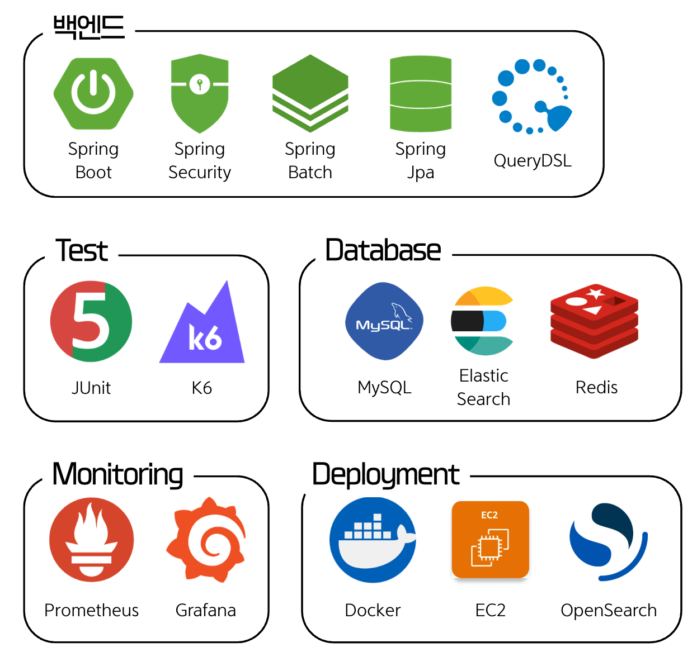

---

## 3. 서버 아키텍처 (Architecture)
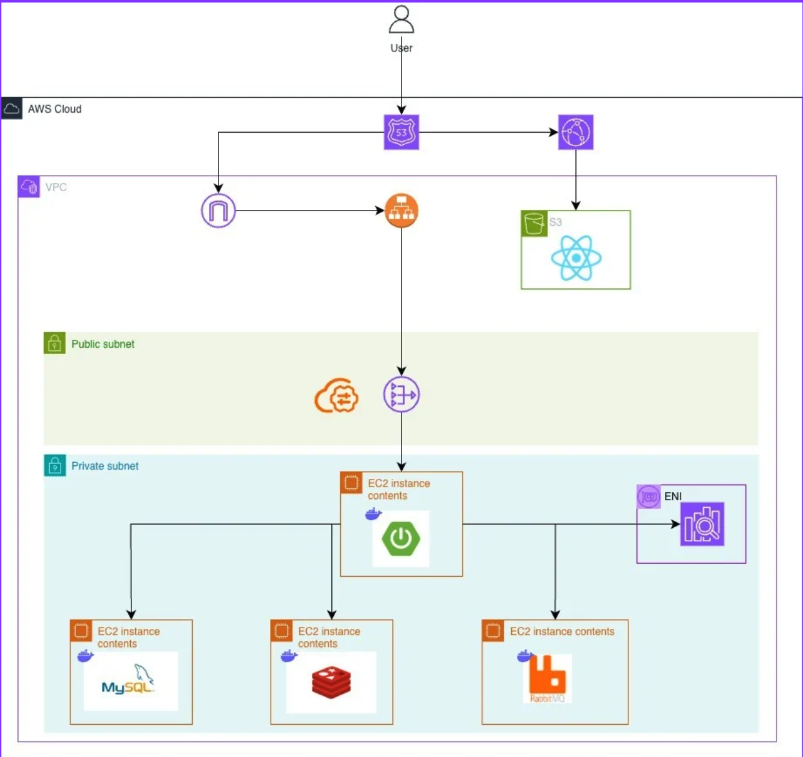

---

## 4. 담당 기능 (Responsibilities)
### 상품 조회 (List)
- 정렬: 기본 정렬, 가격 낮은 순, 가격 높은 순
- 필터: 카테고리 기반 필터링

### 상품 상세 조회 (Detail)
- 검색 결과에서 선택한 옵션(색상/사이즈 등)이 선택된 상태로 상세 페이지 진입/조회

### 상품 검색 (Search)
- 검색 대상: 브랜드명, 카테고리, 상품명, 색상, 사이즈
- 추가 기능: 필터링 및 정렬 지원

---

## 5. 개선 사항 및 성과 (Performance Improvements)

### Test Scenario & SLO (Load Testing Strategy)
테스트 시나리오, 부하치 결정 근거 및 로컬·배포 환경 비교는 [docs/LOAD_TEST_STRATEGY.md](docs/LOAD_TEST_STRATEGY.md)에 분리하여 관리합니다.

### 5.1. 단순 조회(List) 기준

#### Baseline (문제 상황)
- 검색/필터: MySQL `LIKE` 기반
- 병목:
  - 상품 조회 시 옵션 전체를 로딩한 뒤 **최저가 계산**
  - 모든 옵션의 **재고 유무 확인**
  - 전체 상품 **count**까지 함께 수행
- 결과: “단순 조회” 요청인데도 연산/조회 범위가 커져 응답 시간이 크게 증가

#### What changed
**Step 1 (목록 로직 슬림화)**  
- 조회용 컬럼을 상품 테이블에 추가(역정규화): 기본 가격(최저가), 대표 이미지  
  - 목록 조회 시 가격/이미지를 옵션/이미지 테이블에서 join으로 가져오지 않도록 변경
  - 역정규화를 통해 불필요한 `fetch join`을 제거
- 재고 검증 책임 이동: 목록에서 “옵션 전체 재고 확인” 제거 → 상세에서 수행  
  - “전체 옵션 재고가 모두 0인 경우”가 아니라면 목록에서는 재고를 강하게 보장할 필요가 없다는 판단

**Step 2 (인덱스/조회 쿼리/페이징 개선)**  
- `LIKE` 기반 필터 → QueryDSL 동적 쿼리
- MySQL explain을 통한 인덱스 점검및, 주요 인덱스 재설정
- `offset + count` 페이지네이션 → 무한 스크롤(커서/Keyset) 페이지네이션

#### Performance
- Summary: 30s → 329ms
- Step 1: 30s → 3s
  - 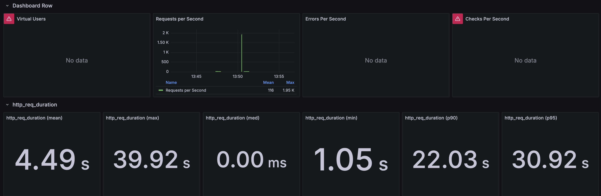
  - 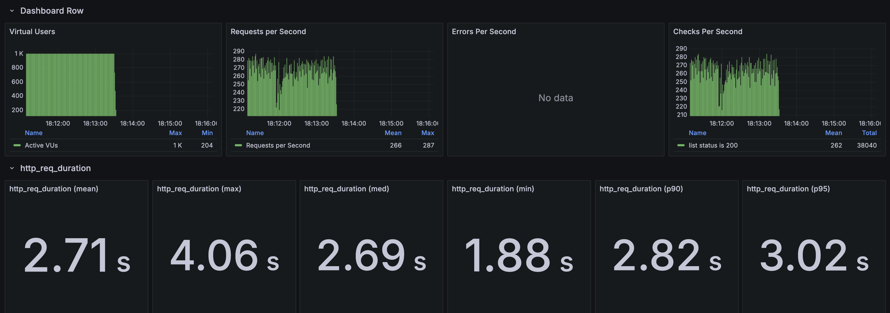
- Step 2: 3s → 329ms
  - 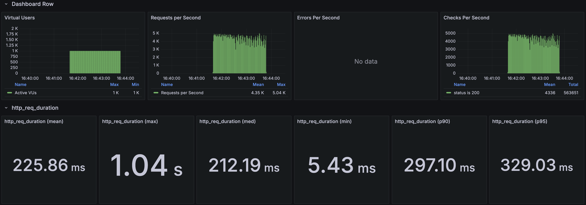
- No-monitoring -> 275ms
  - 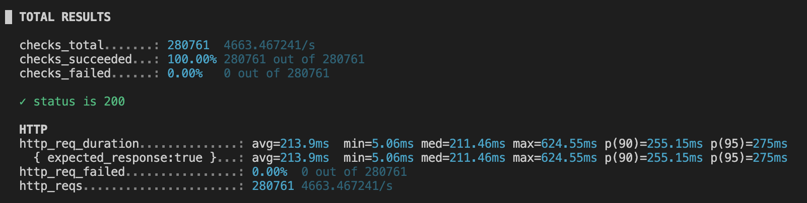

### 5.2. 상세 조회(Detail) 기준

#### Baseline (문제 상황)
- 상세 조회 쿼리는 초기에는 Criteria API로 조합.
- 문제: 이미지/옵션처럼 컬렉션 연관관계를 한 번에 가져오려면 `MultipleBagFetchException`(multiple bag) 제약에 부딪혀 `fetch join`을 적용할 수 없었음.
- 우회 방식:
  - N+1을 감수하고 Criteria로 “이미지”만 조회
  - Mapper로 “옵션”을 별도 조회
  - Mapper에서 이미지/옵션을 합쳐 DTO로 변환 후 응답

#### What changed
**Step 1 (QueryDSL 전환)**  
- Criteria API → QueryDSL로 전환하여 쿼리 조합/유지보수성 개선
- multiple bag 제약은 동일하게 존재하여, 컬렉션을 “한 번에” 가져오지 않고 조회를 분리
  - 옵션(+재고)은 단일 쿼리로 `fetch join`하여 N+1을 방지
  - 이미지는 별도 쿼리로 조회
  - 옵션-옵션값 매핑(ProductOptionValue)은 별도 쿼리로 조회 후, 애플리케이션에서 옵션별로 그룹핑하여 DTO로 조립

**Step 2 (불필요한 join 제거)**  
- 브랜드 조인을 통해 이름을 가져오지 않고, 브랜드명 역정규화 컬럼을 사용해 join 제거

**Step 3 (캐싱)**  
- OptionValue / Category 로딩 → Redis 캐싱
  - 상세 응답 구성 시 OptionValue 메타데이터(이름/값)는 캐시에서 bulk 조회

#### Performance
- Baseline: 30s → 835ms (baseline 이미지는 미첨부)
  - 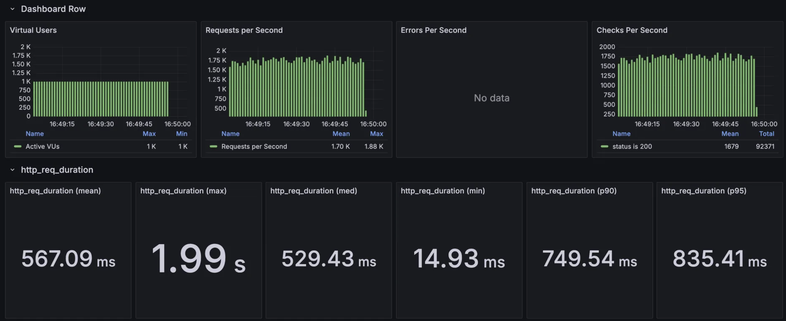
- No-monitoring:
  - 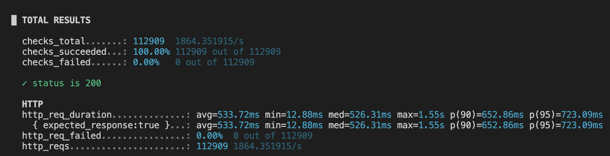

### 5.3. 검색(Search) 기준 (Elasticsearch)

#### Baseline (문제 상황)
- `LIKE` 기반 검색 → QueryDSL 기반 조건 검색까지는 개선했지만, 관계형 테이블(상품명/브랜드/카테고리/옵션 등)을 “검색 관점”으로 한 번에 다루는 데 한계가 있었음.
- Full Text Search/Elasticsearch를 고민했지만, 둘 다 결국 “검색 전용 구조”를 만들어야 한다는 점에서 접근이 비슷했음.

#### What changed
**Step 1 (검색 엔진 전환)**  
- RDB 기반 검색/필터 → Elasticsearch 검색으로 전환
- “어차피 검색 전용 구조(FTS의 전용 뷰/테이블 vs ES의 문서)”를 만들어야 한다면, 이커머스에 중요한 **동의어/오타 허용/형태소 분석**을 지원하는 ES를 선택

**Step 2 (검색 품질)**  
- 문서 단위가 “상품 옵션”이라 검색 결과가 옵션 단위로 중복되므로, 상품 단위 결과를 위해 `collapse(productId)` 적용
  - `collapse` 적용 시 `search_after`로 무한 스크롤 정렬을 보장하기 어려워 `from/size` 기반 페이지네이션으로 전환
  - 검색 특성상 사용자가 깊은 페이지까지 가지 않는다는 가정 하에 `from/size`를 채택
- 정확도 개선: `multi_match`의 `best_fields(max_of)` 특성상 “가장 높은 점수의 필드만” 채택되어 결과 신뢰도가 떨어지는 이슈가 있었음
  - 토큰별로 `should`를 구성하고 `minimum_should_match=1`을 적용해 “각 토큰이 최소 1개 필드에 매칭”되도록 변경
  - 점수/정렬:
    - 각 토큰은 `must(토큰별 should)`로 처리되어 “모든 토큰이 어딘가에 매칭”되는 것을 보장
    - 최종 점수는 필드별 `match` 결과를 기반으로 하며, raw query는 필드별 `boost`로 우선순위를 조정
    - 관련도 정렬은 `_score desc` 기반, 가격 정렬 시에는 점수 계산을 생략(`track_scores=false`)

**Step 3 (성능 튜닝)**  
- 정렬 최적화: 가격 정렬처럼 score가 불필요한 경우 `track_scores=false`로 점수 계산 비용을 제거
- 검색용 분석기와 색인용 분석기를 분리(색인 단계에 동의어 적용)
- JVM/캐시 설정: 힙은 RAM 대비 40%, 쿼리 캐시 10%, 필드 데이터 캐시 20%

#### Performance (Local)
- 로컬 환경 특성상 디바이스 한계로 추가 최적화는 진행하지 못함
- 검색: 5s → 3s
  - 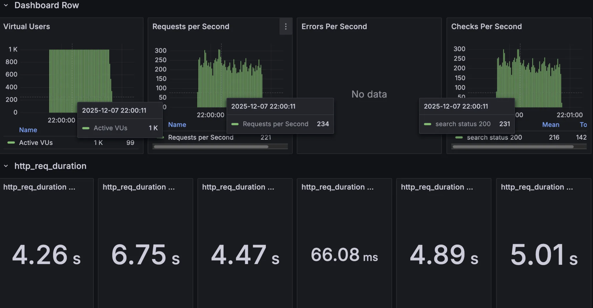
  - 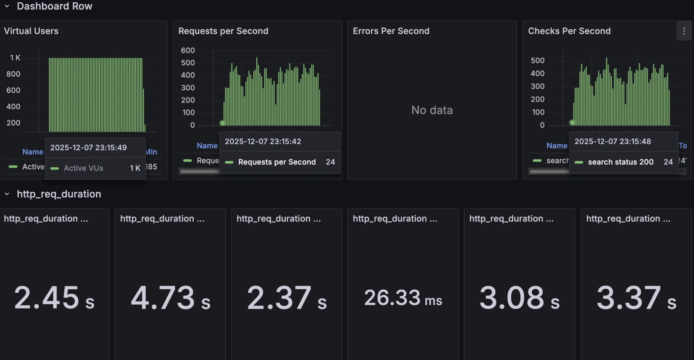
- No-monitoring: 2.3s
  - 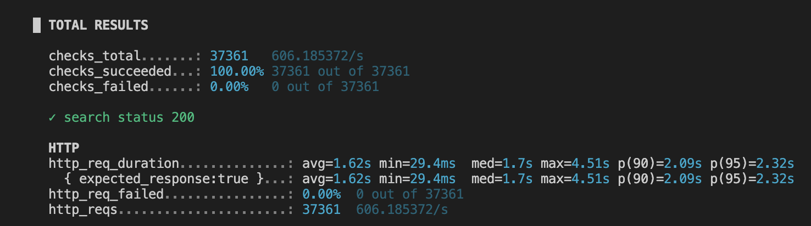

---

## 6. 트러블슈팅 (Troubleshooting)

### 6.1. 성능 이슈: 상품 상세 조회(Detail)의 CPU 병목 해결
검색 엔진 도입 후, 상세 조회에서 **RPS 2,000 정체 & CPU 1100%** 현상이 발생했습니다. 이를 해결한 **Binary Search(이분 탐색)** 디버깅 과정입니다.

#### 1단계: 범인 찾기 (Isolation Testing)
"도대체 누가 범인인가?"를 찾기 위해 가장 바깥쪽부터 안쪽으로 하나씩 Mocking하며 테스트했습니다.

| 실험 단계 | 테스트 환경 | 결과 (RPS) | 판정 |
| :--- | :--- | :--- | :--- |
| **Step 1** | **Mock Controller + No Security** | **41,000** | 웹 서버(Tomcat/Netty)와 네트워크는 문제 없음. |
| **Step 2** | **Mock Controller + Security** | **42,000** | Spring Security(JWT) 오버헤드 미미함. |
| **Step 3** | **Mock Service (Dummy DB)** | **66,000** | **범인 검거: Business Logic & DB Layer.** |
| **Step 4** | **Real Service (Baseline)** | **2,000** | **상세 원인: JPA Object Mapping Cost.** |

#### 2단계: 원인 분석 (Deep Dive)
- **JPA Overhead**: 복잡한 엔티티 그래프(상품-옵션-이미지)를 DB에서 가져와 자바 객체로 변환하는 비용이 CPU를 독점.
- **Fetch Join의 한계**: N+1 문제를 해결하기 위해 도입한 `Fetch Join`이지만, 1:N 관계의 데이터를 한 번에 가져오면서 발생하는 카테시안 곱으로 인한 **Row 수 증가**가 오히려 DB I/O와 애플리케이션 메모리/CPU 부하를 가중시킴.

#### 3단계: 결론 (Conclusion)
다량의 상품 정보(옵션/이미지 등)를 필수로 제공해야 하는 비즈니스 요구사항 하에서, 1:N 컬렉션을 한 번에 당기기 위한 `fetch join`은 **데이터 뻥튀기(Cartesian Product)** 와 매핑 비용을 유발해 구조적인 병목이 됨(이 문제는 QueryDSL로 바꿔도 동일). 단순히 쿼리를 튜닝하는 수준을 넘어, 구조적인 설계를 변경하거나, 요구사항 줄이는 접근이 필요하다는 결론 도출.

### 6.2. 검색 품질 이슈: `multi_match`/`minimum_should_match` 오해
- **문제**: `multi_match` 기반 설계에서 “should match”를 기대했으나, max_of의 형식으로 인한 최고점의 필드만으로 응답을 하기 때문에 사용자가 원하는 검색 결과가 나오지 않음. 
- **예시**: `검은색 티쳐스` 란 쿼리를 입력했을때, 검은색이 idf의 희귀도 가중치에 따라 max_of로 걸린다면, 검은색 옵션을 가진 상품이 나오고, 티셔츠라는 쿼리는 사라지게됨.
- **해결**:
  - `multi_match` 중심 설계를 버리고, 토큰별로 여러 필드에 `should`를 구성
  - `minimum_should_match`를 적용해 “각 토큰이 최소 1개 필드에는 매칭”되도록 보장

### 6.3. 운영 이슈: 관측 비용(Observability Cost)의 역습
- **문제**: 기능 개발 시에는 유용했던 `DEBUG` 레벨 로그와 OpenTelemetry 추적이, 대용량 트래픽 환경에서는 **심각한 성능 저하**를 유발했습니다.
- **분석**:
  - **Log Overhead**: `DEBUG` 레벨 로그가 초당 대량으로 쏟아지며 콘솔 I/O 및 로그 락 경합이 발생.
  - **Trace/Metric Overhead**:
    - OpenTelemetry 데이터가 Jaeger 컨테이너로 전송되며 대용량 트래픽에서 병목 생성
    - Grafana/InfluxDB(Docker Container)로 과도한 메트릭 전송이 발생해 네트워크 대역폭 점유 및 직렬화 비용 증가
- **해결**:
  - 운영(Prod) 환경에서는 로그 레벨을 `INFO/ERROR`로 상향 조정.
  - 불필요한 추적(Tracing) 설정을 비활성화하여 성능을 안정화.

### 6.4. 시스템 리소스 튜닝 (System Resource Tuning)
부하가 올라갈 때 “어디서 먼저 터지는지” 순서대로 병목을 제거했습니다.

1. **Kernel Backlog (`somaxconn`)**
   - **현상**: 과부하/버스트 트래픽에서 연결 시도가 몰리면 accept 대기열이 기본값(작은 backlog)로는 감당이 안 되어 커넥션이 드랍되는 응답이 많아짐.
   - **왜 늘리면 풀리나?**: backlog는 “커널이 아직 accept 처리하지 못한 연결 요청을 잠시 쌓아두는 대기열”이라, burst를 흡수할 여유가 생기면 즉시 처리 못 하는 구간에서도 drop을 줄일 수 있음.
   - **조치**: `128` (Default) → `65535`로 증설
2. **File Descriptors (`ulimit`)**
   - **현상**: backlog를 늘려 drop이 줄어드니 동시에 유지되는 연결(소켓)이 늘었고, 파일 디스크립터가 부족해 `Too many open files` 에러가 발생.
   - **왜 늘리면 풀리나?**: 소켓도 파일 디스크립터를 점유하므로 FD 상한이 낮으면 동시 접속/keep-alive 상황에서 OS 레벨에서 더 이상 소켓을 열지 못해 실패함.
   - **조치**: `256` (Default) → `1,000,000+`로 증설
3. **Tomcat Threads (`server.tomcat.threads.max`)**
   - **현상**:
     - 스레드를 과도하게 키우면 CPU 코어 대비 runnable 작업이 너무 많아져 context switching이 폭증하고, 오히려 처리량이 떨어짐.
     - 반대로 스레드가 너무 작으면 큐에 요청이 쌓여 대기 시간이 늘고 request timeout이 증가.
   - **왜 조정이 필요하나?**: 이 서비스의 상세/조회 로직은 CPU/DB 대기가 섞여 있어 “무조건 스레드를 늘리는 것”이 해결이 아니고, CPU가 감당 가능한 범위에서 대기 시간을 최소화하는 지점을 찾아야 했음.
   - **조정**: `200` (Default) → `500` (Try) → `200` (Final)
4. **DB Connection Pool (`HikariCP`)**
   - **현상**: Tomcat 스레드가 요청을 처리하려고 DB 호출을 하는데, DB 응답속도 대비 동시에 쏟아지는 요청이 많으면 커넥션 풀에서 대기하다가 timeout이 발생.
   - **왜 늘리면 풀리나?**: 동시 DB 작업을 허용하는 슬롯(커넥션)이 늘어나면 “풀 대기”로 막히는 구간이 줄어들어 timeout을 완화할 수 있음(단, DB가 감당 가능한 범위 내에서).
   - **조치**: `10` (Default) → `30`로 증설
   - **트레이드오프**: 커넥션/풀 객체가 메모리를 점유해 GC 여유를 줄일 수 있고, 결과적으로 다른 구간에서 CPU 병목을 만들 수 있어 “무조건 크게”는 답이 아님.

### 6.5. 결론 및 제언: 이벤트 트래픽 대응 전략 (Future Strategy)
시스템 튜닝만으로는 JPA/DB의 태생적 한계(CPU Bound)를 완전히 해소하는 데 한계가 있었습니다. 향후 **선착순 이벤트나 핫딜(Hot Deal)** 과 같은 극한의 단일 상품 부하 상황을 대비하여 다음 전략을 제안합니다.

1.  **Response Caching**: Service 로직(DB/JPA)을 수행하지 않고 Redis에서 완성된 응답(JSON)을 바로 반환하여 CPU 부하 제거.
2.  **Local Cache (Caffeine)**: Redis의 네트워크 비용 및 직렬화 비용조차 아끼기 위해, JVM 힙 메모리에 **초단기(1~3초) 로컬 캐시**를 적용하여 CPU 사용률을 극적으로 낮춤.

---

## 7. 결론 (Conclusion)
단순히 "기능 구현"에 그치지 않고, **1,000만 건 데이터와 고트래픽 상황**을 가정하여 아키텍처를 극한까지 테스트하고 고도화했습니다.
- **검색**: RDBMS의 한계를 **Elasticsearch**로 극복 (검색 품질/속도 향상).
- **상세**: JPA/DB의 물리적 한계를 **OS 튜닝과 Caching 계층**으로 극복 (안정성/처리량 확보).

이 과정을 통해 **"측정 가능한 근거(Data)"** 를 기반으로 문제를 정의하고 해결하는 엔지니어링 역량을 확보했습니다.
