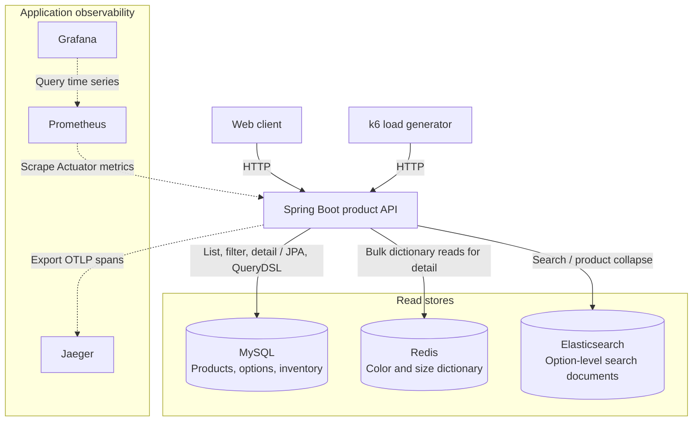
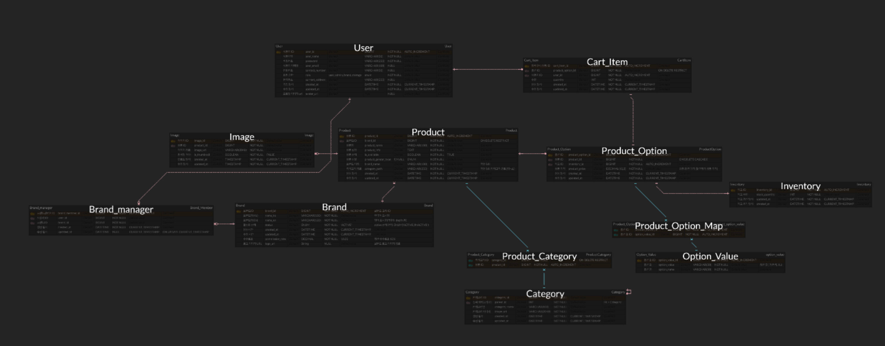
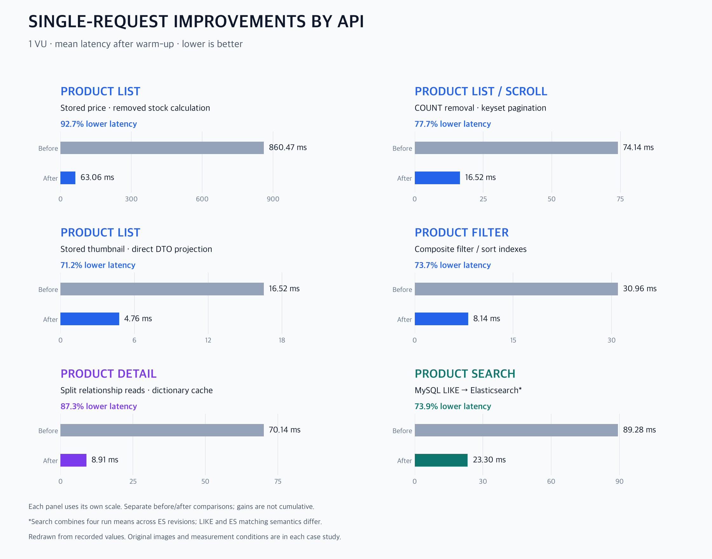

  <h1>Musinsa · Product Search &amp; Query Optimization</h1>
  
Designing how product data is read and searched, then testing those decisions against measurements.

  

    
    
    
  

  
<strong>English</strong> · <a href="./README.ko.md">한국어</a>

  

    <a href="#demo">Demo</a> ·
    <a href="#project-at-a-glance">Project &amp; role</a> ·
    <a href="#key-decisions-and-evidence">Key decisions</a> ·
    <a href="#tech-stack">Tech &amp; rationale</a> ·
    <a href="#architecture">Architecture</a> ·
    <a href="#measurement-setup-and-scenarios">Setup &amp; scenarios</a> ·
    <a href="#single-request-improvements">Case studies</a> ·
    <a href="#troubleshooting">Troubleshooting</a> ·
    <a href="#limits-and-next-steps">Next steps</a>
  

---

## Demo

<h3 align="center"><a href="https://youtu.be/oC8-prv8Qdo">Watch the demo</a></h3>

---

## Project at a Glance

A team e-commerce project modeled on Musinsa. 
With dozens of options per product, it examines how to read and search the information each screen needs and where requests wait as load increases.

### My Role

I designed and implemented product listing, filtering, detail, and search; improved queries and response construction; and investigated connection pools, threads, and search bottlenecks with k6 measurements. 
The case studies describe my work and validation within the team's product-read functionality.

---

## Key Decisions and Evidence

| Problem | Design decision | Outcome | Evidence |
| --- | --- | --- | --- |
| Traversing options and stock for one list price | Store a representative price; remove list stock calculation | Mean 860.47→63.06ms | [Stored price](docs/en/improvements/list-price.md) |
| COUNT for total pages and OFFSET costs | Remove COUNT and apply keyset pagination | Mean 74.14→16.52ms | [Pagination](docs/en/improvements/list-keyset.md) |
| Repeated relationship reads for detail | Split relationship fetching; bulk-read the option dictionary | Mean 70.14→8.91ms | [Detail reads](docs/en/improvements/product-detail.md) |
| Color/type intent missing from product titles | Apply option-level ES documents, multi-field matching, and relevance ranking | Returned results for “black skirt” missed by LIKE | [Search design](docs/en/improvements/product-search.md) |
| Request waiting under load | Establish a baseline, then investigate pools, threads, and search | Four APIs each held 1,000 RPS in separate runs. Detail/search waiting paths identified | [Baseline](#load-results) · [Investigations](#troubleshooting) |

The case studies include repeated measurements, evidence images, design decisions, and trade-offs.

---

## Tech Stack

| Area | Technologies |
| --- | --- |
| Backend | Java 21, Spring Boot 3.5.6, Spring Data JPA, QueryDSL |
| Data / search | MySQL, Redis, Elasticsearch |
| Measurement | k6, Prometheus, Grafana, Jaeger, ES Profile / hot threads |
| Infrastructure / tests | Docker, AWS, JUnit, Spring Boot Test |

### Why These Technologies

| Technology | Alternatives | Reason for selection |
| --- | --- | --- |
| QueryDSL | JPA derived methods, `@Query`/JPQL, Specification | Compose and reuse optional filters, ordering, cursor predicates, and DTO reads in code |
| MySQL | PostgreSQL | Meet relational-read requirements using the team's experience, reducing the effort to learn setup and operations |
| Redis | Local cache, direct DB reads using the buffer pool | Separate repeated option values into a dictionary that instances can share and retrieve in bulk |
| Elasticsearch | Existing LIKE, MySQL FULLTEXT | Express intent across attributes, synonyms, and relevance weights together |
| Load testing and observability | Investigations centered on application logs and IDE profilers | Connect target load, resource metrics, and request spans to investigate latency and waiting |

> **[Read the technology selection rationale →](docs/en/technology-decisions.md)**

---

## Architecture

Read models serve each screen: representative fields and next-page availability for lists, options and inventory for detail, and multi-field matching and relevance for search. 
The diagram shows product reads, search, and application observability.

```mermaid
flowchart TB
    WEB["Web client"] -->|HTTP| API["Spring Boot product API"]
    K6["k6 load generator"] -->|HTTP| API

    subgraph DATA["Read stores"]
        MYSQL[("MySQL<br/>Products, options, inventory")]
        REDIS[("Redis<br/>Color and size dictionary")]
        ES[("Elasticsearch<br/>Option-level search documents")]
    end

    API -->|"List, filter, detail / JPA, QueryDSL"| MYSQL
    API -->|"Bulk dictionary reads for detail"| REDIS
    API -->|"Search / product collapse"| ES

    subgraph OBS["Application observability"]
        PROM["Prometheus"]
        GRAFANA["Grafana"]
        JAEGER["Jaeger"]
    end

    PROM -.->|"Scrape Actuator metrics"| API
    GRAFANA -.->|"Query time series"| PROM
    API -.->|"Export OTLP spans"| JAEGER
```

Full ERD

AWS deployment architecture

The team's AWS deployment at the time; it is no longer running. 
The performance measurements below were run locally, with execution conditions documented in the measurement setup.

---

## Measurement Setup and Scenarios

Products were collected through the [Naver Shopping Search API](https://developers.naver.com/docs/serviceapi/search/shopping/shopping.md) to test reads and search with real product information. 
Color/size combinations expanded roughly 150,000 collected products into a product-option dataset on the scale of ten million records. 
This was inspired by [Coupang's use of an option as its smallest product unit](https://developers.coupang.com/ko/getting-started/coupang-open-api).

155,036 products formed the basis for 11,162,704 product-option records.

This fixed dataset was used for 1-VU before/after comparisons and staged individual-API load. 
The detailed document covers data distribution, the local environment, k6 scenario selection, and the 1,000-RPS target and pass criteria.

> **[Dataset, environment, and k6 scenario details →](docs/en/environment.md)**

---

## Single-Request Improvements

The comparison shows mean API latency before and after each change, measured at 1 VU after warm-up.

| API | Change and case study | Before mean | After mean | Reduction |
| --- | --- | ---: | ---: | ---: |
| Product list | [Stored price / removed list stock calculation →](docs/en/improvements/list-price.md) | 860.47ms | 63.06ms | 92.7% |
| Product list / scroll | [COUNT removal / keyset pagination →](docs/en/improvements/list-keyset.md) | 74.14ms | 16.52ms | 77.7% |
| Product list | [Stored thumbnail / direct DTO projection →](docs/en/improvements/list-thumbnail-dto.md) | 16.52ms | 4.76ms | 71.2% |
| Product filter | [Composite filter / sort indexes →](docs/en/improvements/filter-indexes.md) | 30.96ms | 8.14ms | 73.7% |
| Product detail | [Split relationship reads / dictionary cache →](docs/en/improvements/product-detail.md) | 70.14ms | 8.91ms | 87.3% |
| Product search | [MySQL LIKE → ES search model →](docs/en/improvements/product-search.md) | 89.28ms | 23.30ms | 73.9% |

Each row is a separate comparison: the first five average three additional runs, while search averages one initial run and three additional runs. 
Search spans different ES revisions and different LIKE/ES matching and ordering, so it describes responsiveness as the search feature changed.

---

## Load Results

The table summarizes the final run of each API's baseline load test. 
Each document contains stage/condition tables, resource observations, and original k6, Spring Boot/Hikari, and Jaeger images.

| API and full results | Completed hold | Hold mean | Hold p95 | Outcome |
| --- | --- | ---: | ---: | --- |
| [Product list →](docs/en/load-tests/product-list.md) | 1,000 RPS · 120s | 2.64ms | 4.26ms | No HTTP failures or recorded drops |
| [Product scroll →](docs/en/load-tests/product-scroll.md) | 1,000 RPS · 120s | 2.44ms | 3.95ms | No HTTP failures or recorded drops |
| [Product filter →](docs/en/load-tests/product-filter.md) | 1,000 RPS · 120s | 3.05ms | 5.03ms | No HTTP failures or recorded drops |
| [Product detail →](docs/en/load-tests/product-detail.md) | 1,000 RPS · 120s | 5.07ms | 7.21ms | No HTTP failures or recorded drops |
| [Product search →](docs/en/load-tests/product-search.md) | 250 RPS · 30s | 15.39ms | 40.53ms | 179 drops in the following ramp; early abort |

`dropped_iterations` counts scheduled iterations that could not start. 
Even the aborted search run had zero HTTP failures, so successful responses alone do not establish that the target load was delivered.

List, scroll, and filter met the 1,000-RPS target in this baseline and were not tested above it. 
These results establish that the target load passed under those conditions; they do not establish maximum throughput.

---

## Troubleshooting

Detail progressed to higher-load waiting investigations after meeting the 1,000-RPS baseline; search followed its baseline abort. 
Pool and thread changes test specific hypotheses, with changed and fixed conditions documented per experiment.

| Problem | Observation and decision | Case study |
| --- | --- | --- |
| Detail DB connection waiting | With Tomcat 200 fixed, Hikari 10→50 reduced 2,000-RPS p95 from 875.2→58.6ms; 571 whole-run drops remained. Further expansion had little throughput benefit and reached the DB connection limit | [Hikari / MySQL connection limit →](docs/en/troubleshooting/hikari.md) |
| Tomcat busy at its cap | With Hikari 50 fixed, Tomcat 200→500 did not improve 3,000-RPS throughput; pending rose approximately 150→450 and p95 632.6→901.6ms | [Tomcat 50 / 200 / 500 →](docs/en/troubleshooting/tomcat.md) |
| Repeated search load aborts | Transaction separation → HTTP-pool instrumentation and expansion → client/took split → ES CPU and search-queue investigation | [Search load investigation →](docs/en/troubleshooting/search-capacity.md) |
| Search intent/result mismatch | Distinguished highest-field scoring from required token matching; revisited matching and ranking rules | [Search quality →](docs/en/troubleshooting/search-quality.md) |
| Deduplication and pagination | Investigated option-document collapse / search_after constraints; current from/size still has deep-page costs | [Search pagination →](docs/en/troubleshooting/search-pagination.md) |
| Deployed search-engine compatibility | Injected the response product header and supplied ES 7 compatibility request headers to bypass the client check | [OpenSearch deployment →](docs/en/troubleshooting/opensearch-deployment.md) |
| Cost of observability itself | Reduced DEBUG logs and unnecessary tracing while retaining targeted spans and pool metrics | [Observability overhead →](docs/en/troubleshooting/observability-overhead.md) |
| Initial detail-path isolation | Compared mock controller, Security, and dummy service paths; traced service-entry waiting and DTO assembly with Jaeger | [Detail isolation experiment →](docs/en/troubleshooting/detail-isolation.md) |

Connection-pool and worker-thread comparisons led to a local baseline of Hikari 50 and Tomcat 200.

---

## Limits and Next Steps

The results cover read design against fixed product/option data and observations in a local environment. 
Performance after deployment and consistency across representative fields, caches, and search indexes during updates remain separate validation work.

| Follow-up | What to validate |
| --- | --- |
| Deployed-environment validation | Separate load generation from service resources on Azure; examine throughput, latency, and bottlenecks under the network/resource layout |
| Update consistency | Representative price/thumbnail updates, Redis dictionary refresh, DB→ES propagation, retries, and reindexing |
| Redis vs. local memory vs. RDB | Compare latency, network costs, refresh, and failure dependencies using the same dictionary and response |
| ES nested model | Compare option documents with product-root nested modeling for option combinations, reads, index size, and update costs |

> **[Read the limitations and follow-up details →](docs/en/future-work.md)**
