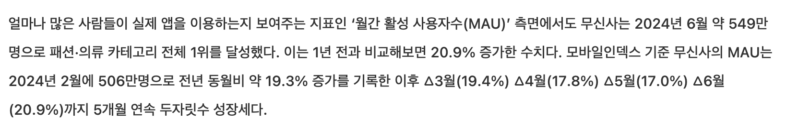
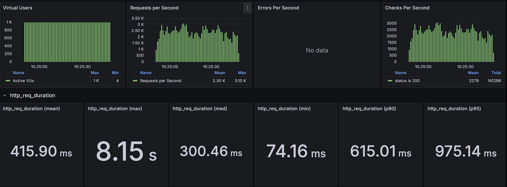
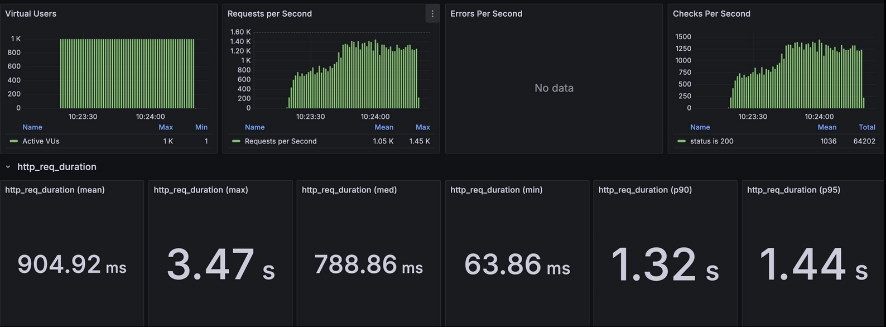
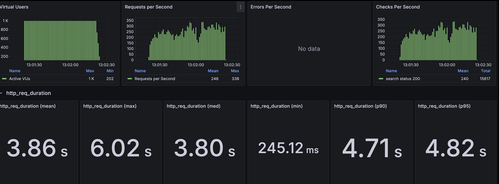

# Load Test Strategy (k6)

## 1. Target
### APIs
- List: http://localhost:8080/api/products
- Detail: http://localhost:8080/api/products/{product_id}
- Search: http://localhost:8080/api/products?keyword={keyword}

### SLO (판정 기준)
- SLO(Service Level Objective)는 “이 테스트에서 합격/불합격을 판단하는 목표치(판정 기준)”입니다.
- Latency: `p95 < 1s`
- Error rate: `0%` (HTTP 5xx, timeout 등 실패 0)
- Throughput: `RPS 1,000~2,000` 구간을 목표로, 대표 목표값은 `1,500 RPS`

```text
# 판정 기준(SLO):
# - p95 < 1s
# - failure = 0
# - target RPS ~= 1500 (min 1000 ~ max 2000)
```

---

## 2. Test Environment (Local)
- Dataset:
  - 상품(Product): `150,000`건
  - 상품 옵션(ProductOption): `11,000,000`건
- Notes:
  - (예: 인덱스/캐시 워밍 여부, 데이터 적재 방식, 옵션/이미지 분포 등)

---

## 3. Load Numbers (부하 수치) & Why
“왜 이 부하를 선택했는지”가 핵심입니다. 계산식/가정/제약(로컬 한계)을 같이 남깁니다.

   

### Assumptions
- MAU (리서치): 5,490,000 → 내림하여 `5,000,000` 가정
- DAU: MAU의 10% 가정 → `500,000`
- Peak concurrent: DAU의 1% 가정 → `5,000`
- 사용자 요청률: 1 user ≒ `0.2 req/s` 가정

```text
# 계산:
# - Peak RPS = peak_concurrent * req_per_user
#          = 5,000 * 0.2 = 1,000 RPS
#
# 로컬 부하 테스트 목표:
# - peak_concurrent의 20% 수준인 VU=1,000에서 worst-case 부하를 재현
# - 기대 RPS 범위: 1,000 ~ 2,000
# - 대표 목표 RPS: 1,500
```

### Load Profile
- VUs: `1,000` (로컬 환경 제약을 고려한 peak의 20%)
- Target RPS: `1,500` (min 1,000 ~ max 2,000 범위 유지)
- Duration:
- Ramp-up/Steady/Ramp-down:


---

## 4. k6 Scenarios (Scripts)

### Script A: List

```javascript
import http from 'k6/http';
import { check } from 'k6';

const TARGET_URL = __ENV.TARGET_URL || 'http://localhost:8080/api/products';

export const options = {
  vus: 1000,
  duration: '1m',
  thresholds: {
    http_req_failed: ['rate<0.01'],
    http_req_duration: ['p(95)<1000'],
  },
};

export default function () {
  const res = http.get(TARGET_URL, { tags: { endpoint: 'detail' } });
  check(res, { 'status is 200': (r) => r.status === 200 });
}
```

### Script B: Detail

```javascript
import http from 'k6/http';
import { check } from 'k6';

const TARGET_URL = __ENV.TARGET_URL || 'http://localhost:8080/api/products/{product_id}';

export const options = {
  vus: 1000,
  duration: '1m',
  thresholds: {
    http_req_failed: ['rate<0.01'],
    http_req_duration: ['p(95)<1000'],
  },
};

export default function () {
  const res = http.get(TARGET_URL, { tags: { endpoint: 'detail' } });
  check(res, { 'status is 200': (r) => r.status === 200 });
}

```

### Script C: Search
```javascript
import http from 'k6/http';
import { check } from 'k6';

const BASE_URL = __ENV.BASE_URL || 'http://localhost:8080';
const KEYWORD = __ENV.KEYWORD || '{keyword}';
const CATEGORY_PATHS = __ENV.CATEGORY_PATHS || '';
const GENDER = __ENV.GENDER || '';
const CURSOR = __ENV.CURSOR || '0';
const LIMIT = __ENV.LIMIT || '30';

const TARGET_URL =
  __ENV.TARGET_URL ||
  `${BASE_URL}/api/products?keyword=${encodeURIComponent(String(KEYWORD))}&categoryPaths=${encodeURIComponent(
    String(CATEGORY_PATHS),
  )}&gender=${encodeURIComponent(String(GENDER))}&cursor=${encodeURIComponent(
    String(CURSOR),
  )}&limit=${encodeURIComponent(String(LIMIT))}`;

export const options = {
  vus: 1000,
  duration: '1m',
  thresholds: {
    http_req_failed: ['rate<0.01'],
    http_req_duration: ['p(95)<1000'],
  },
};

export default function () {
  const res = http.get(TARGET_URL, { tags: { endpoint: 'search' } });
  check(res, { 'search status 200': (r) => r.status === 200 });
}

```

---

## 5. Local vs AWS (Comparison)
AWS 배포 환경에서 동일 조건으로 측정하고 로컬과 비교합니다.

### Deployment (AWS)
- Compute: EC2
- Search: OpenSearch
- WAS: `m7i-flex.xlarge` (vCPU 4 / RAM 16GB)
- Redis + DB: `m7i-flex.xlarge` (vCPU 4 / RAM 16GB)
- OpenSearch nodes: `r8g.large` (vCPU 2 / RAM 16GB) * 3 nodes
  - Shards: 3 shards (total 6 shards), 1 replica

### Measurements
- List: Local vs AWS 
  - 

  - 

- Detail: Local vs AWS 
  - 

  - 
  
- Search(ES): Local vs AWS 
  - 

  - 
