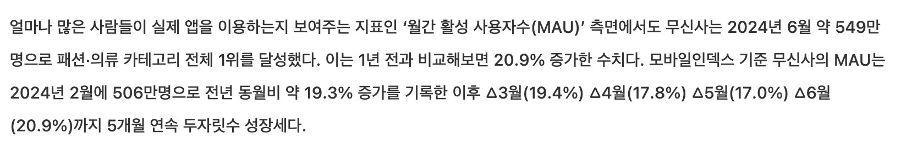

# Measurement environment, data, target load, and scenarios

[한국어](../ko/environment.md) · [README](../../README.md)

The measurements do three jobs: compare the cost of a read-path change, run each API at the target load, and locate where requests wait near the limit. 
Results from these experiments are not combined into one improvement ratio or a production-capacity claim.

---

## Dataset Design

Products were collected through the [Naver Shopping Search API](https://developers.naver.com/docs/serviceapi/search/shopping/shopping.md) to test reads and search with real product information. 
Color/size option combinations expanded the dataset toward ten million records to examine relationship reads at scale.

The expansion unit was a product option. 
Inspired by [Coupang's definition](https://developers.coupang.com/ko/getting-started/coupang-open-api) of `vendorItemId` as an option ID and the smallest product unit, each sellable option combination became a separate row under its product.

| Item | Composition and distribution |
| --- | --- |
| Products | 155,036, based on product information collected through the Naver API |
| Product options / inventory | 11,162,704 records each after option expansion |
| Option-value mappings | 22,325,408 |
| Option distribution | Approximately 72 per product, range 50–95 |
| Images | One per product |
| Dictionaries | 20 brands, 96 categories, 60 option values: 8 sizes and 52 colors |
| Availability / stock | All products available; stock between 10 and 1,000 |

Collected product information and generated option/inventory data serve different roles. 
This is not ten million independently collected products or an unchanged real-seller option distribution. 
Attribute accuracy, sold-out products, and multiple images have limited coverage. 
Completing and reproducing the collection/preprocessing pipeline remains follow-up work.

## Execution Environment

| Item | Condition |
| --- | --- |
| Host | Apple M3 Max, 36GB RAM |
| Docker allocation | 14 CPUs, approximately 15GB RAM |
| Placement | k6, Spring, MySQL, Redis, ES, and monitoring share one machine |
| Request path | Loopback |
| Measurement scope | Read APIs against fixed data; image downloads and write load excluded |

The README's AWS diagram describes deployment history; these measurements ran locally. 
Fixed inputs, settings, and warm-up conditions are distinct from remaining shared CPU, memory, and I/O effects. 
Sharing one machine does not isolate resource contention.

## Settings by experiment stage

The baseline and subsequent bottleneck investigations have different purposes and deliberately change settings. 
After list, scroll, filter, and detail completed 1,000 RPS, detail advanced to higher loads and pool/thread comparisons. 
Search followed a separate investigation of its baseline abort.

| Run | Main settings | How to interpret the result |
| --- | --- | --- |
| Seven-minute individual-API baseline | Hikari 10, maximum 200 VUs, timeout 5s; search ES HTTP total/per-host 30/10 | Completion of the 1,000-RPS, 120-second target; search completed 250 RPS before aborting in the ramp |
| Detail Hikari comparison | Tomcat 200 fixed, Hikari 10/20/30/50; extended runs use 50/100/200, maximum 1,000 VUs | DB connection waiting and throughput at 2,000/3,000 RPS |
| Detail Tomcat comparison | Hikari 50 fixed, Tomcat 50/200/500, maximum 1,000 VUs | Whether more workers improve throughput or add connection waiting |
| Search HTTP-pool/CPU investigation | Transaction separation; ES HTTP settings from 30/10 to 150/150 across runs | HTTP waiting, ES work, and shared resources; automatic and manual aborts distinguished |

The later local settings are Hikari 50, Tomcat 200, and ES HTTP 150/150. 
They do not describe the earlier baseline runs. 
Detailed conditions are in the [Hikari](troubleshooting/hikari.md), [Tomcat](troubleshooting/tomcat.md), and [search](troubleshooting/search-capacity.md) investigations.

---

## Three comparison methods

| Purpose | Method | Interpretation |
| --- | --- | --- |
| Read design before/after | 1 VU, fixed inputs, repeated after warm-up; usually three additional runs | Mean cost of a particular change |
| Single-API baseline | Seven-minute scenario, one final run per API | Completion of the specified target workload |
| Pool and thread investigation | Five-minute / six-minute-15-second detail runs, once per setting | Waiting and throughput within equivalent hold stages |

The 1-VU comparisons used initial and additional warm-up calls before repetition. 
Conditions, sample counts, and whether earlier screenshots were included are documented for [lists](improvements/list-price.md), [detail](improvements/product-detail.md), and [search](improvements/product-search.md). 
Search's four means are not four repeats of identical code.

---

## k6 Scenario Selection

Home discovery, early scrolling, filtering, detail, and search were selected as the main product-read paths. 
Each API first ran separately to isolate inputs and bottlenecks. 
The 1-VU comparisons examine read changes; staged load examines how latency, failures, and waiting change as requests to the same path increase.

| Path | Fixed inputs | Reason for selection |
| --- | --- | --- |
| Home list | First 24 products | Repeated first-list reads at home entry |
| Early scrolling | Follow response cursors through pages 1–5 | Consecutive page reads during initial browsing |
| Filters | Ten conditions × default/lowest/highest-price ordering, first 24 | Category, brand, gender, combined conditions, and ordering |
| Detail | Five fixed products | Comparable option-relationship fetching and assembly |
| Search | 스커트 / 블랙 스커트 / 나이키 / 나이키 후드, first ten | Product type, color + type, brand, and brand + type inputs |

Fixed products and queries support before/after comparison and include cache/JIT warm-up effects. 
They do not reproduce real popularity or user transition probabilities.

`ramping-arrival-rate` supplies a target arrival rate to test whether scheduled work can start as latency grows, rather than waiting for each previous request to finish before scheduling more. 
One iteration makes one HTTP request, so target iterations/s corresponds to target HTTP RPS. 
Actual throughput can differ with latency and drops and is reported separately.

---

## Why the target was 1,000 RPS

The starting figure is Musinsa’s June 2024 MAU of approximately 5.49 million, from a July 2024 report citing Mobile Index. 
[Reference: Fashion Insight, July 12, 2024](https://www.fi.co.kr/main/view.asp?idx=82843)

June 2024 Musinsa MAU passage used for the load target

*Image of the cited passage. 
The same MAU figure is in the source above.*

MAU alone does not produce an RPS. 
The target is fixed by the planning model below. 
It is not measured Musinsa traffic.

| Step | Calculation | Result |
| --- | --- | ---: |
| MAU | Reported value | 5,490,000 |
| DAU | MAU × 8/30, assuming eight visit days per month | 1,464,000 |
| Daily reads | DAU × 10, assuming ten product-read API calls per visit | 14,640,000 |
| Average RPS | Daily reads / 86,400 seconds | 169 |
| Peak RPS | Assuming 50% of daily reads fall in two hours: 7,320,000 / 7,200 seconds | 1,017 |

The scenario hold target rounds that peak to 1,000 RPS for 120 seconds.

1,000 is the peak for list, scroll, filter, detail, and search combined. 
Each API was loaded to that full value on its own. 
Split across endpoints, one API’s share is smaller. 
Dividing ten calls per visit into list 2, scroll 3, filter 1, detail 3, and search 1 puts their peak shares near 200, 300, 100, 300, and 100 RPS.

The runs repeat a hot set. 
List hits the first 24 products, scroll cycles pages 1–5, and detail and search repeat fixed products and queries. 
Every product is available for sale. 
There are no writes and no mixed APIs. 
HTTP failures and `dropped_iterations` are what separated outcomes. 
Hold-stage p95 under one second was also a threshold, but the four APIs that finished 1,000 RPS had hold p95 around 4–7ms, so that threshold did not decide the result.

---

## Seven-minute baseline

Arrival-rate execution scheduled one HTTP request per iteration. 
Maximum VUs: 200; request timeout: five seconds. 
RPS is the total across a scenario's inputs, not a separate target for each input.

| Stage | Target RPS | Hold |
| --- | ---: | ---: |
| Warm-up | 10 | 30s |
| 1–4 | 50 / 100 / 250 / 500 | 30s each |
| 5 | 750 | 60s |
| 6 | 1,000 | 120s |

Each post-warm-up stage has a 15-second ramp, totaling 420 seconds. 
Pass criteria were a 120-second target hold, hold p95 under one second, zero HTTP failures, and zero drops. 
Early abort is a separate guard: after the initial 30 seconds, an HTTP failure rate of 5% or more or any drop could stop the run; hold-stage p95 violations also triggered abort after a stage-specific evaluation delay. 
A nonzero HTTP failure rate below 5% still fails the pass criteria. 
`dropped_iterations` counts scheduled iterations that could not start because no VU was available. 
It differs from a failed HTTP request or an ES rejected task.

---

## Interpretation

Repeated fixed inputs include cache and JIT warm-up effects. 
Lower latency at a later, higher-load stage is not evidence that concurrency itself improved performance. 
HTTP-success checks do not validate every response field. 
Distinguish fixed inputs, settings, and warm-up conditions from the remaining effects of shared CPU, memory, and I/O. 
Running on one machine does not isolate resource contention.

---

## Reading aggregates and observations

Whole-run statistics include warm-up, ramps, and holds. 
Stage tables cover holds, except the aborted search ramp. 
Stage boundaries and recording can make response samples differ slightly from target RPS multiplied by duration.

Connection/CPU maxima use one-second queries over each run and immediate cleanup. 
Peaks need not coincide; coarse graphs can miss brief spikes. 
System CPU is not DB-only CPU. 
A Jaeger sample describes one request and does not replace population means or p95.

---

## Follow-up stress experiments

Detail Hikari/Tomcat comparisons are separate from the baseline. 
They use 1,000 preallocated/maximum VUs, a five-second request timeout, and disabled performance-triggered early aborts. 
The initial five-minute scenario holds 50 RPS for 30s → 1,000 for 45s → 1,500 for 60s → 2,000 for 75s → 50 for 30s, with 15-second ramps. 
The extended six-minute-15-second scenario inserts a 15-second ramp and 60-second hold at 3,000 RPS after 2,000. 
Each setting ran once.

Capacity validation must distinguish target RPS from actual throughput and retain both the last hold satisfying latency/error/drop criteria and the first failing hold. 
One peak without repetition near the boundary is not established production capacity. 
Maximum throughput has not been measured for every API.

---

## Repeat units for single-request comparisons

Initial calls and warm-ups were excluded from measured samples. 
Additional executions and initial screenshots are separate aggregation scopes; each linked case study provides run values and actual conditions.

| Comparison | Inputs | Measured samples per execution | Additional-run aggregate |
| --- | --- | --- | --- |
| Stored price | First page, 24 products | 30 | 3 runs / 90 per version |
| Keyset | Depths 0 / 100 / 1,000 / 5,000 | 360 | 3 runs / 1,080 per version |
| Thumbnail/DTO | Same keyset positions | 360 | 3 runs / 1,080 per version; before reused |
| Detail | Five fixed products | 450 | 3 runs / 1,350 per version |
| Filter indexes | Ten filters × three orders | 2,700 | 3 runs / 8,100 per state |
| Search | Four fixed queries | 360 | 3 additional runs / 1,080 per method; summary averages four means including the initial screenshot |

For keyset, DTO, detail, filter, and search, each input repeats a group of one initial call, four warm-ups, and 30 measured calls three times within one execution. 
Stored price instead aggregates three executions of 30 measured calls. 
Preparation counts and server/cache conditions are specified in each case study.

Percentile aggregation matters: filter's pooled p95 is recomputed from individual requests, while the final search p95 row is an arithmetic mean of run percentiles. 
Initial/additional differences, revision differences, and uncleared caches remain explicit. 
Aggregate gains are not attributed exclusively to SQL, caching, or object construction.
