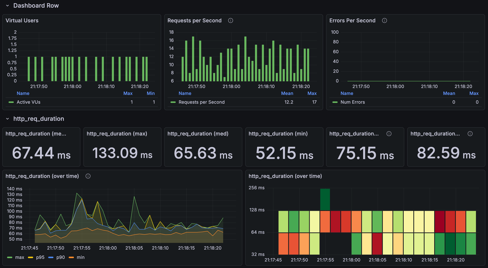
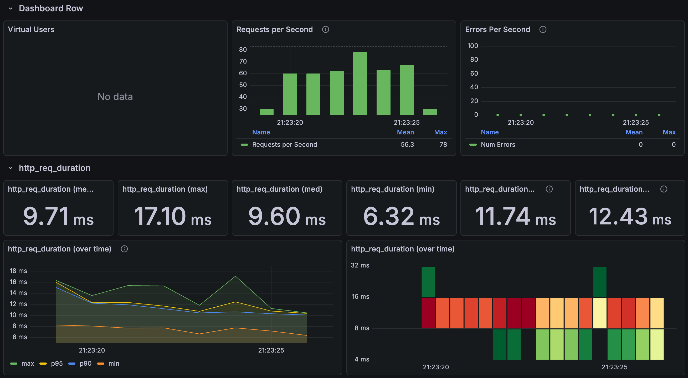
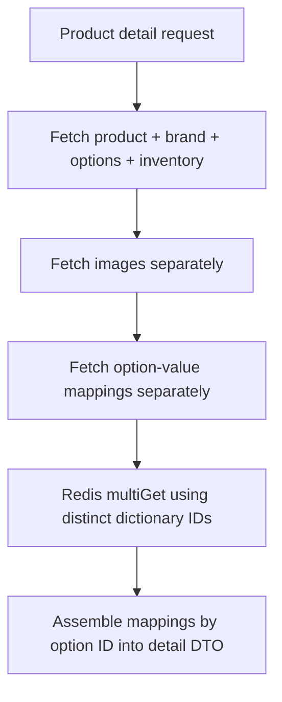

# Detail reads: preserve information, change how relationships are fetched

[한국어](../../ko/improvements/product-detail.md) · [README](../../../README.md) · [Measurement setup](../environment.md)

---

## Problem and comparison conditions

The first detail response returns every option, price, stock value, and option description. 
This work occurs even without clicking an option. 
Previously, product/brand/images were fetched together, then the mapper traversed options, inventory, and option values, potentially issuing additional SQL. 
Required information was fetched through repeated small operations.

Five initially selected products were fixed for the comparison. 
Product numbers below are document-local sample labels.

| Product | Options | Images |
| --- | --- | --- |
| Product 1 | 60 | 1 |
| Product 2 | 72 | 1 |
| Product 3 | 65 | 1 |
| Product 4 | 67 | 1 |
| Product 5 | 72 | 1 |

For each product: one initial call, four warm-ups, then 30 measured calls, repeated three times. 
An execution contains 450 measured / 525 total requests. 
Three additional executions yield 1,350 measured / 1,575 total requests per version, with zero HTTP failures. 
These measure JSON responses, not image downloads or option clicks.

Measurement started after Redis option/category dictionaries loaded. 
Both versions used Java 21, a 6GiB heap, `TieredStopAtLevel=1`, and the dev profile. 
The app restarted between versions, while DB/Redis caches remained; before ran first, then after. 
The initial IntelliJ screenshot is kept separate from additional runs.

---

## Repeated measurements

| Run | Before mean | Before p95 | After mean | After p95 |
| --- | --- | --- | --- | --- |
| Additional run 1 | 71.33ms | 89.70ms | 9.75ms | 13.21ms |
| Additional run 2 | 70.69ms | 87.94ms | 8.36ms | 9.50ms |
| Additional run 3 | 68.41ms | 80.94ms | 8.62ms | 10.61ms |
| Initial screenshot | 67.44ms | 82.59ms | 9.71ms | 12.43ms |
| Additional 3 runs combined | 70.14ms | — | 8.91ms | — |

The additional-run mean is 70.14→8.91ms, an 87.3% reduction. 
Initial calls, warm-ups, and separate correctness checks are excluded. 
Means and p95 use individual InfluxDB request durations.

 

### Mean by product

Each row combines 270 measured calls across the three additional runs.

| Product | Before mean | After mean |
| --- | --- | --- |
| Product 1 | 63.49ms | 9.27ms |
| Product 2 | 74.01ms | 9.14ms |
| Product 3 | 68.52ms | 8.51ms |
| Product 4 | 69.41ms | 8.75ms |
| Product 5 | 75.30ms | 8.86ms |

Detail before

Detail after

Outside the timed benchmark, JSON fields, values, and array ordering matched for the five products. 
Timed k6 requests did not parse/validate the entire body. 
This does not establish correctness for every distribution or cache failure.

---

## Read flow

Previously, product, brand, and images were fetched together, followed by traversal of options, inventory, and option values. 
The new detail path still uses entities; it is not the list's direct DTO projection.

Options and images are independent collections. 
Joining both can multiply result rows, so images are fetched separately. 
Each sampled product had one image, however; this experiment did not directly quantify the benefit for multi-image products.

Color and size names are shared dictionary data. 
Distinct IDs are read from Redis in bulk and combined with mappings grouped by option ID. 
Prices, inventory, and complete product responses are not cached by this change.

---

## Why this path reduces work

Reading inventory individually for 60 options can repeat small SQL calls. 
This is an N+1-shaped relationship traversal, but exact query counts depend on mappings and loaded state, not latency alone. 
Explicit fetch groups, grouping mappings by option ID, and `multiGet` of distinct dictionary IDs reduce repeated traversal.

Joining three images alongside 60 options can produce 180 rows. 
Splitting avoids that multiplication, but every measured product had one image, so the multi-image benefit was not measured directly. 
The design balances round trips against result-row expansion.

Detail still reads entities and assembles DTOs in Java, unlike the list's direct DTO projection. 
Both versions initialize Redis, but the old detail path reads dictionary values from DB entities and the new one reads Redis. 
Detail's `categoryPath` comes from the product, so category-tree caching does not explain this result. 
Fetch splitting, join scope, and dictionary caching changed together.

---

## Decisions and alternatives

| Decision | Benefit | Cost or limitation |
| --- | --- | --- |
| Separate image and mapping reads | Control relationship sizes and repeated traversal | More DB round trips and application assembly |
| Bulk Redis dictionary read | Batch repeated name/value lookups | Redis availability, initialization, and consistency |
| Keep prices and inventory in DB reads | Read changing detail data from the DB | Does not eliminate DB work like a full-response cache |

The dictionary has only 60 entries. 
Joining option values in the DB or keeping an in-process dictionary are reasonable alternatives, but were not compared here. 
Fetch restructuring and cache use changed together, so the 87.3% reduction cannot be attributed to Redis alone.

The current dictionary path has no DB fallback or TTL; missing cached values can produce `null` names and values. 
Initialization, missing-data behavior, failure handling, and refresh policy need decisions before operational use. 
Full-response caching and Caffeine remain ideas, not implemented achievements.

 

### Correctly assembling multiple results

Incorrect option/dictionary ID joins can attach the wrong value or omit data. 
Array and image ordering must also be preserved. 
Consistency across multiple SQL statements depends on transactions and isolation. 
Redis connection failure can fail requests, while missing entries can produce null fields even with a live connection. 
Prepared-cache performance is separate from failure behavior.

 

### What to compare against a DB join

As an illustration, ten colors and ten sizes mean 20 dictionary entries, 100 options, and 200 mappings. 
The current approach combines 200 DB mapping rows with 20 Redis values. 
Joining dictionary values onto mappings would return strings on those 200 rows and remove the Redis round trip. 
Each mapping references one value, so this is not a cross-product of multiple collections.

The DB can read its buffer pool; repeated values do not imply a disk access or separate SQL call every time. 
Duplicate string transfer and join work still have costs. 
Hold other reads constant and change only mapping/dictionary access under identical responses, warm-up, and repeats. 
If performance is similar, operational/code simplicity matters. 
The [Redis/memory/DB comparison](../future-work.md) remains future work.

---

## Interpretation limits

Execution order and warm-up are not fully isolated. 
Per-SQL timings, allocation/GC, cache failure, multiple images, and concurrency need separate tests. 
Observation classes and `@Observed` were also added while the existing disabled OTLP/tracing settings were retained; their contribution was not isolated.

---

## Follow-up under load

The optimized detail path still waited for connections at higher load. 
The 1,000-RPS baseline and Hikari/Tomcat experiments are separate workloads. 
See [baseline detail results](../load-tests/product-detail.md) and [connection-pool troubleshooting](../troubleshooting/hikari.md).

Implementation: [ProductQueryService](../../../src/main/java/com/mudosa/musinsa/product/application/ProductQueryService.java) · [ProductQueryMapper](../../../src/main/java/com/mudosa/musinsa/product/application/mapper/ProductQueryMapper.java)
