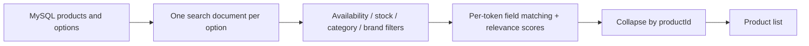

# Search design: from a product-name substring to option-aware intent

[한국어](../../ko/improvements/product-search.md) · [README](../../../README.md) · [Measurement setup](../environment.md)

A product-name substring cannot express intent well when color, product type, and brand live in different fields. 
ES was chosen to preserve option relationships, search across attributes, and rank results. 
This document records changed results and their costs alongside latency.

---

## Comparison scenario

Four queries were called equally: `스커트` (skirt), `블랙 스커트` (black skirt), `나이키` (Nike), and `나이키 후드` (Nike hoodie). 
Each `GET /api/products?limit=10&keyword=...` retrieves the first ten results. 
For each query: one initial call, four warm-ups, and 30 measured calls, repeated three times. 
Each execution has 360 measured / 420 total calls; three additional executions provide 1,080 measured samples per method, with zero HTTP failures.

Additional executions ran ES before LIKE. 
Apps restarted between versions, but DB/ES caches were not cleared. 
Timed k6 calls checked HTTP success without validating JSON bodies. 
Result screenshots are separate observations.

---

## Repeated measurements

| Run | Before mean | Before p95 | After mean | After p95 |
| --- | --- | --- | --- | --- |
| Additional run 1 | 89.96ms | 174.35ms | 25.75ms | 60.19ms |
| Additional run 2 | 90.19ms | 175.78ms | 22.95ms | 54.48ms |
| Additional run 3 | 89.91ms | 176.34ms | 22.37ms | 53.50ms |
| Initial screenshot | 87.06ms | 168.54ms | 22.14ms | 47.06ms |
| Arithmetic mean of 4 runs | 89.28ms | 173.75ms | 23.30ms | 53.81ms |

The arithmetic mean of run means is 89.28→23.30ms, a 73.9% reduction. 
The final p95 cells, 173.75/53.81ms, average run percentiles; they are not percentiles pooled across all requests.

Additional runs use individual InfluxDB durations. 
The initial ES screenshot represents the restored introduction version; additional runs include response-field limiting and a brand-search-field correction. 
These are not four identical-code repeats. 
Matching and ordering also differ, so this does not compare algorithms producing an identical result set.

Initial LIKE k6 screenshot

Initial ES k6 screenshot

---

## Observed result differences

These screenshots illustrate individual queries, not a quantitative relevance evaluation. 
A result screenshot alone does not establish exactly which field matched every returned product.

Skirt: LIKE / Elasticsearch

LIKE returns product-name substring matches in ID order; ES ordering also reflects category and other relevance. 
Repetition in a title alone does not determine BM25 rank.

Skirt LIKE results

Skirt ES results

Black skirt: LIKE / Elasticsearch

LIKE found no contiguous phrase. 
ES matched the tokens separately and returned results; exact field attribution requires a separate explain.

Black skirt LIKE results

Black skirt ES results

Nike: LIKE / Elasticsearch

LIKE uses title inclusion while ES combines multiple fields. 
Source brand values include sellers, so neither screenshot establishes verified official-brand identity.

Nike LIKE results

Nike ES results

Nike hoodie: LIKE / Elasticsearch

LIKE can miss titles with an intervening word, such as Nike Club Hoodie. 
In current ES results, the hoodie-category contribution can outrank another item with a higher title contribution.

Nike hoodie LIKE results

Nike hoodie ES results

---

## Document unit: one sellable option

Flattening all colors and sizes onto a product can match a combination that no individual option offers. 
I used one document per option, applied stock and availability filters, then collapsed on `productId` to return products.

This allows individual option updates but repeats shared product and brand information. 
Updating a product can require updating many documents; approximately 155,000 products expand to approximately 11 million option documents. 
A product document with nested options is a candidate, but search cost must be compared with reindexing costs when options change. 
That migration has not been implemented or measured.

Product name, brand, representative price, and thumbnail come from ES to reduce DB rereads for search lists. 
The thumbnail is not a query-matching field; its baseline keyword mapping was retained. 
Stock/availability filters do not imply automatic synchronization from DB updates.

---

## Analyzers, multifields, and update cost

| Field | Mapping | Reason |
| --- | --- | --- |
| productName / krBrandName | text + nori_default | Tokenized Korean search |
| enBrandName | text | English-brand search |
| categoryPath | keyword + text subfield (nori_default) | Path filters and category-token matching |
| colorOptions / sizeOptions | keyword + text subfields (nori_color / nori_size) | Original option values and synonym-expanded search forms |

`nori_default` uses a Nori tokenizer, part-of-speech filtering, reading-form conversion, and lowercasing. 
Color/size analyzers lowercase, expand synonyms, and apply part-of-speech/reading-form filters; search uses `nori_default`. 
Examples connect 블랙/black/검정색/blk and M/미디엄/medium. 
Index-time synonym changes require reindexing existing documents.

Multifields index the same value as keyword/text representations; this differs from querying multiple fields with `multi_match`.

---

## Separate matching requirements from ranking

The index uses Nori and synonym analysis, with distinct exact-filter and text-search fields. 
Every input token must match at least one of product name, category, color, size, or brand. 
These token clauses are combined with `must`. 
Additional `should` matches for the whole query affect ranking.

| Whole-query field | Boost | Rationale |
| --- | ---: | --- |
| Category / color | 3 | Emphasize product type and option attributes |
| Product name | 2 | Useful meaning mixed with promotional text |
| Size / Korean and English brand | 1 | Supporting clues; collected brand data can include seller names |

These boosts are not separately applied to the required per-token clauses. 
They are initial design assumptions, not an optimum established from user logs or relevance judgments. 
Color is not assumed universally more important than brand.

Whole-query field boosts

In the collected data, 131,962 descriptions duplicated product titles. 
Descriptions were excluded to avoid adding repeated matches without new information. 
Promotional titles and inaccurate attributes remain data-quality problems that a search engine alone does not solve.

A concrete title/category score reversal is documented separately in [search-quality troubleshooting](../troubleshooting/search-quality.md). 
Boosts multiply scores rather than assigning fixed ranks; they do not correct erroneous source categories or brands.

---

## Why results and latency changed

LIKE uses product-name substrings and ID order; ES uses morphology, synonyms, multiple fields, and relevance ordering. 
The change serves richer cross-attribute intent, and latency also fell in this comparison. 
It does not establish that LIKE used a full scan or attribute saved milliseconds to one ES operation. 
Queries were equally weighted because empty-result requests can be faster.

---

## One-shard diagnostic

One-shard diagnostic

The one-shard screenshot shows 38.55ms mean / 99.95ms p95, versus 22.14ms / 47.06ms for the initial two-shard screenshot: approximately 1.74× / 2.12× higher. 
Shards can execute in parallel on one node, but equivalence of mappings, analyzers, data, cache, and post-reindex merge state was not established. 
This is not an isolated shard-count effect, is excluded from the four-run LIKE/ES aggregate, and the baseline index was restored.

---

## Operational settings and trade-offs

| Setting | Baseline | Meaning / trade-off |
| --- | --- | --- |
| Index | product | Baseline documents and analyzers |
| number_of_shards | 2 | Shard-level parallelism plus merge/management cost |
| number_of_replicas | 0 | Single-node measurement; no failover replica |
| refresh_interval | 10s | Search-visibility delay versus refresh work; benefit not isolated |
| index.queries.cache.enabled | true | Reusable eligible filter document sets, not every complete query response |

A ten-second refresh is not ten-second polling of MySQL. 
Query-cache hits/misses and usage were not measured, so cache benefit is not claimed as the cause. 
Richer search requires operating ES, indexing/reindexing, propagating changes, and recovering failed updates. 
Duplicated product data, collapse, and result merging remain costs.

---

## Current limits and follow-up

Unlike the list's keyset path, search uses `from/size` and a page-number cursor. 
Collapse and sorting restrictions are covered in [search and operations troubleshooting](../troubleshooting/search-pagination.md). 
Accurate unique-product totals are not guaranteed, and deep-page cost remains.

DB-to-ES propagation and recovery need separate validation. 
An index refresh interval does not establish synchronization with MySQL. 
The measured local index used two shards and zero replicas; it does not represent a highly available deployment.

At higher load, search CPU work and queueing remained after connection limits were increased. 
[Search bottleneck investigation](../troubleshooting/search-capacity.md) separates observations from unmeasured query costs and shared-host effects. 
Current query construction is in [ProductIndexSearchQueryRepositoryImpl](../../../src/main/java/com/mudosa/musinsa/product/infrastructure/search/repository/ProductIndexSearchQueryRepositoryImpl.java).
