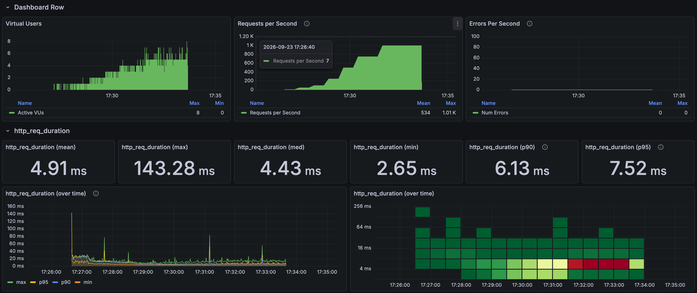
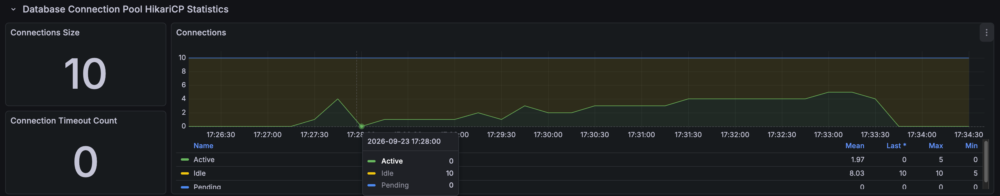
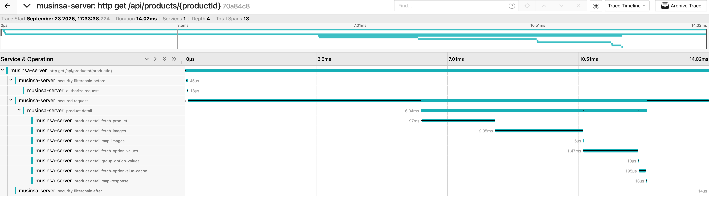

# Product detail load results

[한국어](../../ko/load-tests/product-detail.md) · [README](../../../README.md) · [Measurement setup](../environment.md)

Five fixed products were requested evenly, including product, image, option-mapping, dictionary-cache reads, and response assembly. 
Completed the 1,000-RPS hold for 120s, with zero HTTP failures and no recorded drops.

Product detail k6

---

## Test conditions

This is one final run from September 23, 2026. 
The planned seven-minute scenario ramps from a 10-RPS warm-up through 50/100/250/500/750/1,000 RPS, holding 1,000 for 120 seconds. 
Maximum VUs: 200; HTTP timeout: five seconds; Hikari limit: ten. 
APIs were not loaded simultaneously.

---

## Whole-run responses

| Response samples | Mean | p95 | Maximum |
| ---: | ---: | ---: | ---: |
| 224,621 | 4.91ms | 7.52ms | 143.28ms |

Whole-run results include warm-up and ramps. 
Distinguish them from stage tables and selected dashboard ranges.

---

## Results by load stage

| Hold stage | Hold duration | Response samples | Mean | p95 |
| --- | --- | --- | --- | --- |
| 50 RPS | 30s | 1,500 | 10.09ms | 12.88ms |
| 100 RPS | 30s | 3,000 | 7.17ms | 9.95ms |
| 250 RPS | 30s | 7,500 | 4.44ms | 5.92ms |
| 500 RPS | 30s | 15,001 | 4.20ms | 5.40ms |
| 750 RPS | 60s | 44,999 | 4.47ms | 5.99ms |
| 1,000 RPS | 120s | 119,993 | 5.07ms | 7.21ms |

---

## Per-product results at 1,000 RPS

| Product | Response samples | Mean | p95 |
| --- | --- | --- | --- |
| Product 1 | 23,999 | 4.96ms | 7.12ms |
| Product 2 | 23,998 | 5.13ms | 7.26ms |
| Product 3 | 23,998 | 5.06ms | 7.22ms |
| Product 4 | 23,999 | 5.08ms | 7.17ms |
| Product 5 | 23,999 | 5.13ms | 7.27ms |

---

## Connections and resources

Spring Boot / Hikari connection observations

These maxima come from one-second queries in the same run and need not coincide. 
System CPU is not MySQL-only CPU.

| Metric | Result in the same run |
| --- | --- |
| Hikari connection limit | 10 |
| Maximum Hikari active / pending | 10 / 18 |
| Connection timeout increase | 0 |
| Maximum JVM / system CPU | 25.45% / 72.06% |
| Maximum MySQL running threads | 3 |

Raw metrics were queried at one-second intervals across the run and immediate cleanup. 
The attached graph can use coarser resolution and miss brief pending peaks. 
A displayed pending=0 differs from the run's maximum; maxima across metrics need not occur simultaneously.

---

## Request trace sample

Product detail Jaeger

| Span / timing | Time in the trace sample |
| --- | --- |
| HTTP total | 14.02ms |
| Service body start | 6.30ms after request start |
| Service body | 6.04ms |
| Product read | 1.97ms |
| Image read | 2.35ms |
| Option-value read | 1.47ms |
| Option dictionary cache read | 0.195ms |
| Final response mapping | 0.013ms |

Product-level p95 ranged from 7.12 to 7.27ms. 
The example trace does not establish that all 6.30ms before the service body was connection waiting. 
Later pool/thread limits use a different workload in [detail troubleshooting](../troubleshooting/hikari.md).

---

## Interpretation and measurement scope

This single-API test repeats fixed inputs and includes cache/JIT warm-up and shared local resources. 
Lower latency at a later, higher-load stage is not an improvement caused by higher load itself. 
HTTP 200 checks do not validate every response field. 
One trace does not represent the population mean/p95, and DB-call spans are not pure SQL execution time.

Image, product, and option-value reads dominate the sampled service body. 
The 6.30ms before body entry needs additional connection/scheduling instrumentation for attribution.

---

## Validated load range and limits

The baseline completed 1,000 RPS for 120 seconds with Hikari ten. 
A separate later run with Hikari 50 and Tomcat 200 targeted 3,000 RPS but delivered approximately 2,121 RPS and retained 57,291 whole-run drops. 
This is a local saturation observation, not successfully sustained maximum throughput. 
See the [Hikari comparison](../troubleshooting/hikari.md) for conditions.
