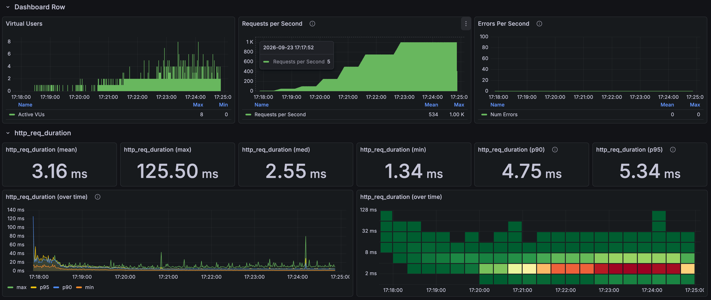
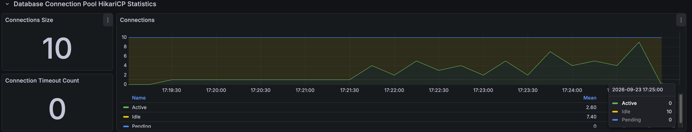
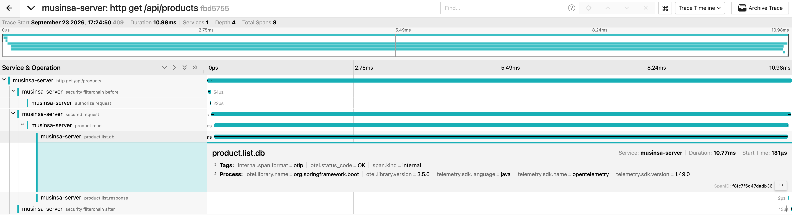

# Product filter load results

[한국어](../../ko/load-tests/product-filter.md) · [README](../../../README.md) · [Measurement setup](../environment.md)

Ten category, brand, gender, combined, child-category, and multiple-category conditions were combined with default, lowest-price, and highest-price ordering. 
Each request returned the first 24 products. 
Completed the 1,000-RPS hold for 120s, with zero HTTP failures and no recorded drops.

Product filter k6

---

## Test conditions

This is one final run from September 23, 2026. 
The planned seven-minute scenario ramps from a 10-RPS warm-up through 50/100/250/500/750/1,000 RPS, holding 1,000 for 120 seconds. 
Maximum VUs: 200; HTTP timeout: five seconds; Hikari limit: ten. 
APIs were not loaded simultaneously.

---

## Whole-run responses

| Response samples | Mean | p95 | Maximum |
| ---: | ---: | ---: | ---: |
| 224,624 | 3.16ms | 5.34ms | 125.50ms |

Whole-run results include warm-up and ramps. 
Distinguish them from stage tables and selected dashboard ranges.

---

## Results by load stage

| Hold stage | Hold duration | Response samples | Mean | p95 |
| --- | --- | --- | --- | --- |
| 50 RPS | 30s | 1,500 | 6.85ms | 10.43ms |
| 100 RPS | 30s | 3,000 | 5.32ms | 8.46ms |
| 250 RPS | 30s | 7,500 | 3.44ms | 5.39ms |
| 500 RPS | 30s | 15,001 | 2.99ms | 4.84ms |
| 750 RPS | 60s | 45,000 | 2.97ms | 4.80ms |
| 1,000 RPS | 120s | 119,995 | 3.05ms | 5.03ms |

---

## p95 by filter and order at 1,000 RPS

| Condition | Default order | Lowest price | Highest price |
| --- | --- | --- | --- |
| No filter | 3.57ms | 3.58ms | 3.66ms |
| Category | 5.62ms | 4.60ms | 3.56ms |
| Brand | 3.49ms | 3.35ms | 3.42ms |
| Gender | 3.35ms | 3.30ms | 3.33ms |
| Category + brand | 5.47ms | 3.99ms | 3.97ms |
| Category + gender | 5.80ms | 4.78ms | 3.78ms |
| Brand + gender | 3.53ms | 3.35ms | 3.55ms |
| Category + brand + gender | 5.47ms | 4.08ms | 3.90ms |
| Child category | 6.88ms | 5.64ms | 5.19ms |
| Multiple categories | 6.09ms | 5.05ms | 4.41ms |

---

## Connections and resources

Spring Boot / Hikari connection observations

These maxima come from one-second queries in the same run and need not coincide. 
System CPU is not MySQL-only CPU.

| Metric | Result in the same run |
| --- | --- |
| Hikari connection limit | 10 |
| Maximum Hikari active / pending | 10 / 10 |
| Connection timeout increase | 0 |
| Maximum JVM / system CPU | 33.35% / 57.67% |
| Maximum MySQL running threads | 3 |

Raw metrics were queried at one-second intervals across the run and immediate cleanup. 
The attached graph can use coarser resolution and miss brief pending peaks. 
A displayed pending=0 differs from the run's maximum; maxima across metrics need not occur simultaneously.

---

## Request trace sample

Jaeger request trace

| Span / timing | Time in the trace sample |
| --- | --- |
| HTTP total | 10.98ms |
| Service body | 10.78ms |
| DB read call | 10.77ms |
| Service body start | 0.129ms after request start |

Each filter/sort combination recorded approximately 4,000 requests. 
Category was bags; child category was bags > tote bags; multiple categories were tote and crossbody bags; brand was one fixed brand; gender was unisex (ALL). 
Default-order p95 for child/multiple categories was approximately 5–7ms in this hold. 
These are current-implementation results, not an index before/after improvement ratio. 
The DB-call trace is not pure SQL execution time.

---

## Interpretation and measurement scope

This single-API test repeats fixed inputs and includes cache/JIT warm-up and shared local resources. 
Lower latency at a later, higher-load stage is not an improvement caused by higher load itself. 
HTTP 200 checks do not validate every response field. 
One trace does not represent the population mean/p95, and DB-call spans are not pure SQL execution time.

The attached response-processing span is approximately 0.002ms. 
DB calls exceed assembly time in this request, but can include connection acquisition and repository work.

---

## Validated load range and limits

The run completed 1,000 RPS for 120 seconds. 
Higher load was not tested in this baseline, so maximum throughput is unestablished.
