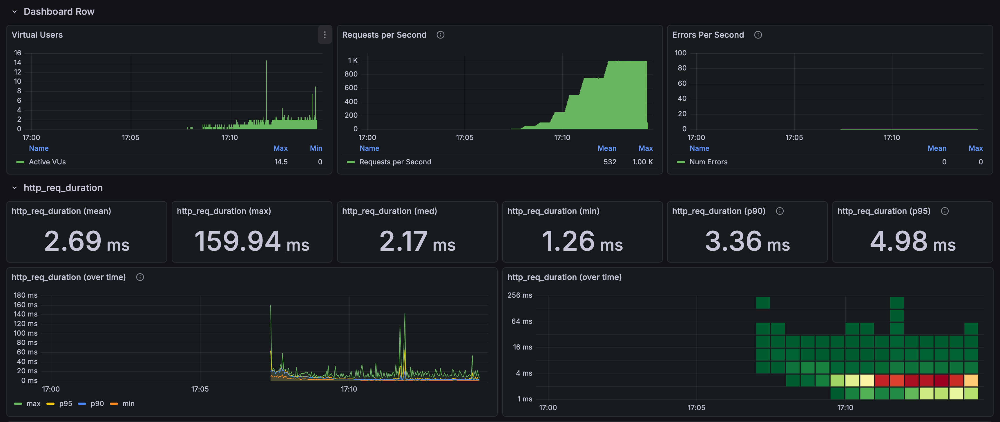
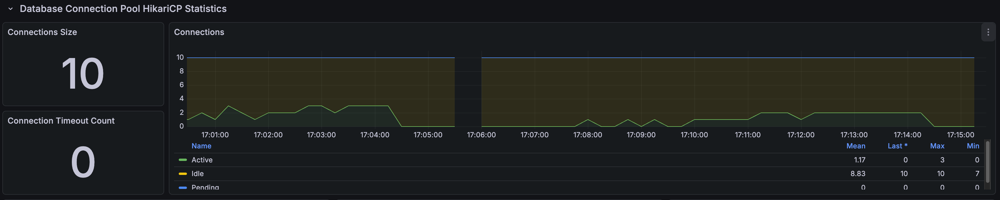
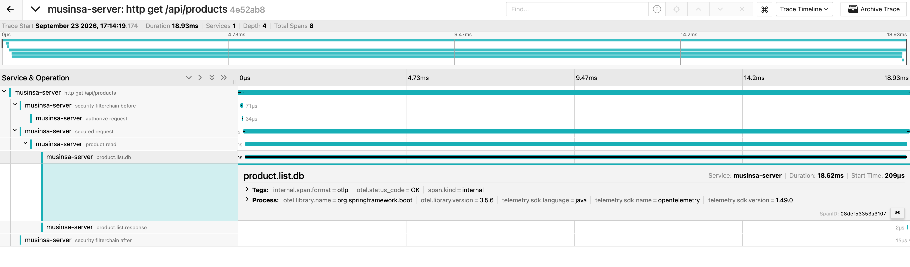

# Product scroll load results

[한국어](../../ko/load-tests/product-scroll.md) · [README](../../../README.md) · [Measurement setup](../environment.md)

Each VU followed the returned `nextCursor` through pages 1–5. 
One iteration requested one page. 
Completed the 1,000-RPS hold for 120s, with zero HTTP failures and no recorded drops.

Product scroll k6

---

## Test conditions

This is one final run from September 23, 2026. 
The planned seven-minute scenario ramps from a 10-RPS warm-up through 50/100/250/500/750/1,000 RPS, holding 1,000 for 120 seconds. 
Maximum VUs: 200; HTTP timeout: five seconds; Hikari limit: ten. 
APIs were not loaded simultaneously.

---

## Whole-run responses

| Response samples | Mean | p95 | Maximum |
| ---: | ---: | ---: | ---: |
| 224,564 | 2.69ms | 4.98ms | 159.94ms |

Whole-run results include warm-up and ramps. 
Distinguish them from stage tables and selected dashboard ranges.

---

## Results by load stage

| Hold stage | Hold duration | Response samples | Mean | p95 |
| --- | --- | --- | --- | --- |
| 50 RPS | 30s | 1,500 | 6.63ms | 9.40ms |
| 100 RPS | 30s | 2,999 | 4.71ms | 7.17ms |
| 250 RPS | 30s | 7,498 | 2.89ms | 4.23ms |
| 500 RPS | 30s | 14,997 | 2.33ms | 3.21ms |
| 750 RPS | 60s | 44,983 | 3.03ms | 4.72ms |
| 1,000 RPS | 120s | 119,967 | 2.44ms | 3.95ms |

---

## Per-page results at 1,000 RPS

| Page | Response samples | Mean | p95 |
| --- | --- | --- | --- |
| Page 1 | 23,994 | 2.72ms | 6.29ms |
| Page 2 | 23,995 | 2.43ms | 3.71ms |
| Page 3 | 23,998 | 2.29ms | 3.26ms |
| Page 4 | 23,997 | 2.23ms | 2.86ms |
| Page 5 | 23,983 | 2.51ms | 4.53ms |

---

## Connections and resources

Spring Boot / Hikari connection observations

These maxima come from one-second queries in the same run and need not coincide. 
System CPU is not MySQL-only CPU.

| Metric | Result in the same run |
| --- | --- |
| Hikari connection limit | 10 |
| Maximum Hikari active / pending | 10 / 7 |
| Connection timeout increase | 0 |
| Maximum JVM / system CPU | 10.44% / 77.66% |
| Maximum MySQL running threads | 3 |

Raw metrics were queried at one-second intervals across the run and immediate cleanup. 
The attached graph can use coarser resolution and miss brief pending peaks. 
A displayed pending=0 differs from the run's maximum; maxima across metrics need not occur simultaneously.

---

## Request trace sample

Jaeger request trace

| Span / timing | Time in the trace sample |
| --- | --- |
| HTTP total | 18.93ms |
| DB read call | 18.62ms |
| DB call start | 0.209ms after request start |

Each of pages 1–5 received approximately 24,000 requests, with no sequential latency increase through page five. 
This covers only those first five pages, not an entire deep traversal. 
The trace is one sample, and its DB-call span is not pure SQL time.

---

## Interpretation and measurement scope

This single-API test repeats fixed inputs and includes cache/JIT warm-up and shared local resources. 
Lower latency at a later, higher-load stage is not an improvement caused by higher load itself. 
HTTP 200 checks do not validate every response field. 
One trace does not represent the population mean/p95, and DB-call spans are not pure SQL execution time.

---

## Validated load range and limits

The run completed 1,000 RPS for 120 seconds. 
Higher load was not tested in this baseline, so maximum throughput is unestablished.
