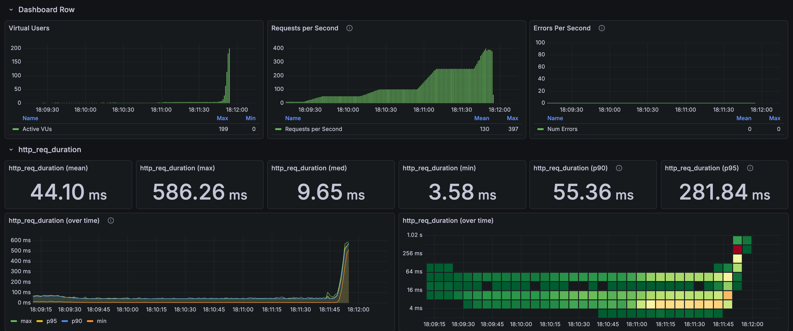
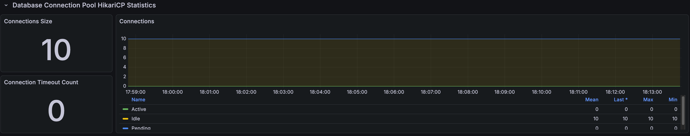
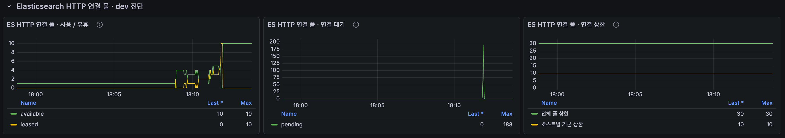
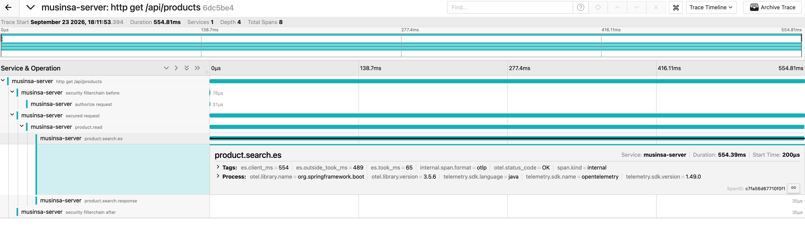

# Search load results

[한국어](../../ko/load-tests/product-search.md) · [README](../../../README.md) · [Measurement setup](../environment.md)

The first ten results were requested evenly for `스커트`, `블랙 스커트`, `나이키`, and `나이키 후드`. 
Completed the 250-RPS hold, then aborted during the ramp to 500 RPS: zero HTTP failures, 179 drops. 
ES HTTP limits were 30 total / ten per host. 
The 500-RPS hold and subsequent stages were not completed.

Search k6

---

## Test conditions

This is one final run from September 23, 2026. 
The planned seven-minute scenario ramps from a 10-RPS warm-up through 50/100/250/500/750/1,000 RPS, holding 1,000 for 120 seconds. 
Maximum VUs: 200; HTTP timeout: five seconds; Hikari limit: ten. 
Search aborted early with ES HTTP limits of 30 total / ten per host. 
APIs were not loaded simultaneously.

---

## Whole-run responses

| Response samples | Mean | p95 | Maximum |
| ---: | ---: | ---: | ---: |
| 21,728 | 44.03ms | 279.62ms | 586.26ms |

Whole-run results include warm-up and ramps. 
Distinguish them from stage tables and selected dashboard ranges.

---

## Results by load stage

| Stage | Response samples | Mean | p95 |
| --- | --- | --- | --- |
| 50 RPS hold | 1,500 | 16.91ms | 41.13ms |
| 100 RPS hold | 3,000 | 15.98ms | 39.95ms |
| 250 RPS hold | 7,500 | 15.39ms | 40.53ms |
| 250 → 500 RPS ramp, aborted | 5,229 | 132.05ms | 504.68ms |

---

## Connections and resources

Spring Boot / Hikari connection observations

These maxima come from one-second queries in the same run and need not coincide. 
System CPU is not MySQL-only CPU.

ES HTTP pool

| Metric | Result |
| --- | --- |
| Total / per-host connection limit | 30 / 10 |
| Maximum leased, screenshot | 10 |
| Maximum pending, screenshot | 188 |
| Maximum pending, 1-second query | 189 |
| Maximum Tomcat busy, source query | 199 |
| Maximum JVM / system CPU, source query | 11.70% / 95.99% |

Raw metrics were queried at one-second intervals across the run and immediate cleanup. 
The attached graph can use coarser resolution and miss brief pending peaks. 
A displayed pending=0 differs from the run's maximum; maxima across metrics need not occur simultaneously.

---

## Request trace sample

Search Jaeger

| Span / timing | Time in the trace sample |
| --- | --- |
| HTTP total | 554.81ms |
| ES search-call span | 554.39ms |
| es.client_ms | 554ms |
| es.took_ms | 65ms |
| es.outside_took_ms | 489ms |

Hikari pending was zero, but ES HTTP leased connections reached the per-host limit of ten and pending increased. 
All 489ms of outside time cannot be attributed to pool waiting. 
The k6 screenshot mean of 44.10ms and p95 of 281.84ms differ slightly from whole-run statistics because of its selected range. 
Later pool-100/150 and CPU experiments are separate runs in the [search investigation](../troubleshooting/search-capacity.md).

---

## Interpretation and measurement scope

This single-API test repeats fixed inputs and includes cache/JIT warm-up and shared local resources. 
Lower latency at a later, higher-load stage is not an improvement caused by higher load itself. 
HTTP 200 checks do not validate every response field. 
One trace does not represent the population mean/p95, and DB-call spans are not pure SQL execution time.

Hikari active/pending were both zero with no connection-timeout increase. 
ES available=10 and leased=0 after completion indicate returned connections. 
`took` is server-side elapsed time; `outside=client−took` mixes pool waiting, transfer, and response handling. 
Per-host limits and downstream search capacity are the next investigation targets; system CPU is not ES-only CPU.

---

## Validated load range and limits

With 30/10 connections, search completed the 250-RPS hold and aborted during the ramp to 500. 
This does not establish 250 as the exact maximum. 
Later pool-expansion diagnostics also failed to complete the target workload; see the [search investigation](../troubleshooting/search-capacity.md). 
No new capacity experiment was run before changing queries or document modeling.
