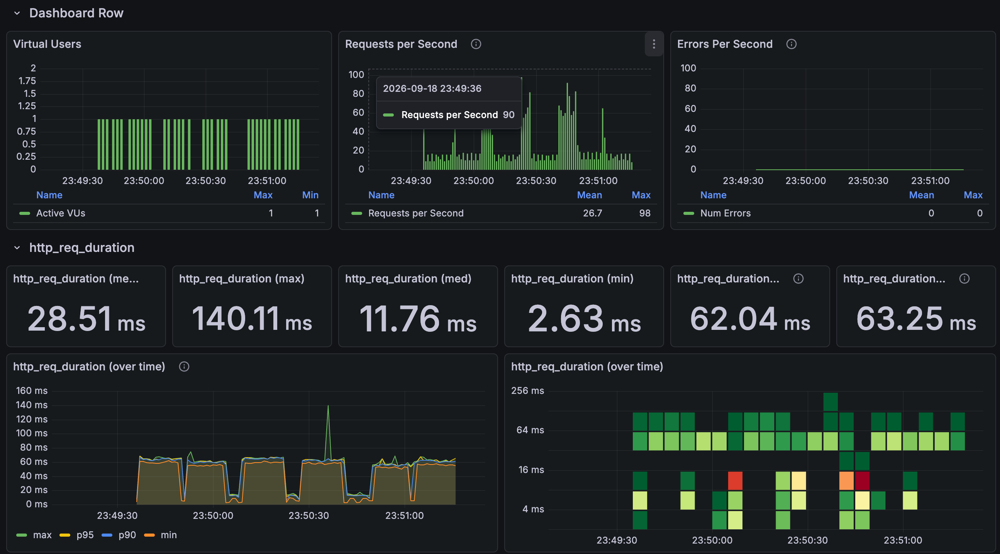
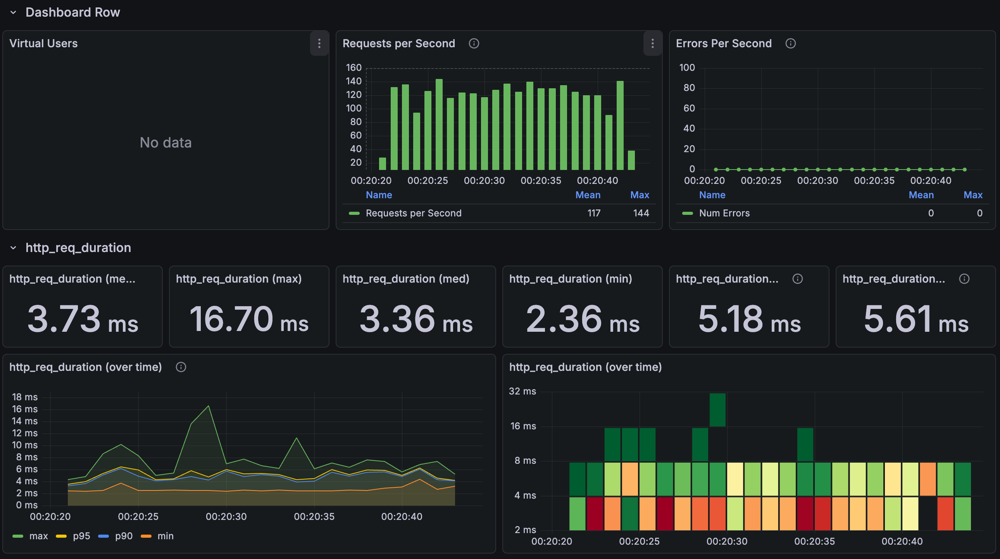
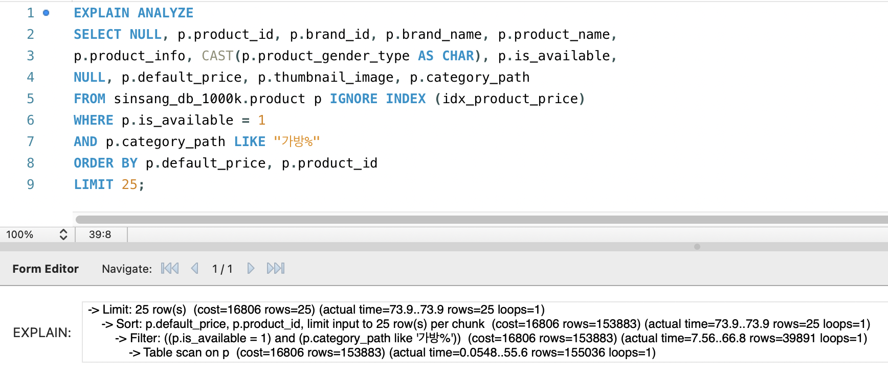
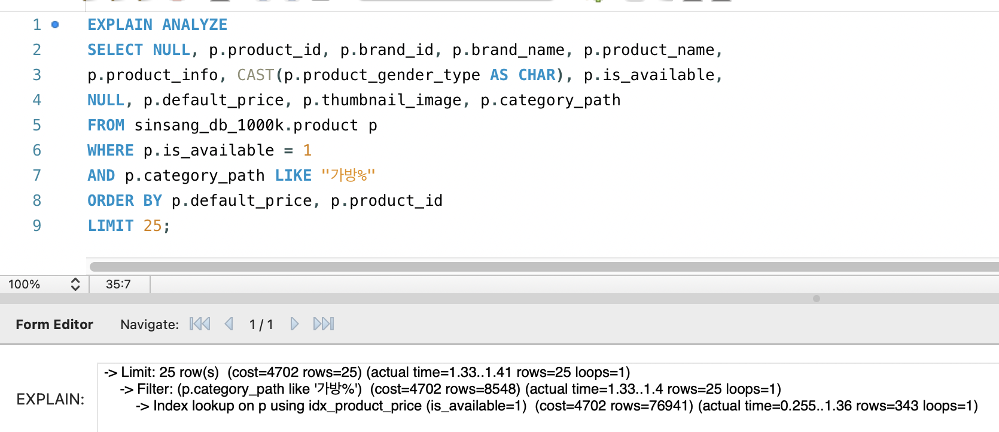

# 상품 필터: 실행 계획으로 검증한 복합 인덱스

[English](../../en/improvements/filter-indexes.md) · [README](../../../README.ko.md) · [공통 측정 환경](../environment.md)

---

## 문제와 비교 조건

기본 ID순 목록과 가격순 목록은 필요한 접근 경로가 다르다.<br>
필터로 후보를 줄이는 것만으로는 가격순 상위 24개를 싸게 찾는다고 보장할 수 없어, 필터·정렬을 함께 만족하는 복합 인덱스를 비교했다.

`GET /api/products?limit=24`의 첫 페이지를 사용하며 SQL은 다음 페이지 확인용으로 최대 25개를 읽는다.<br>
필터 10종 × 기본 ID·최저가·최고가 정렬 3종, 총 30개 조건이다.<br>
카테고리는 가방, 최종은 토트백, 복수는 토트백·크로스 백, 브랜드는 고정 1개, 성별은 공용 `ALL`이다.<br>
ALL은 필터 생략이 아니다.<br>
단일 카테고리 접두어·복수 IN 조건은 유지했다.

조건별 첫 요청 1회 → 워밍업 4회 → 본 측정 30회를 3번 반복한다.<br>
실행당 본 측정 2,700건·준비 포함 3,150건, 추가 3회는 상태별 8,100건·준비 포함 9,450건이다.<br>
인덱스 제거 상태에서도 PK·유니크·외래키 유지용 브랜드 단일 인덱스는 남겼다.

---

## 적용한 인덱스

```sql
CREATE INDEX idx_product_price
    ON product (is_available, default_price, product_id);
CREATE INDEX idx_product_brand_price
    ON product (brand_id, is_available, default_price, product_id);
```

조회 코드는 고정하고 위 두 인덱스를 함께 적용했다.<br>
카테고리 후보는 최종안에서 제외했다.

---

## 반복 측정 결과

단위 ms.<br>
추가 3회 통합값과 기존 화면을 포함한 통합값을 구분한다.

| 구분 | 변경 전 평균 | 변경 전 p95 | 변경 후 평균 | 변경 후 p95 |
| --- | --- | --- | --- | --- |
| 최초 화면 | 28.51 | 63.25 | 3.73 | 5.61 |
| 추가 1회 | 31.15 | 64.33 | 8.35 | 11.20 |
| 추가 2회 | 31.57 | 65.28 | 8.14 | 11.04 |
| 추가 3회 | 30.17 | 63.28 | 7.94 | 11.08 |
| 추가 3회 통합 | 30.96 | 64.45 | 8.14 | 11.12 |
| 화면 포함 4회 통합 | 30.35 | 64.21 | 7.04 | 10.81 |

추가 3회 평균 30.96→8.14ms, 73.7% 감소다.<br>
모든 본 측정은 HTTP 200이었다.<br>
통합 p95는 회차 p95의 평균이 아니라 요청별 원본을 합쳐 다시 계산했다.<br>
기존 화면의 변경 후 3.73ms보다 추가 실행 8.35·8.14·7.94ms가 높았으며 원인을 분리 검증하지 않았다.

인덱스 변경 전 k6



인덱스 변경 후 k6



---

## 조건·정렬별 반복 결과

추가 3회만 합쳤으며 조건별 전후 각각 270건이다.<br>
단위 ms.<br>
조건 비중은 동일하며 실제 트래픽 비중이 아니다.

| 조건 / 정렬 | 전 mean (ms) | 전 p95 (ms) | 후 mean (ms) | 후 p95 (ms) |
| --- | --- | --- | --- | --- |
| 필터 없음 / 기본 ID순 | 8.33 | 12.03 | 7.50 | 10.21 |
| 필터 없음 / 최저가순 | 63.08 | 67.30 | 7.29 | 10.21 |
| 필터 없음 / 최고가순 | 63.30 | 66.59 | 7.87 | 10.36 |
| 상위 카테고리 / 기본 ID순 | 9.71 | 12.64 | 9.38 | 11.74 |
| 상위 카테고리 / 최저가순 | 59.53 | 63.07 | 8.36 | 10.51 |
| 상위 카테고리 / 최고가순 | 59.27 | 62.17 | 7.96 | 10.34 |
| 브랜드 / 기본 ID순 | 7.99 | 10.38 | 7.49 | 10.01 |
| 브랜드 / 최저가순 | 14.07 | 17.16 | 7.64 | 9.99 |
| 브랜드 / 최고가순 | 14.07 | 17.43 | 7.37 | 9.41 |
| 성별 / 기본 ID순 | 7.71 | 10.03 | 7.20 | 9.72 |
| 성별 / 최저가순 | 63.56 | 66.97 | 7.64 | 10.24 |
| 성별 / 최고가순 | 63.79 | 67.05 | 7.49 | 11.19 |
| 상위 카테고리 + 브랜드 / 기본 ID순 | 8.31 | 11.58 | 9.36 | 11.74 |
| 상위 카테고리 + 브랜드 / 최저가순 | 13.89 | 16.90 | 7.19 | 9.65 |
| 상위 카테고리 + 브랜드 / 최고가순 | 13.80 | 16.26 | 7.74 | 10.07 |
| 상위 카테고리 + 성별 / 기본 ID순 | 9.58 | 11.66 | 9.29 | 12.01 |
| 상위 카테고리 + 성별 / 최저가순 | 61.30 | 65.24 | 7.93 | 11.12 |
| 상위 카테고리 + 성별 / 최고가순 | 62.28 | 68.44 | 7.76 | 10.53 |
| 브랜드 + 성별 / 기본 ID순 | 7.48 | 10.43 | 7.73 | 10.43 |
| 브랜드 + 성별 / 최저가순 | 14.17 | 18.03 | 7.13 | 9.83 |
| 브랜드 + 성별 / 최고가순 | 13.87 | 16.54 | 7.41 | 10.07 |
| 상위 카테고리 + 브랜드 + 성별 / 기본 ID순 | 8.39 | 11.09 | 9.27 | 11.33 |
| 상위 카테고리 + 브랜드 + 성별 / 최저가순 | 14.49 | 17.12 | 7.96 | 10.41 |
| 상위 카테고리 + 브랜드 + 성별 / 최고가순 | 13.95 | 16.79 | 7.78 | 10.35 |
| 최종 카테고리 / 기본 ID순 | 10.02 | 13.17 | 9.62 | 12.00 |
| 최종 카테고리 / 최저가순 | 54.85 | 58.51 | 8.28 | 10.78 |
| 최종 카테고리 / 최고가순 | 55.61 | 59.70 | 8.34 | 11.45 |
| 복수 카테고리 / 기본 ID순 | 10.86 | 13.84 | 10.20 | 13.04 |
| 복수 카테고리 / 최저가순 | 60.87 | 64.57 | 8.81 | 11.09 |
| 복수 카테고리 / 최고가순 | 60.79 | 64.40 | 9.27 | 12.38 |

가격 정렬의 감소가 컸지만 기본 ID순 일부 조건은 소폭 증가했다.<br>
모든 조건이 개선됐다고 해석하지 않는다.

---

## 실행 계획: 읽는 행과 정렬 작업의 변화

가방·하위 카테고리의 가격·ID 오름차순, LIMIT 25다.<br>
가격 인덱스 미사용은 `IGNORE INDEX (idx_product_price)`로 비교했다.

가격 인덱스 미사용 실행 계획



가격 인덱스 사용 실행 계획



| 항목 | 인덱스 미사용 | 인덱스 사용 |
| --- | --- | --- |
| Workbench 기록 actual time (ms) | 0.05..73.9 | 0.25..1.41 |
| 표기된 종료 시간 비교 | 73.9ms | 1.41ms — 98.09% 감소 |
| 조회 방식 | 상품 테이블 전체 스캔 | 가격 복합 인덱스 범위 탐색 |
| 스캔 단계 actual rows | 155,036행 | 343행 — 99.78% 감소 |
| 필터 통과 actual rows | 39,891행 | 25행 |
| 별도 정렬 대상 | 필터를 통과한 39,891행 | 없음 — 가격순 인덱스 활용 |
| 최종 반환 | 25개 | 25개 |

인덱스에서 가격순으로 읽다가 조건을 만족한 25개를 확보하면 멈춰, 읽은 행은 155,036→343개로 줄고 별도 정렬이 사라졌다.<br>
위 actual time은 단일 SQL 실행 계획이며 전체 API 평균 30.96→8.14ms와 다르다.<br>
행 수는 동일 조건의 확인 기록, 시간은 첨부 재실행 화면의 값이다.

---

## 왜 이 인덱스를 선택했는가

`is_available`을 고정한 뒤 가격·상품 ID 순서로 읽는 경로와, 브랜드·판매상태를 고정한 뒤 가격순으로 읽는 경로를 제공한다.<br>
최고가순은 가격·ID가 모두 내림차순이므로 역방향 탐색을 활용할 수 있다.<br>
기존 브랜드 단일 인덱스는 브랜드 필터만 돕고 가격 정렬까지 제공하지 못했다.

기본 ID순은 기존 PK로도 앞부분을 찾을 수 있어 같은 감소 폭을 기대하지 않는다.<br>
카테고리·성별 조건이 드물면 필요한 25개를 찾기 위해 더 많은 행을 읽는다.<br>
두 인덱스의 개별 기여도는 분리하지 않았다.

<br>

### 카테고리 후보를 제외한 이유

`(is_available, category_path, default_price, product_id)`는 경로마다 가격순으로 정렬된다.<br>
여러 하위 경로를 포함하는 접두어 조회의 전체 가격순을 그대로 제공하지 못한다.<br>
가방 조건에서 가격 인덱스는 343행으로 25개를 찾았지만 카테고리 인덱스를 강제한 진단은 39,891행을 정렬 단계로 보냈다.<br>
이 숫자는 인덱스 조건 이후 출력 행 수이지 모든 인덱스 검사 횟수는 아니다.

토트백의 같은 4,707개 후보·상위 25개 결과로 비교한 진단은 다음과 같다.

| 조건 | 선택 인덱스 | 읽은 행 → 반환 |
| --- | --- | --- |
| LOWER + LIKE | 가격 | 730 → 25 |
| LOWER 없이 LIKE | 가격 | 730 → 25 |
| LOWER + 일치 | 가격 | 730 → 25 |
| LOWER 없이 일치 | 카테고리 복합 | 25 → 25 |

LOWER만 제거하면 해결된다는 결과가 아니다.<br>
최종 카테고리 일치 조건에서는 효용이 있었지만 상위·하위 카테고리를 함께 찾는 기능을 유지한 최종안에는 채택하지 않았다.

---

## 트레이드오프와 측정 한계

인덱스는 저장·버퍼풀 공간과 쓰기 유지 비용을 추가한다.<br>
모든 조합에 인덱스를 만들지 않고 두 가격 경로만 우선했다.<br>
판매상태 단독 선택도가 높아서 빨라졌다고 설명하지 않으며 정렬·LIMIT까지 함께 본다.<br>
브랜드 복합 인덱스가 FK 지원 단일 인덱스를 대체했지만 외래키 제약은 유지했다.

같은 실행 중인 서버·복원 DB에서 제거 상태 3회→적용 상태 3회 순서로 실행했다.<br>
서버·DB 재시작이나 캐시 비우기 없이 워밍업했고 MySQL 버퍼풀 256MiB, 기존 SQL 로그·관측 설정을 유지했다.<br>
쓰기 비용·응답 본문 정확성·깊은 페이지·동시 부하는 별도다.<br>
측정 후 두 최종 인덱스를 복원하고 카테고리 후보가 없는 상태를 확인했다.
