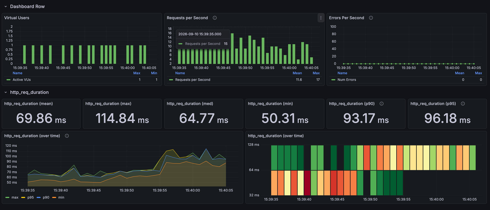

# 상품 스크롤: COUNT 제거와 keyset 페이지네이션

[English](../../en/improvements/list-keyset.md) · [README](../../../README.ko.md) · [공통 측정 환경](../environment.md)

---

## 문제와 비교 조건

무한 스크롤에는 정확한 전체 건수보다 다음 페이지가 있는지가 필요했다.<br>
대표 가격 저장이 적용된 기존 구현에도 COUNT와 OFFSET이 남아 있어, 첫 페이지에는 전체 개수 계산이, 깊은 페이지에는 앞부분을 건너뛰는 비용이 발생했다.

판매 가능 상품을 ID 오름차순으로 24개씩 조회했다.<br>
아래 같은 위치의 커서를 미리 준비했으며, 첫 페이지부터 5,000페이지를 실제로 연속 이동한 시험은 아니다.

| 비교 위치 | OFFSET 건너뛰기 | 준비한 커서 |
| --- | --- | --- |
| page 0 | 0개 | 없음 — 첫 페이지 |
| page 100 | 2,400개 | 2454 |
| page 1000 | 24,000개 | 24700 |
| page 5000 | 120,000개 | 123177 |

위치별 첫 요청 1회 → 워밍업 4회 → 본 측정 30회를 3번 반복했다.<br>
스크립트 1회는 본 측정 360건·준비 포함 420건이며, 추가 실행 3회는 버전별 본 측정 1,080건이다.<br>
같은 최종 복원 DB를 사용했다.

---

## 반복 측정 결과

| 구분 | 변경 전 평균 | 변경 전 p95 | 변경 후 평균 | 변경 후 p95 |
| --- | --- | --- | --- | --- |
| 최초 화면 | 69.86ms | 96.18ms | 19.26ms | 25.02ms |
| 추가 1회 | 74.90ms | 98.94ms | 17.51ms | 22.48ms |
| 추가 2회 | 73.82ms | 98.63ms | 16.17ms | 18.86ms |
| 추가 3회 | 73.70ms | 97.22ms | 15.88ms | 17.95ms |
| 추가 3회 통합 | 74.14ms | — | 16.52ms | — |

추가 3회는 74.14→16.52ms, 77.7% 감소다.<br>
최초 화면은 통합에서 제외했다.<br>
회차 번호가 혼동되지 않도록 화면과 추가 실행을 구분했다.

<br>

### 깊이별 평균

| 비교 위치 | OFFSET 평균 | Keyset 평균 |
| --- | --- | --- |
| page 0 | 65.23ms | 16.86ms |
| page 100 | 64.90ms | 16.46ms |
| page 1000 | 70.69ms | 16.63ms |
| page 5000 | 95.75ms | 16.13ms |

COUNT·OFFSET 화면



Keyset 화면


---

## 왜 빨라졌는가

COUNT는 개수를 구하는 연산이고 풀스캔은 실행 방법이다.<br>
모든 기존 SQL이 풀스캔했다고 설명하지 않는다.<br>
OFFSET도 인덱스가 있다고 배열 위치처럼 바로 이동하는 것은 아니며 실제 읽는 양은 실행 계획과 필터에 따라 달라진다.

변경 후에는 마지막 정렬값 다음 범위에서 `limit + 1`개를 읽는다.<br>
24개를 반환하고 25번째 존재 여부로 `hasNext`를 판단한다.<br>
아래는 깊이 1,000의 개념 예시다.

```sql
-- Before
SELECT COUNT(*) FROM product WHERE is_available = true;
SELECT ... FROM product WHERE is_available = true
ORDER BY product_id ASC LIMIT 24 OFFSET 24000;

-- After
SELECT ... FROM product
WHERE is_available = true AND product_id > 24700
ORDER BY product_id ASC LIMIT 25;
```

COUNT 제거는 첫 페이지의 비용도 줄이고, Keyset은 적절한 인덱스가 있을 때 앞부분을 건너뛰는 비용을 줄인다.<br>
두 변경을 함께 적용했으므로 77.7%를 Keyset 하나의 효과로 분리하지 않는다.<br>
가격·재고 변경은 이미 양쪽에 적용돼 있었고 이미지 조회는 남아 있었다.

---

## 선택과 트레이드오프

- `totalCount=null`, `hasNext`, `nextCursor`를 반환한다.<br>
  전체 페이지 수와 100페이지로 바로 이동하는 기능을 포기하고 순차 탐색을 선택했다.<br>
  무한 스크롤은 UI 동작, Keyset은 조회 방식이다.
- 가격이 같은 상품은 가격 외 고유 ID를 커서에 넣어야 한다.<br>
  정렬·비교 방향이 맞아야 하고 필터·정렬 변경 시 기존 커서를 재사용하지 않아야 한다.<br>
  이번 측정은 ID순이며 가격 커서 검증은 별도다.
- 드문 필터 조건과 맞지 않는 인덱스에서는 여전히 많은 행을 검사할 수 있다.<br>
  가격·판매 상태가 바뀌면 결과 위치도 달라지므로 여러 요청에 걸친 동일 스냅샷을 보장하지 않는다.
- 클라이언트는 페이지 번호 대신 다음 커서를 전달하고 `hasNext=false`에서 멈춰야 한다.<br>
  잘못된 커서, 마지막 페이지, 중복 요청과 실제 프론트 흐름은 후속 검증이다.

전체 평균은 네 위치를 같은 표본 수로 합친 값이다.<br>
짧은 실행에서는 주기 수집 VU 그래프가 비어도 요청별 지연값은 기록될 수 있으므로 설정과 표본 수를 함께 확인한다.<br>
최대 처리량 측정은 아니다.
