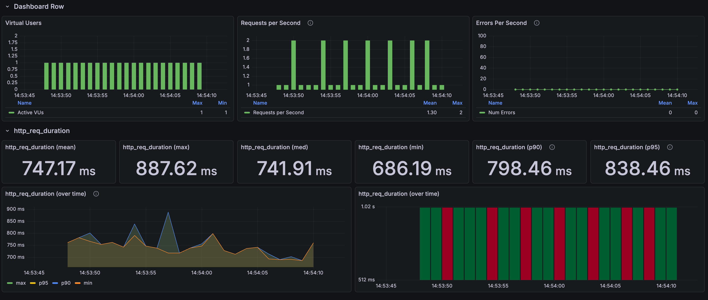
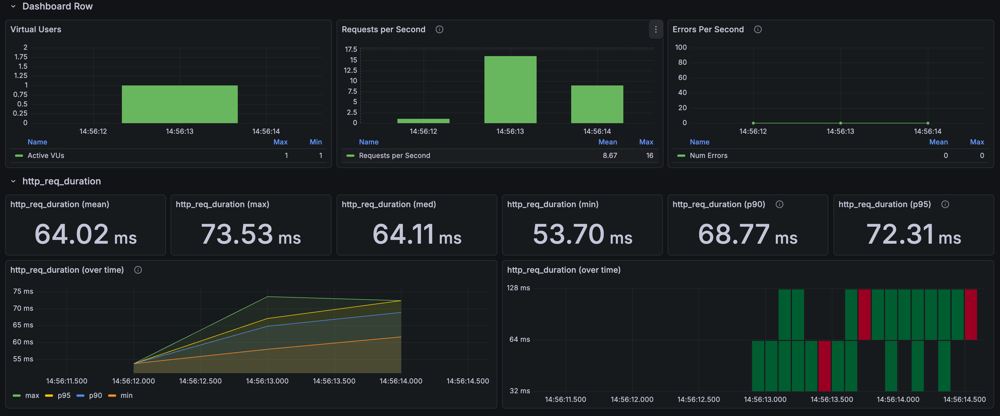

# 상품 목록: 대표 가격 저장과 재고 계산 제거

[English](../../en/improvements/list-price.md) · [README](../../../README.ko.md) · [공통 측정 환경](../environment.md)

---

## 문제와 비교의 조건

목록에는 대표 가격 하나가 필요하지만 기존 응답 조립은 상품별 옵션·재고 관계를 따라 최저가와 재고 유무를 계산했다. 
첫 페이지 상품 24개에 연결된 데이터를 읽는 비용이며, 1,116만 옵션 전체를 매 요청 읽었다는 뜻은 아니다.

요청은 `GET /api/products?page=0&size=24`로, 검색어·가격 정렬이 없는 일반 목록이다. 
버전별 첫 요청 1회 → 추가 워밍업 4회 → 1 VU 본 측정 30회를 한 묶음으로 3번 실행했다. 
버전별 준비 포함 105건, 본 측정 90건이다. 
본 측정은 모두 HTTP 200이었다.

같은 최종 복원 DB를 두 구현에 연결하고 MySQL 버퍼풀은 256MiB로 유지했다. 
버전 전환 시 앱은 재시작했지만 반복 사이 서버·DB를 재시작하거나 DB 캐시를 비우지는 않았다. 
과거 당시의 DB·인덱스 환경까지 복원한 비교는 아니다.

---

## 반복 측정 결과

| 구분 | 변경 전 평균 | 변경 전 p95 | 변경 후 평균 | 변경 후 p95 |
| --- | --- | --- | --- | --- |
| 추가 1회 | 852.25ms | 955.68ms | 63.88ms | 73.83ms |
| 추가 2회 | 880.45ms | 1,032.82ms | 63.15ms | 70.65ms |
| 추가 3회 | 848.70ms | 957.91ms | 62.16ms | 66.78ms |
| 최초 화면 | 747.17ms | 838.46ms | 64.02ms | 72.31ms |
| 추가 3회 통합 | 860.47ms | — | 63.06ms | — |

추가 3회 평균 860.47→63.06ms, 92.7% 감소다. 
최초 화면은 통합 평균에서 제외했다. 
추가 실행 p95는 k6, 최초 화면 p95는 Grafana 표시값이다. 
p95를 단순 평균해 전체 p95로 제시하지 않는다.

목록 변경 전

목록 변경 후

---

## 왜 느렸고 무엇을 줄였는가

기존 매퍼는 재고가 있는 옵션 중 최저가를 찾고, 재고가 있는 옵션이 없으면 전체 옵션 중 최저가를 반환했다. 
`hasStock`도 별도로 계산했다. 
지연 로딩된 관계에 접근하면서 추가 SQL, DB 왕복, 결과 수신, 객체 생성과 변환이 반복될 수 있는 구조였다.

변경 후에는 상품의 `default_price`를 읽고 목록의 재고 계산을 제거했다. 
이 두 값을 위한 옵션·재고 순회를 줄인 것이다. 
대표 가격 저장과 재고 계산 제거의 합산 효과이며, SQL·객체 생성 등 각 비용의 시간 비중은 분리 측정하지 않았다. 
가격 정렬도 대표 가격 컬럼을 사용하도록 바뀌었지만 이번 요청에는 가격 정렬이 없어 그 효과를 포함하지 않는다.

요청 횟수가 고정된 1 VU 테스트이므로 빨라지면 같은 요청 수가 더 빨리 끝난다. 
실행 시간이 짧아진 것은 측정 누락이나 최대 처리량 증가를 뜻하지 않는다. 
COUNT·OFFSET·상품별 이미지 조회는 이 비교 시점에 남아 있었다.

---

## 선택과 트레이드오프

- 원본과 대표값의 정합성: 상품 등록과 더 저렴한 옵션 추가 시 대표가격을 설정·낮추는 구현은 확인했다. 
  모든 가격·재고 변경에서 자동 갱신된다는 뜻은 아니다.
- 가격 하락과 상승은 다르다: 옵션이 10,000원·12,000원일 때 9,000원 옵션 추가는 비교로 처리할 수 있다. 
  기존 10,000원 옵션이 삭제되거나 13,000원이 되면 나머지를 확인해 12,000원으로 다시 계산해야 한다. 
  품절·재입고와 전체 품절의 표시 정책도 필요하다.
- 갱신 시점: 같은 트랜잭션에서 함께 갱신하면 일관성을 유지하기 쉽지만 쓰기·잠금·동시 갱신 비용이 생긴다. 
  비동기·배치는 오래된 값 노출과 실패 복구를 감수한다. 
  두 방식의 비용은 이번에 비교하지 않았다.
- 응답 계약 변경: `hasStock`은 재고 유무에서 `null`로 바뀐다. 
  품절 표시가 필요한 클라이언트에는 대안이 필요하므로 모든 응답 의미를 유지한 최적화로 설명하지 않는다.

---

## 한계와 후속 검증

측정 데이터는 모두 재고가 있어 가격 상승·삭제·품절·재입고·동시 갱신 경계를 검증하지 못했다. 
상세, 깊은 페이지, 가격 정렬과 동시 부하는 별도다. 
다음 변화인 [COUNT 제거와 keyset](list-keyset.md)은 이 대표가격 변경이 적용된 상태에서 비교했다.
