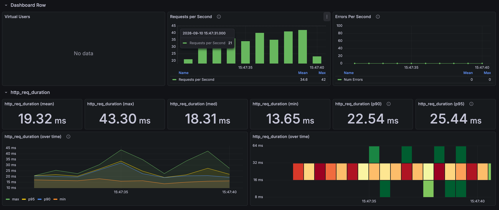
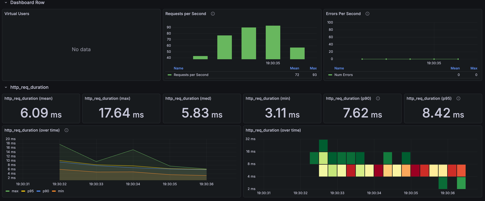

# 상품 목록: 썸네일 저장과 DTO 직접 조회

[English](../../en/improvements/list-thumbnail-dto.md) · [README](../../../README.ko.md) · [공통 측정 환경](../environment.md)

---

## 문제와 비교 조건

대표 가격과 Keyset이 적용된 후에도 목록은 Product 엔티티를 읽고 각 상품의 이미지 목록에서 썸네일을 찾은 뒤 DTO로 옮겼다.<br>
이미지 관계가 미로딩 상태면 추가 SQL이 발생한다.<br>
기존에도 DTO는 있었으며, 이번 변경은 DTO를 만드는 경로다.

판매 가능 상품을 ID순 24개씩, 첫 페이지와 깊이 100·1,000·5,000에 대응하는 고정 커서로 조회했다.<br>
위치별 첫 호출 1회 → 워밍업 4회 → 본 측정 30회를 3번 반복했다.<br>
실행당 360건, 추가 3회는 버전별 1,080건이다.<br>
변경 전은 [Keyset 추가 측정](list-keyset.md)을 재사용했다.<br>
이미지 다운로드나 브라우저 렌더링은 포함하지 않는다.

---

## 반복 측정 결과

| 구분 | 변경 전 평균 | 변경 전 p95 | 변경 후 평균 | 변경 후 p95 |
| --- | --- | --- | --- | --- |
| 최초 화면 | 19.32ms | 25.44ms | 6.09ms | 8.42ms |
| 추가 1회 | 17.51ms | 22.48ms | 5.35ms | 7.92ms |
| 추가 2회 | 16.17ms | 18.86ms | 4.73ms | 6.22ms |
| 추가 3회 | 15.88ms | 17.95ms | 4.20ms | 5.36ms |
| 추가 3회 통합 | 16.52ms | — | 4.76ms | — |

추가 3회 평균은 16.52→4.76ms, 71.2% 감소다.<br>
최초 화면은 제외했다.<br>
변경 후 1,080건은 HTTP 실패 0건이며 InfluxDB 요청별 응답시간으로 평균·p95를 집계했다.<br>
이미 실행 중이던 서버에서 캐시를 비우지 않아 변경 후 평균이 5.35→4.73→4.20ms로 내려가는 변동도 있다.<br>
기존 결과를 재사용한 순차 비교라 예열·실행 순서 영향을 완전히 분리하지 못했다.

변경 전 Keyset 경로의 관측 화면



썸네일·DTO 변경 후



*원본 페이지가 재사용한 변경 전 이미지는 Keyset 화면(19.26ms)이다.<br>
DTO 페이지의 최초 기록 표는 19.32ms로 달라, 두 값을 같은 집계로 맞추지 않았다.<br>
둘 다 추가 3회 평균에서는 제외된다.*

---

## 왜 빨라졌는가

```text
변경 전: DB → Product 엔티티 → 이미지 목록·썸네일 탐색 → ProductSummary → JSON
변경 후: DB의 필요한 컬럼 → ProductSummary → JSON
```

썸네일 역정규화는 원본 이미지 테이블을 유지하면서 URL 하나를 상품의 `thumbnail_image`에도 저장한다.<br>
이미지 파일 복사가 아니다.<br>
등록·수정 시 썸네일 표시 이미지를 우선하고 없으면 첫 이미지를 선택한다.

DTO 직접 조회는 DB에서 받은 컬럼으로 애플리케이션이 `ProductSummary`를 생성하는 방식이다.<br>
DB가 Java 객체를 만드는 것이 아니며 DTO 생성·JSON 직렬화는 남는다.<br>
목록의 중간 Product 엔티티와 이미지 탐색을 줄였다.<br>
QueryDSL은 엔티티도 DTO도 조회할 수 있으므로 문법 교체 자체의 효과로 해석하지 않는다.

```java
// Simplified projection; the actual response contains more fields.
.select(Projections.constructor(
    ProductSummary.class,
    product.productId,
    product.productName,
    product.defaultPrice,
    product.thumbnailImage
)).from(product)
```

썸네일 저장과 DTO 직접 조회는 각각 따로 적용할 수 있지만 이번에는 함께 변경했다.<br>
SQL 횟수·객체 할당·GC의 감소량이나 각각의 기여율은 측정하지 않았다.<br>
DTO에는 설명 등 여러 컬럼이 남아 있어 응답 크기 최소화 실험도 아니다.<br>
기존 매퍼 메서드가 남아 있는 것과 실제 목록 경로에서 호출하는 것은 다르다.

---

## 선택과 트레이드오프

- 썸네일 중복 저장: 기존 데이터 초기 적재, 대표 이미지 교체·삭제·동시 수정 시 원본과 요약 URL을 맞춰야 한다.<br>
  그렇지 않으면 목록과 상세 이미지가 달라진다.
- 조회와 응답 결합: DTO 생성자의 필드 순서·타입과 조회 컬럼을 함께 관리해야 한다.<br>
  응답 변경에 저장소 수정이 필요할 수 있다.
- 기본값과 갱신 의미: 기존 매퍼의 `defaultPrice=null → 0` 처리가 직접 조회에 자동 적용되지는 않는다.<br>
  DTO 값 변경도 DB 갱신이 아니다.<br>
  null·누락과 정상 데이터 모두 응답 계약을 확인해야 한다.

상품 ID·순서·개수·가격·URL·커서의 동등성과 이미지 SQL 감소는 별도 확인 대상이다.<br>
대표가격·COUNT 제거·Keyset은 양쪽 공통 조건이므로 이번 개선에 다시 합산하지 않는다.
