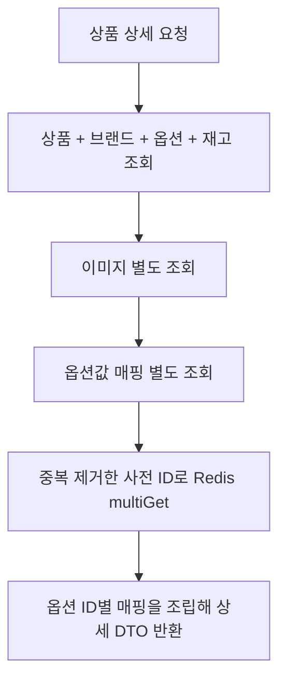

# 상세 조회: 정보는 유지하고 관계를 읽는 방법을 바꾸기

[English](../../en/improvements/product-detail.md) · [README](../../../README.ko.md) · [공통 측정 환경](../environment.md)

---

## 문제와 비교 조건

첫 상세 응답은 해당 상품의 모든 옵션·가격·재고·옵션값을 반환한다. 
사용자가 옵션을 클릭하지 않아도 이 조회·조립 비용은 발생한다. 
기존에는 상품·브랜드·이미지를 함께 읽은 뒤, 매퍼가 옵션·재고·옵션값 관계를 따라 추가 SQL을 실행할 수 있었다. 
필요한 정보가 잘게 나뉘어 반복되는 문제였다.

처음 선정한 상품 5개를 고정했다. 
아래 번호는 문서 안에서 표본을 구분하는 이름이다.

| 상품 | 옵션 수 | 이미지 수 |
| --- | --- | --- |
| 상품 1 | 60 | 1 |
| 상품 2 | 72 | 1 |
| 상품 3 | 65 | 1 |
| 상품 4 | 67 | 1 |
| 상품 5 | 72 | 1 |

상품별 첫 요청 1회 → 워밍업 4회 → 본 측정 30회를 3번 반복했다. 
실행당 본 측정 450건·준비 포함 525건이고, 추가 3회는 버전별 본 측정 1,350건·준비 포함 1,575건이다. 
HTTP 실패는 0건이다. 
JSON API 응답을 측정하며 이미지 다운로드나 옵션 클릭은 포함하지 않는다.

Redis의 옵션 사전·카테고리 적재가 끝난 뒤 측정했다. 
두 버전 모두 Java 21·힙 6GiB·`TieredStopAtLevel=1`·dev 프로필로 실행했다. 
버전 전환 시 앱을 재시작했지만 DB·Redis 캐시를 비우지 않았고 변경 전→후 순서로 실행했다. 
최초 IntelliJ 화면은 추가 실행 집계와 구분한다.

---

## 반복 측정 결과

| 구분 | 변경 전 평균 | 변경 전 p95 | 변경 후 평균 | 변경 후 p95 |
| --- | --- | --- | --- | --- |
| 추가 1회 | 71.33ms | 89.70ms | 9.75ms | 13.21ms |
| 추가 2회 | 70.69ms | 87.94ms | 8.36ms | 9.50ms |
| 추가 3회 | 68.41ms | 80.94ms | 8.62ms | 10.61ms |
| 최초 화면 | 67.44ms | 82.59ms | 9.71ms | 12.43ms |
| 추가 3회 통합 | 70.14ms | — | 8.91ms | — |

추가 3회 통합 평균 70.14→8.91ms, 87.3% 감소다. 
첫 호출·워밍업·별도 응답 검증 요청은 본 측정에서 제외했다. 
평균과 p95는 InfluxDB 요청별 응답시간으로 집계했다.

 

### 상품별 평균

각 상품의 추가 3회 본 측정 270건을 합친 값이다.

| 상품 | 변경 전 평균 | 변경 후 평균 |
| --- | --- | --- |
| 상품 1 | 63.49ms | 9.27ms |
| 상품 2 | 74.01ms | 9.14ms |
| 상품 3 | 68.52ms | 8.51ms |
| 상품 4 | 69.41ms | 8.75ms |
| 상품 5 | 75.30ms | 8.86ms |

상세 조회 변경 전

상세 조회 변경 후

측정 밖에서 같은 상품 5개의 JSON 필드·값·배열 순서를 비교했고 일치했다. 
k6 본 측정에서는 JSON 파싱·전체 본문 검증을 하지 않았다. 
캐시 장애나 모든 데이터 분포의 정확성까지 보장하는 확인은 아니다.

---

## 변경한 조회 흐름

기존에는 상품·브랜드·이미지를 fetch join한 뒤 옵션, 재고, 옵션값 관계를 따라가며 응답을 만들었다. 
변경 후에도 상세는 엔티티를 사용하지만, 조회와 조립 순서를 명시했다.

옵션과 이미지는 서로 독립적인 컬렉션이다. 
한 쿼리로 모두 조인하면 옵션 수와 이미지 수에 따라 결과 행이 곱해질 수 있어 이미지를 분리했다. 
단, 이번 표본은 상품당 이미지가 한 장이므로 여러 이미지에서의 행 증폭 감소 효과를 직접 측정한 것은 아니다.

색상·사이즈 이름은 반복해서 사용하는 사전 데이터다. 
중복 ID를 제거해 Redis에서 일괄 조회하고 옵션 ID별로 묶은 매핑과 합친다. 
가격·재고와 상품 응답 전체를 캐시한 것은 아니다.

---

## 왜 이 경로가 비용을 줄이는가

옵션 60개의 재고를 개별적으로 읽는다면 작은 SQL도 여러 번 반복된다. 
이는 연관 관계 탐색에서 발생할 수 있는 N+1 형태지만, 실제 SQL 수는 매핑·로딩 상태에 따라 달라지므로 응답시간만으로 특정 횟수라고 단정하지 않는다. 
함께 읽을 관계를 명시하고, 매핑을 옵션 ID별로 묶고, 중복 제거한 사전 ID를 `multiGet`으로 가져와 반복 탐색을 줄였다.

이미지 3개와 옵션 60개를 한 SQL에서 나란히 조인하면 180행이 될 수 있다. 
분리하면 이 곱셈을 피할 수 있지만, 이번 표본은 이미지가 모두 1개여서 다중 이미지의 행 증폭 감소는 직접 측정하지 않았다. 
여러 SQL의 왕복과 결과 행 수 사이에서 선택한 구조다.

상세는 여전히 엔티티를 읽고 Java에서 DTO를 조립한다. 
목록의 직접 DTO projection과 다르다. 
두 버전 모두 Redis 초기 적재는 하지만 기존 상세는 사전을 DB에서, 변경 후 상세는 Redis에서 읽었다. 
상세의 `categoryPath`는 상품 값이므로 카테고리 트리 캐시 효과로 설명하지 않는다. 
조회 분리·fetch join 범위·사전 캐시를 함께 바꾼 결과다.

---

## 선택과 대안

| 선택 | 얻는 점 | 부담·제약 |
| --- | --- | --- |
| 이미지·매핑 조회 분리 | 관계별 데이터 양을 통제하고 반복 탐색 감소 | DB 왕복과 애플리케이션 조립 증가 |
| 사전 데이터 Redis 일괄 조회 | 반복되는 이름·값 조회를 한 번에 처리 | Redis 가용성·초기화·정합성 의존 |
| 가격·재고 DB 조회 유지 | 상세의 변동 데이터는 DB에서 읽음 | 완성 응답 캐시처럼 DB 작업 전체를 없애지는 않음 |

사전은 60개 항목으로 작다. 
DB에서 옵션값을 함께 조인하거나 애플리케이션 메모리에 사전을 보관하는 방식도 후보이며, 이번 실험은 이 대안들을 비교하지 않았다. 
조회 구조와 캐시를 함께 변경했으므로 87.3%를 Redis만의 효과로 설명하지 않는다.

현재 사전 조회에는 DB fallback과 TTL이 없고, 캐시 값이 없으면 관련 이름·값이 `null`이 될 수 있다. 
운영 적용 전 초기화, 누락·장애 대응, 갱신 정책을 결정해야 한다. 
전체 상품 응답 캐시와 Caffeine은 이후 검토 대상으로, 구현 성과에 포함하지 않는다.

 

### 여러 결과를 합칠 때의 정확성

옵션 ID와 사전 ID를 잘못 연결하면 다른 옵션값이 붙거나 누락된다. 
배열 순서·이미지 정렬도 보존해야 한다. 
여러 SQL 사이의 일관성은 트랜잭션·격리 수준의 영향을 받는다. 
Redis 연결 실패는 요청 실패가 될 수 있고, 연결이 살아 있어도 사전 누락은 null 응답을 만들 수 있다. 
준비된 캐시에서의 결과와 장애 동작을 구분한다.

 

### Redis와 DB 조인의 구체적인 비교 대상

설명용으로 색상 10개·사이즈 10개라면 사전 값 20개, 옵션 100개, 매핑 200행이다. 
현재 방식은 매핑 200행과 Redis 사전 20개를 읽어 결합한다. 
매핑에 옵션값을 조인하는 대안은 200행에 문자열을 붙여 받아 Redis 왕복을 없앤다. 
한 매핑은 한 사전 값에 연결되므로 이 조인은 여러 컬렉션의 곱과 다르다.

DB도 버퍼풀에 있는 데이터를 메모리에서 읽으므로 반복 값마다 디스크·별도 SQL을 읽는다고 가정하지 않는다. 
반대로 중복 문자열 전송과 조인 비용은 남는다. 
다른 조회 구조를 고정하고 매핑·사전 조회만 바꿔 같은 응답·워밍업·반복으로 비교해야 한다. 
차이가 작으면 운영·코드 단순성도 선택 기준이다. 
[Redis·메모리·DB 후속 비교](../future-work.md)는 아직 수행 전이다.

---

## 해석 범위

실행 순서·예열을 완전히 분리하지 않았고 SQL별 시간·객체 할당·GC·캐시 장애·다중 이미지·동시 부하는 따로 측정하지 않았다. 
변경 후 관측용 클래스와 `@Observed`도 추가됐지만 기존 OTLP·트레이싱 비활성 설정을 유지했으며 관측 비용 기여도는 분리하지 않았다.

---

## 고부하에서의 후속 확인

최적화된 상세도 부하가 높아지면 연결을 기다렸다. 
1,000 RPS 기준 측정과 Hikari·Tomcat 비교는 조건이 다른 후속 실험이다. 
[기준 부하 결과](../load-tests/product-detail.md)와 [연결 풀 트러블슈팅](../troubleshooting/hikari.md)에서 구분해 설명한다.

현재 구현: [ProductQueryService](../../../src/main/java/com/mudosa/musinsa/product/application/ProductQueryService.java) · [ProductQueryMapper](../../../src/main/java/com/mudosa/musinsa/product/application/mapper/ProductQueryMapper.java)
