# 검색 설계: 상품명 문자열에서 옵션과 검색 의도로

[English](../../en/improvements/product-search.md) · [README](../../../README.ko.md) · [공통 측정 환경](../environment.md)

상품명에 검색어가 연속으로 포함돼야 하는 LIKE는 색상·종류·브랜드가 서로 다른 필드에 있는 의도를 표현하기 어려웠다. 
옵션 관계를 보존하며 여러 필드에서 검색하고 관련도순으로 반환하기 위해 ES를 선택했다. 
아래에는 속도뿐 아니라 달라진 결과와 그 비용을 함께 기록한다.

---

## 비교 시나리오

`스커트`, `블랙 스커트`, `나이키`, `나이키 후드`를 같은 횟수로 호출했다. 
요청은 `GET /api/products?limit=10&keyword=검색어`이며 첫 페이지 10개다. 
검색어마다 첫 요청 1회 → 워밍업 4회 → 본 측정 30회를 3번 반복했다. 
실행당 본 측정 360건·준비 포함 420건, 추가 3회는 방식별 1,080건이며 HTTP 실패는 0건이었다.

추가 실행은 ES→LIKE 순서였고 버전별 앱 재시작은 했지만 DB·ES 캐시는 비우지 않았다. 
k6 본 측정에서는 JSON 본문 검증을 하지 않고 HTTP 성공을 확인했다. 
결과 화면은 별도 관측이다.

---

## 반복 측정 결과

| 구분 | 변경 전 평균 | 변경 전 p95 | 변경 후 평균 | 변경 후 p95 |
| --- | --- | --- | --- | --- |
| 추가 1회 | 89.96ms | 174.35ms | 25.75ms | 60.19ms |
| 추가 2회 | 90.19ms | 175.78ms | 22.95ms | 54.48ms |
| 추가 3회 | 89.91ms | 176.34ms | 22.37ms | 53.50ms |
| 최초 화면 | 87.06ms | 168.54ms | 22.14ms | 47.06ms |
| 4회 산술평균 | 89.28ms | 173.75ms | 23.30ms | 53.81ms |

회차별 평균의 산술평균은 89.28→23.30ms, 73.9% 감소다. 
마지막 행의 p95 173.75·53.81ms는 회차별 p95의 산술평균이며 전체 요청을 합친 p95가 아니다.

추가 3회는 InfluxDB 요청별 값으로 집계했다. 
최초 ES 화면은 도입 직후 복원 시점, 추가 실행은 응답 필드 제한·브랜드 검색 필드 수정 후다. 
따라서 네 회차는 같은 코드의 독립 반복이 아니다. 
두 방식은 매칭·정렬도 달라 동일 결과 집합의 알고리즘만 교체한 비교로 해석하지 않는다.

LIKE 최초 k6 화면

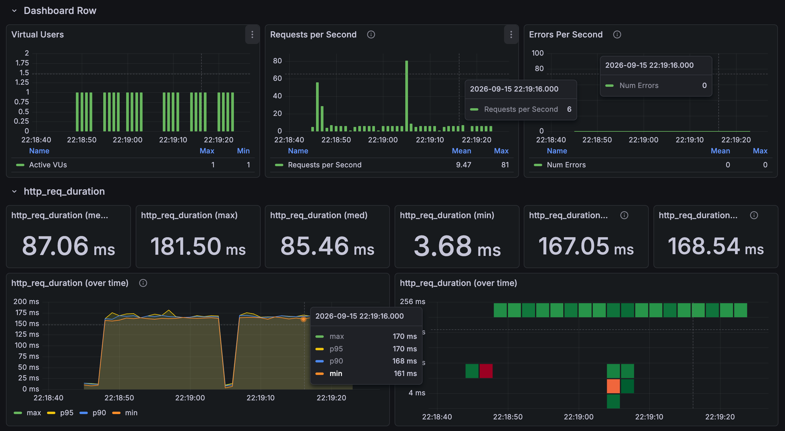

ES 최초 k6 화면

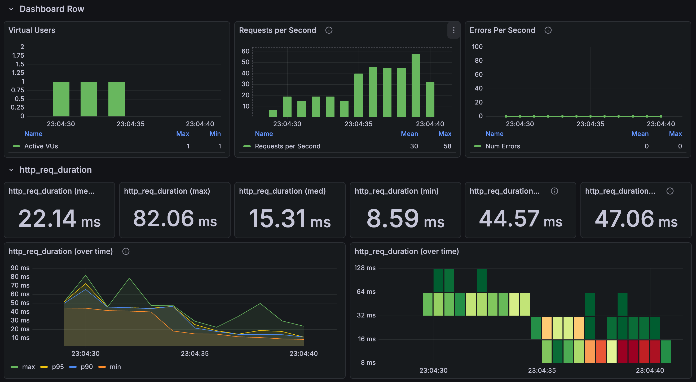

---

## 검색 결과에서 확인한 차이

화면은 해당 검색어의 예시이며 검색 품질의 정량 평가를 대신하지 않는다. 
설명은 상품의 실제 매칭 필드를 화면만으로 확정하지 않는 범위에서 해석했다.

스커트: LIKE / Elasticsearch

LIKE는 상품명 포함 조건의 ID순이고 ES는 카테고리 등 관련도가 순서에 영향을 준다. 
상품명 반복 횟수만으로 BM25 순위가 정해지는 것은 아니다.

스커트 LIKE 결과

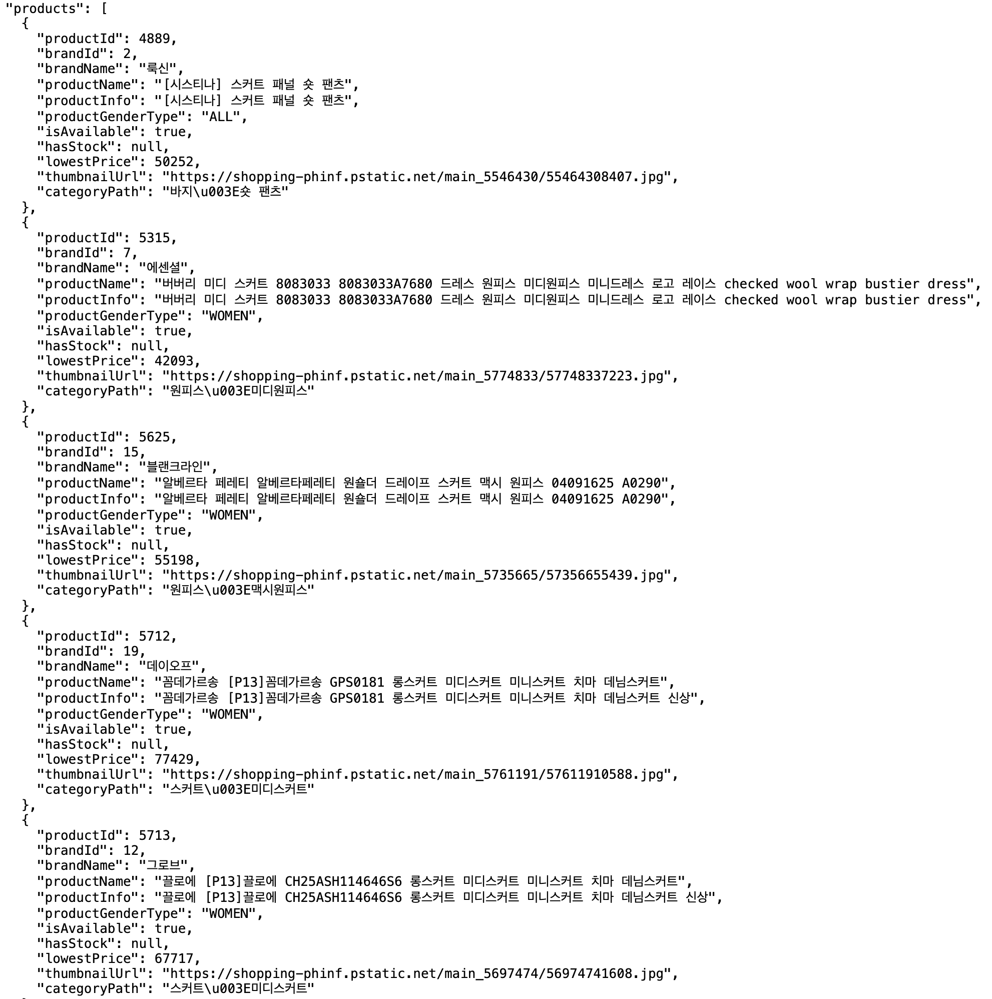

스커트 ES 결과

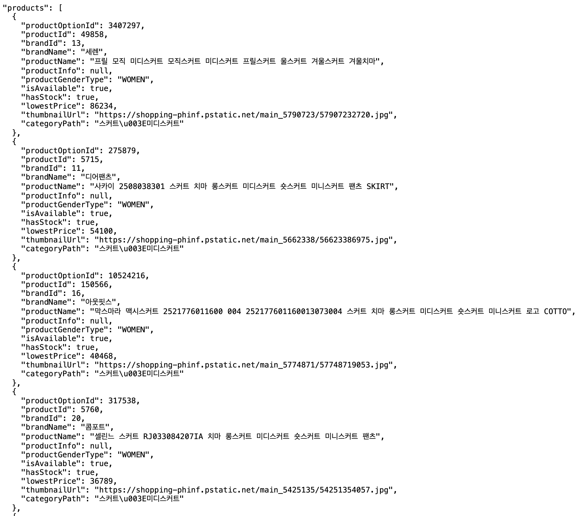

블랙 스커트: LIKE / Elasticsearch

LIKE는 연속 문자열이 없어 결과가 없었다. 
ES는 블랙·스커트를 각각 검색해 결과를 반환했다. 
어느 필드의 매칭인지는 별도 explain이 필요하다.

블랙 스커트 LIKE 결과

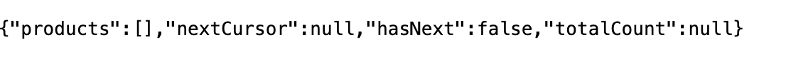

블랙 스커트 ES 결과

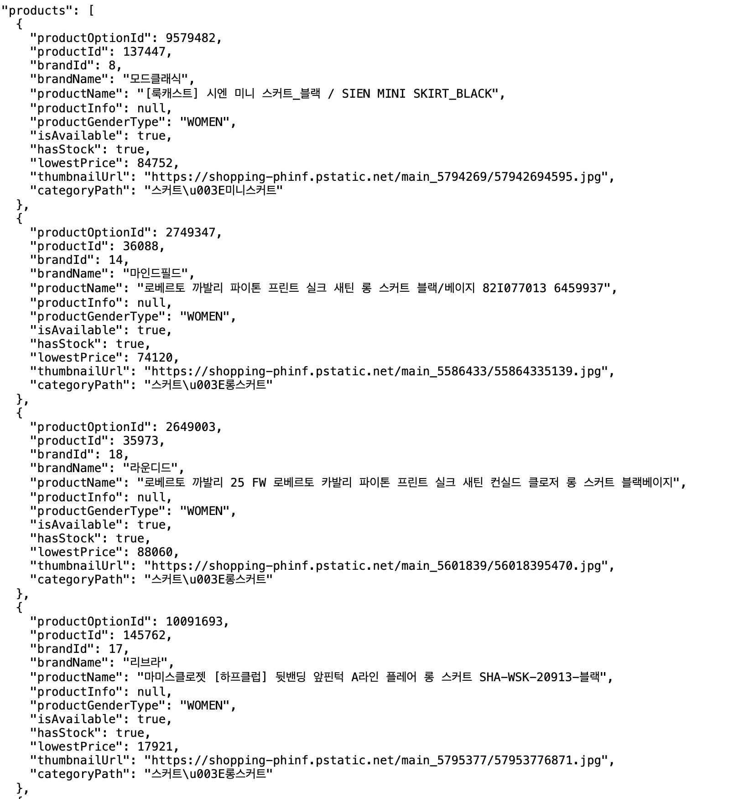

나이키: LIKE / Elasticsearch

LIKE는 상품명 포함으로, ES는 여러 필드 점수로 결과를 반환한다. 
브랜드 원본에는 판매 업체가 섞여 있어 공식 브랜드 정확성을 보장하지 않는다.

나이키 LIKE 결과

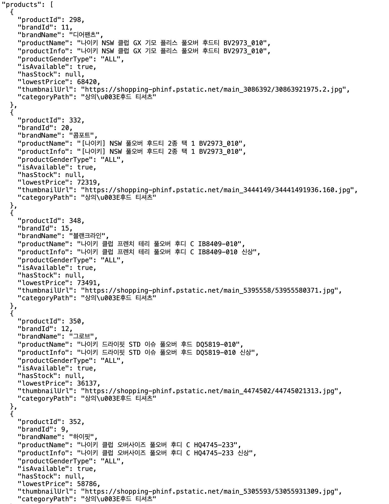

나이키 ES 결과

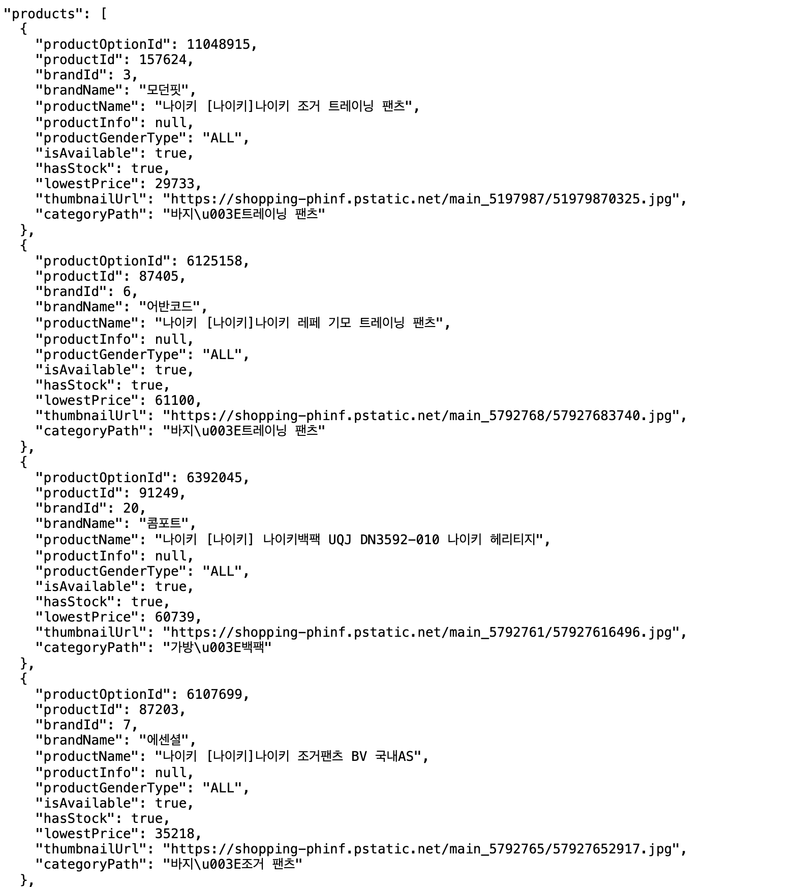

나이키 후드: LIKE / Elasticsearch

LIKE는 나이키 클럽 후드처럼 중간 단어가 있는 제목을 놓칠 수 있다. 
현재 ES에서는 후드 카테고리 점수가 더해져 상품명 점수가 더 높은 다른 결과보다 앞설 수 있었다.

나이키 후드 LIKE 결과

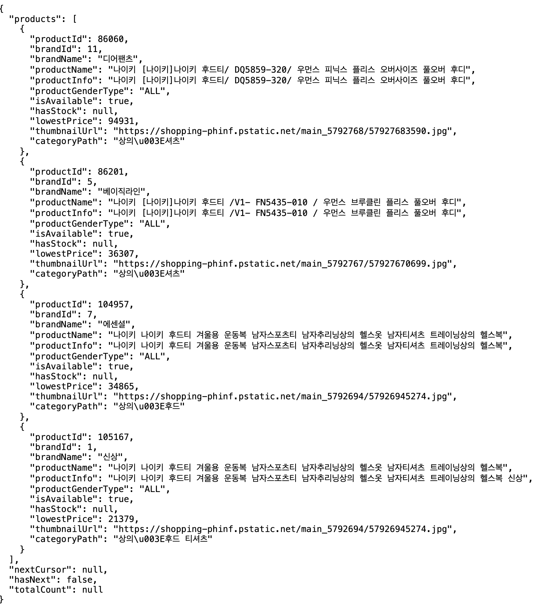

나이키 후드 ES 결과

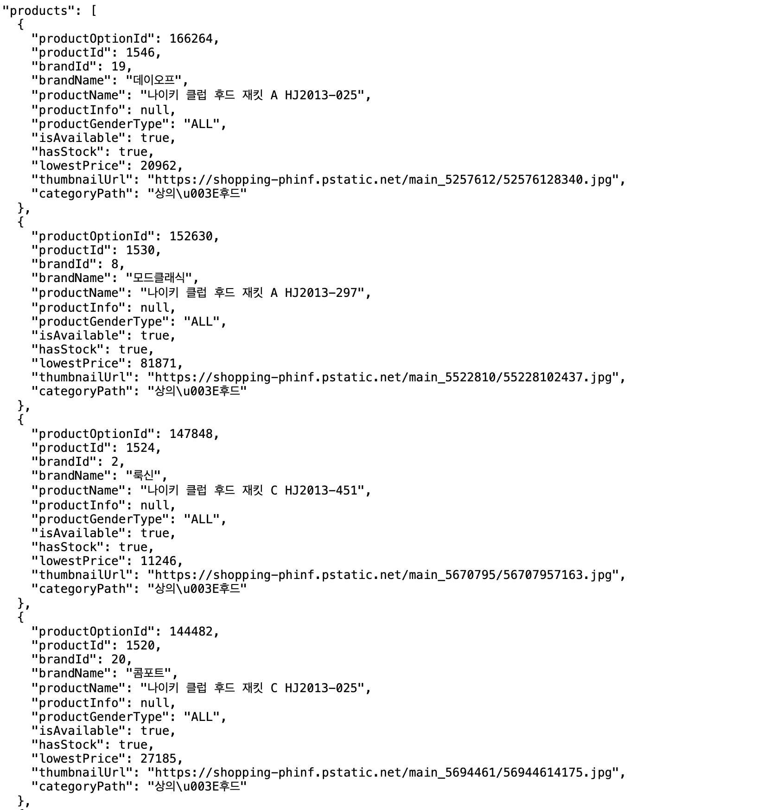

---

## 문서 단위: 옵션 하나당 문서 하나

상품 아래 색상·사이즈 목록만 평탄하게 모으면 실제로 없는 색상·사이즈 조합을 같은 상품에서 찾을 수 있다. 
판매 가능한 옵션의 관계를 유지하기 위해 옵션별로 문서를 만들고, 재고·판매 여부를 필터링한 뒤 `productId`로 collapse해 상품 단위 결과를 반환한다.

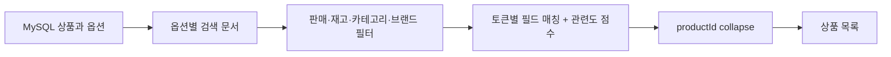

옵션을 개별 갱신할 수 있지만 상품명·브랜드 등 공통 정보가 반복된다. 
상품 정보 변경 시 여러 문서를 갱신해야 하고, 약 15만 상품이 약 1,100만 옵션 문서로 확대된다. 
상품 문서에 nested 옵션을 두는 대안은 검색 비용뿐 아니라 옵션 변경 시 재색인 비용도 비교해야 한다. 
아직 전환·비교하지 않았다.

상품명·브랜드·대표 가격·썸네일을 ES 응답에서 받아 목록의 DB 재조회를 줄인다. 
썸네일은 검색어 매칭용이 아니며 이번 기준 매핑의 keyword 설정을 유지했다. 
재고·판매 필터가 있다고 DB 변경이 자동으로 동기화되는 것은 아니다.

---

## 분석기·멀티필드와 변경 비용

| 필드 | 설정 | 이유 |
| --- | --- | --- |
| productName / krBrandName | text + nori_default | 한글을 분석해 단어 단위로 검색 |
| enBrandName | text | 영문 브랜드 검색 |
| categoryPath | keyword + text 하위 필드(nori_default) | 경로 필터링과 카테고리 단어 검색을 함께 지원 |
| colorOptions / sizeOptions | keyword + text 하위 필드(nori_color / nori_size) | 원래 옵션 값과 동의어를 적용한 검색 표현을 함께 보관 |

`nori_default`는 Nori tokenizer → 품사 필터 → 읽기형 변환 → 소문자 변환을 사용한다. 
색상·사이즈는 소문자화 뒤 동의어 확장·품사·읽기형 필터를 적용하고 검색에는 `nori_default`를 사용한다. 
예를 들어 블랙·black·검정색·blk, M·미디엄·medium을 연결한다. 
색인 시 동의어이므로 규칙 변경을 기존 문서에 적용하려면 재색인이 필요하다.

멀티필드는 같은 값을 keyword와 text로 다르게 색인하는 설정이며 여러 필드를 질의하는 `multi_match`와는 별개다.

---

## 매칭 조건과 점수의 역할 분리

Nori·동의어 분석을 사용하고, 정확한 필터용 필드와 텍스트 검색 필드를 구분한다. 
각 입력 토큰은 상품명·카테고리·색상·사이즈·브랜드 중 적어도 한 필드에 맞아야 한다. 
이 토큰 조건들을 `must`로 묶는다. 
여기에 전체 검색어의 필드별 매칭을 `should`로 추가해 순위를 조절한다.

| 전체 검색어 매칭 필드 | boost | 선택 이유 |
| --- | ---: | --- |
| 카테고리·색상 | 3 | 상품 종류와 옵션 속성을 우선 |
| 상품명 | 2 | 의미가 있지만 판매 문구가 섞임 |
| 사이즈·한글/영문 브랜드 | 1 | 보조 단서; 수집 브랜드에 판매자 정보가 섞임 |

토큰별 필수 매칭에는 이 boost를 별도로 적용하지 않는다. 
가중치는 사용자 로그나 정답 집합으로 최적화한 값이 아닌 초기 설계 가정이다. 
색상이 항상 브랜드보다 중요하다고 일반화하지 않는다.

전체 검색어 필드별 가중치

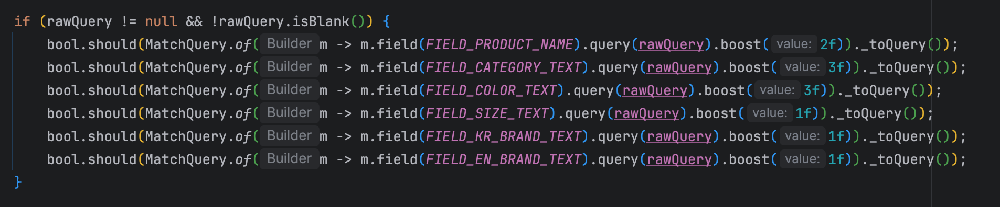

수집 데이터에서 설명이 상품명과 같은 레코드가 131,962개였다. 
중복 설명을 검색에 추가하면 정보보다 중복 매칭이 늘 수 있어 제외했다. 
수집 제목의 판매 문구와 부정확한 속성은 검색 엔진만으로 해결되지 않는 데이터 품질 문제다.

구체적인 상품명·카테고리 점수의 순위 역전 사례는 [검색 품질 트러블슈팅](../troubleshooting/search-quality.md)에 분리했다. 
가중치는 고정 순위 번호가 아니라 점수 배수이며 잘못된 카테고리·브랜드 원본 자체를 교정하지 않는다.

---

## 왜 결과와 응답시간이 달라졌는가

LIKE는 상품명 부분 문자열과 ID순, ES는 형태소·동의어·다중 필드 매칭과 관련도순이다. 
색상과 종류를 조합하는 표현력을 위해 바꿨으며 이번 관측에서는 지연도 줄었다. 
다만 LIKE 실행 계획이 풀스캔이었다거나 ES 내부 특정 연산이 몇 ms를 줄였다고 입증한 실험은 아니다. 
빈 결과가 빠를 수 있어 네 검색어를 같은 비율로 비교했다.

---

## 샤드 1개 진단

샤드 1개 진단 화면

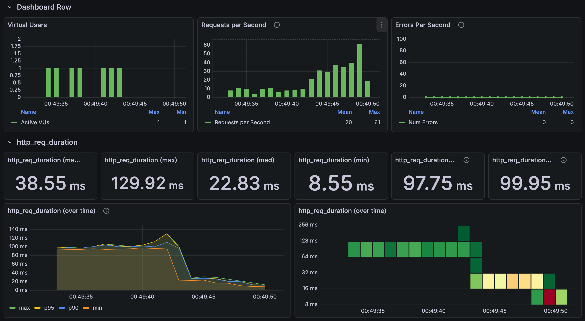

샤드 1개 화면은 평균 38.55ms·p95 99.95ms, 샤드 2개 최초 화면은 22.14ms·47.06ms였다. 
각각 약 1.74배·2.12배 높았다. 
한 노드에서도 샤드별 병렬 처리가 가능하지만, 매핑·분석기·데이터·캐시·재색인 후 병합 조건까지 통제했는지 확인하지 못했다. 
독립적인 샤드 수 효과로 확정하지 않고 LIKE/ES 4회 평균에서도 제외했다. 
기준 인덱스로 되돌렸다.

---

## 운영 설정과 트레이드오프

| 설정 | 측정 기준 | 의미와 트레이드오프 |
| --- | --- | --- |
| 인덱스 | product | 원본 문서·분석기를 사용한 기준 인덱스 |
| number_of_shards | 2 | 한 노드에서도 샤드별 검색 병렬 처리가 가능하지만 결과 병합·관리 비용도 발생 |
| number_of_replicas | 0 | 단일 노드 측정 환경. 같은 샤드의 복제본은 동일 노드에 배치되지 않으며, 장애 시 대체 복제본은 없음 |
| refresh_interval | 10s | 쓰기 이후 검색 노출까지의 지연과 refresh 비용의 절충. 이번 고정 데이터 읽기 측정에서는 효과를 분리 검증하지 않음 |
| index.queries.cache.enabled | true | 캐시 대상이 되는 필터 결과의 문서 집합을 재사용. 검색 결과 전체나 모든 검색어 응답을 저장하는 캐시는 아님 |

refresh 10초는 MySQL을 10초마다 읽는 동기화가 아니다. 
Query cache의 hit/miss·사용량도 확인하지 않아 이번 개선 원인으로 단정하지 않는다. 
LIKE보다 검색 표현력을 얻지만 별도 ES 운영·색인·재색인과 데이터 변경 전파·실패 재처리를 관리해야 한다. 
옵션 문서의 공통 정보 중복, collapse·결과 병합 비용도 남는다.

---

## 현재 제약과 다음 판단

검색은 목록의 keyset과 달리 `from/size`를 사용하며 커서는 페이지 번호다. 
Collapse와 현재 정렬의 제약은 [검색 페이지네이션](../troubleshooting/search-pagination.md)에 정리했다. 
검색 결과의 정확한 고유 상품 수를 제공한다고 보장하지 않으며 깊은 페이지 비용도 남아 있다.

DB→ES 변경 전파·복구는 별도의 검증 대상이다. 
인덱스 refresh 주기를 설정한 것만으로 DB 동기화를 보장하지 않는다. 
측정 인덱스는 2 shards·0 replicas인 로컬 구성으로 고가용성 환경을 대표하지 않는다.

고부하에서는 연결 수를 늘린 뒤에도 CPU·검색 큐 부담이 남았다. 
[검색 병목 조사](../troubleshooting/search-capacity.md)에서 쿼리 비용과 로컬 자원 경쟁의 근거·미확정 부분을 다룬다. 
현재 쿼리는 [ProductIndexSearchQueryRepositoryImpl](../../../src/main/java/com/mudosa/musinsa/product/infrastructure/search/repository/ProductIndexSearchQueryRepositoryImpl.java)에서 확인할 수 있다.
