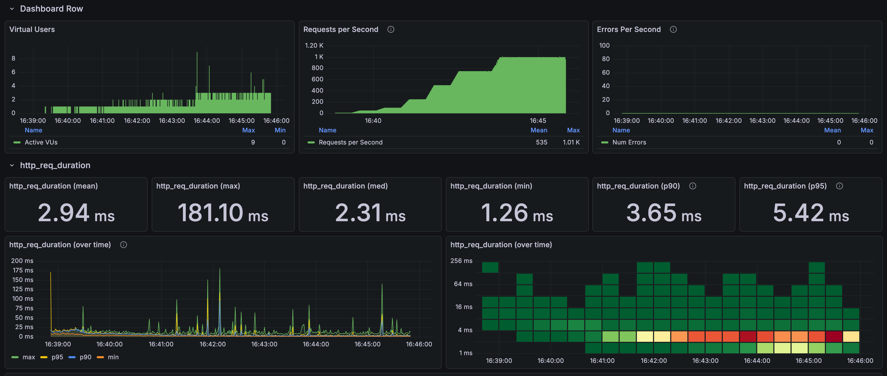
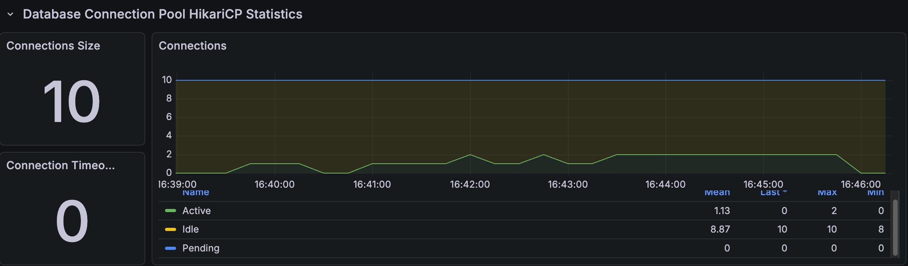
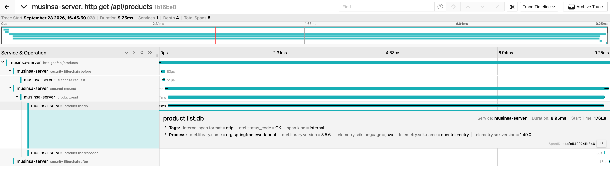

# 상품 목록 고부하 결과

[English](../../en/load-tests/product-list.md) · [README](../../../README.ko.md) · [공통 측정 환경](../environment.md)

목록은 검색어·필터·가격 정렬 없이 첫 24개를 반복했다. 
1,000 RPS 120초 유지 완료, HTTP 실패 0건·drop 기록 없음.

상품 목록 k6

---

## 측정 조건

2026년 9월 23일 최종 실행 1회다. 
7분 예정 시나리오는 10 RPS 워밍업부터 50·100·250·500·750·1,000 RPS로 증가하며, 마지막 1,000 RPS는 120초 유지한다. 
VU 상한 200, HTTP timeout 5초, Hikari 상한 10이다. 
다른 API와 동시에 호출한 부하는 아니다.

---

## 전체 실행 응답

| 응답 표본 수 | 평균 | p95 | 최대 |
| ---: | ---: | ---: | ---: |
| 224,540 | 2.94ms | 5.42ms | 181.10ms |

전체는 워밍업·증가 구간을 포함한다. 
아래 단계별 표와 그래프의 선택 범위 요약값을 구분한다.

---

## 부하 단계별 결과

| 유지 구간 | 유지 시간 | 응답 표본 수 | 평균 | p95 |
| --- | --- | --- | --- | --- |
| 50 RPS | 30초 | 1,500 | 7.02ms | 10.30ms |
| 100 RPS | 30초 | 2,997 | 5.07ms | 7.38ms |
| 250 RPS | 30초 | 7,496 | 3.58ms | 5.28ms |
| 500 RPS | 30초 | 14,995 | 4.22ms | 5.50ms |
| 750 RPS | 60초 | 44,983 | 2.68ms | 3.92ms |
| 1,000 RPS | 120초 | 119,955 | 2.64ms | 4.26ms |

---

## 연결·자원 관측

Spring Boot · Hikari 연결 관측

아래 최대값은 같은 실행의 1초 간격 조회이며 발생 시각은 서로 다를 수 있다. 
시스템 CPU는 MySQL 단독 CPU가 아니다.

| 관측 항목 | 동일 실행 구간 결과 |
| --- | --- |
| Hikari 연결 상한 | 10 |
| Hikari active / pending 최대 | 10 / 53 |
| Hikari 연결 타임아웃 증가 | 0 |
| JVM / 시스템 CPU 최대 | 18.80% / 87.57% |
| MySQL 실행 스레드 최대 | 4 |

원본 메트릭은 실행 구간과 종료 직후 정리 구간을 1초 간격으로 확인했다. 
첨부 그래프는 더 성긴 간격으로 조회돼 짧은 pending 피크가 표시되지 않을 수 있다. 
화면의 pending=0과 표의 실행 내 최대값은 구분하며, 각 지표의 최대값이 같은 시각에 발생했다는 뜻도 아니다.

---

## 요청 트레이스 표본

Jaeger 요청 트레이스

| 구간 | 기록된 표본의 시간 |
| --- | --- |
| HTTP 전체 | 9.25ms |
| DB 조회 호출 | 8.95ms |
| DB 호출 시작 시점 | 요청 시작 후 0.176ms |

한 트레이스에서는 DB 호출이 전체 시간의 대부분을 차지했다. 
이 스팬은 연결 획득·저장소 호출을 포함할 수 있어 순수 SQL 시간과 같지 않다. 
짧은 pending 피크는 있었지만 이 실행만으로 풀 증설이 필요하다고 판단하지 않는다.

---

## 결과 해석과 측정 범위

고정된 입력을 반복한 단일 API 시험이며 캐시·JIT 예열과 로컬 자원 공유의 영향을 포함한다. 
높은 부하 단계에서 지연이 줄어든 것을 부하 증가 자체의 효과로 해석하지 않는다. 
HTTP 200 확인은 응답 내용 전체의 정확성 검증과 다르다. 
한 트레이스의 시간은 전체 평균·p95를 대신하지 않으며 DB 호출 스팬도 순수 SQL 시간만을 뜻하지 않는다.

---

## 현재 확인한 부하 범위와 한계

1,000 RPS 120초까지 완료한 결과다. 
그보다 높은 부하는 이 기준 실행에서 측정하지 않았으므로 최대 처리량은 미확정이다.
