# 상품 상세: Hikari 증설과 MySQL 연결 제한

[English](../../en/troubleshooting/hikari.md) · [README](../../../README.ko.md) · [공통 측정 환경](../environment.md)

상세 API의 Hikari pending과 Tomcat busy가 함께 증가했다. 
Tomcat 200을 고정하고 연결 풀만 늘려, DB 연결 획득 대기가 처리 상태를 제한하는지 확인했다.

---

## 시나리오와 고정 조건

고정 상품 5개를 순환 호출했다. 
k6 사전 할당·최대 VU 1,000, 요청 timeout 5초, 같은 조회 로직·로컬 환경에서 설정별 1회 실행했다. 
성능 기준 위반 자동 중단을 해제해 회복 구간까지 관측했다.

1. Tomcat 200을 고정하고 Hikari 10·20·30·50을 비교했다. 
   50 RPS 30초 → 1,000 RPS 45초 → 1,500 RPS 60초 → 2,000 RPS 75초 → 50 RPS 30초, 단계 사이 15초 ramp로 총 5분이다.
2. 2,000 RPS 뒤에 15초 ramp와 3,000 RPS 60초를 추가한 6분 15초 시나리오에서 Hikari 50·100·200을 비교했다.

처리량은 유지 단계의 완료 건수÷유지 시간의 근삿값이다. 
메트릭 평균은 유지 구간을 1초 간격으로 조회했다. 
아래 drop은 각 유지 구간이 아닌 전체 실행 합계다. 
이미지 요약값도 전체 선택 범위라 단계별 표와 다를 수 있다.

---

## 원인 가설을 세운 관측

풀 10에서 1,500 RPS로 올리자 평균 pending 약 188개·Tomcat busy 약 198개가 됐다. 
연결 대기 중인 요청도 busy에 포함될 수 있어, busy 최대만 보고 Tomcat 부족으로 판단하지 않았다. 
Tomcat 200을 고정하고 Hikari만 바꾸어 DB 연결 획득 대기 가설을 비교했다.

---

## 1. Hikari 10→50: 대기가 줄자 Tomcat 점유도 감소

| 2,000 RPS · 75초 | Hikari 10 | 20 | 30 | 50 |
| --- | ---: | ---: | ---: | ---: |
| 처리량 약, RPS | 1,381 | 1,686 | 1,814 | 1,999 |
| 응답 p95, ms | 875.2 | 786.3 | 731.1 | 58.6 |
| 평균 pending | 189.8 | 179.8 | 169.9 | 10.9 |
| 평균 Tomcat busy | 200 | 200 | 200 | 34.7 |
| 연결 획득 평균, ms | 137.1 | 106.4 | 93.2 | 4.5 |
| 전체 drop | 55,382 | 22,948 | 13,281 | 571 |

 

### Hikari 10 결과

Hikari 10의 부하 결과

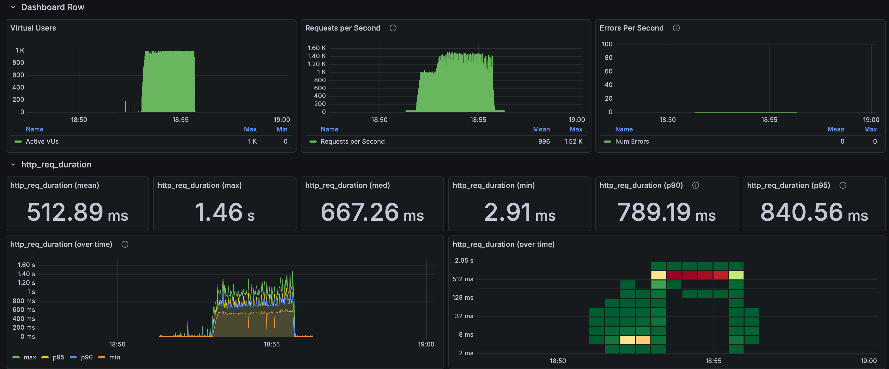

Hikari 10의 연결 대기

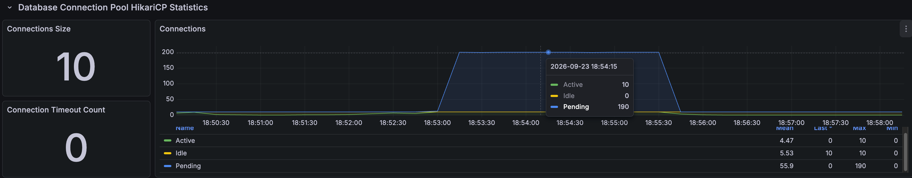

 

### Hikari 20 결과

10→20에서 1,500 RPS p95는 798.3→53.6ms로 줄었다. 
지속적인 포화가 시작되는 단계는 늦어졌지만, 2,000 RPS에서는 20·30 모두 연결 풀과 Tomcat 대기가 남았다.

Hikari 20 · k6

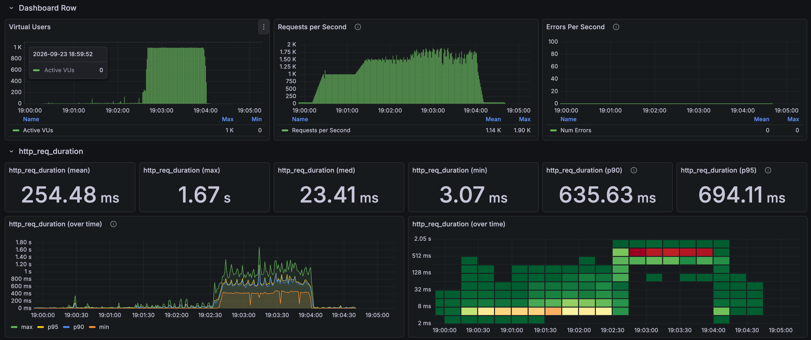

Hikari 20 · 연결 풀

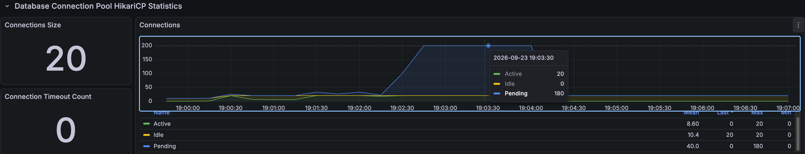

 

### Hikari 30 결과

Hikari 30 · k6

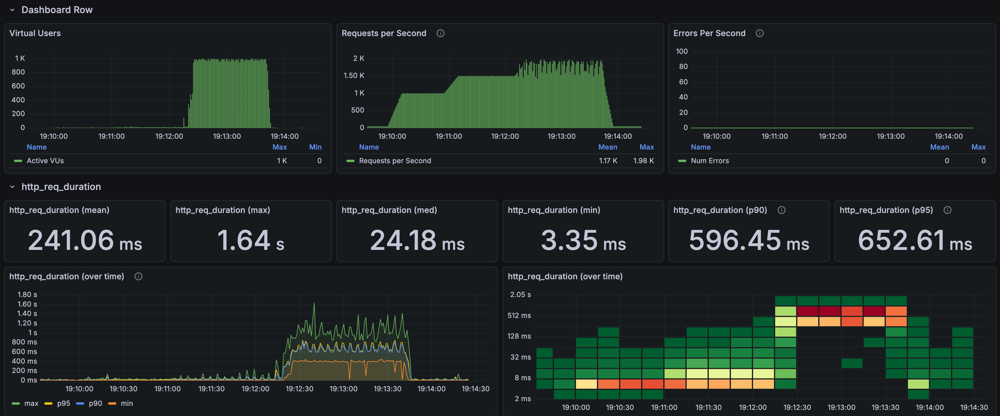

Hikari 30 · 연결 풀

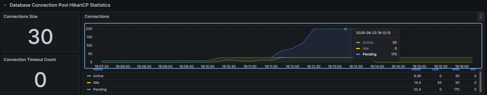

 

### Hikari 50 결과

Hikari 50의 부하 결과

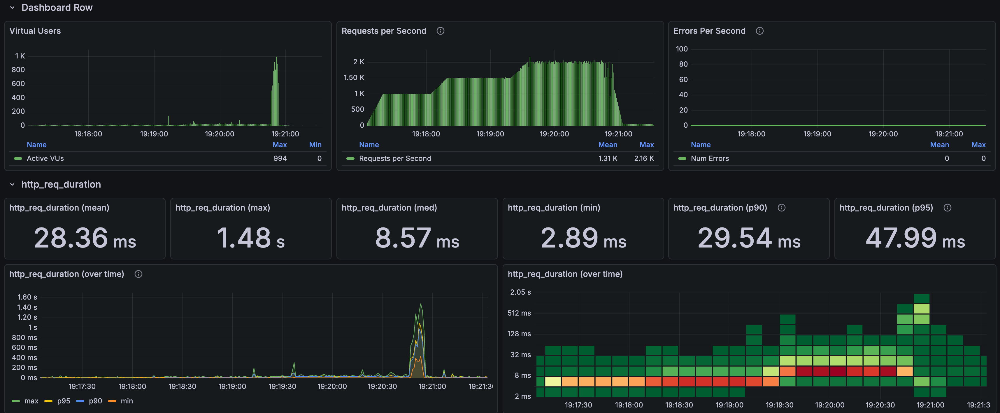

Hikari 50의 연결 관측

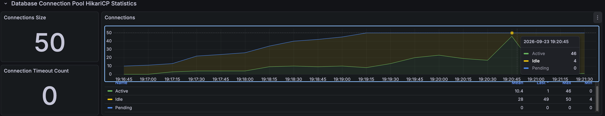

Tomcat을 바꾸지 않았는데 평균 busy가 200→34.7로 줄었다. 
상당수 스레드 점유가 DB 연결 획득 대기와 관련 있었다는 가설을 뒷받침한다. 
풀 크기를 늘리는 효과는 pending 최대 하나보다 처리량·응답 시간·대기 지속 시간으로 판단했다.

화면의 pending 0은 실행 전체 대기 0이 아니었다. 
15·30초 간격 그래프에서는 보이지 않던 약 19:20:48~19:20:55의 pending 150이 1초 조회에서 확인됐다. 
전체 실행 약 254~258초의 짧은 포화에 drop 571건이 남았다. 
누적 표시 그래프는 선 높이가 아닌 개별 범례·툴팁 값을 읽어야 한다.

---

## 2. Hikari 50→100→200: 대기 감소와 처리량 증가는 달랐다

아래 Hikari 50은 앞의 5분 실행과 다른 확장 실행이다. 
이 실행의 2,000 RPS p95는 265.9ms로, 앞의 58.6ms와 섞지 않는다.

| 3,000 RPS · 60초 | Hikari 50 | 100 | 200 설정 |
| --- | ---: | ---: | ---: |
| 실제 연결 최대 | 50 | 100 | 152 |
| 처리량 약, RPS | 2,121 | 2,134 | 2,058 |
| 응답 평균, ms | 469.4 | 466.9 | 483.8 |
| 응답 p95, ms | 632.6 | 604.9 | 597.2 |
| 연결 획득 평균, ms | 70.4 | 46.6 | 23.1 |
| 연결 점유 평균, ms | 23.4 | 46.6 | 73.5 |
| 평균 pending | 149.8 | 99.8 | 47.8 |
| 평균 Tomcat busy | 200 | 200 | 200 |
| 호스트 CPU 평균 | 96.6% | 97.0% | 97.5% |
| 전체 drop | 57,291 | 56,050 | 62,819 |

50→100에서 연결 획득은 빨라졌지만 점유 시간이 약 두 배가 됐고 처리량 증가는 약 0.6%였다. 
연결 획득 대기를 줄여도 전체 처리량은 약 2,100 RPS에 머물렀으며, 애플리케이션·DB가 공유하는 호스트 CPU는 96% 이상이었다.

 

### Hikari 100: 대기는 줄어도 처리량은 정체

Hikari 100 · k6

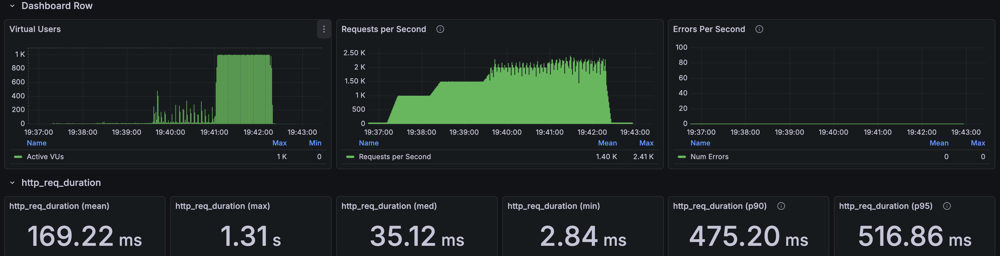

Hikari 100 · 연결 풀

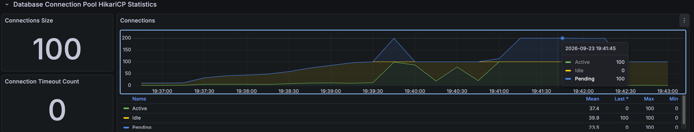

 

### Hikari 200: 실제 연결 제한

Hikari 200 설정의 부하 결과

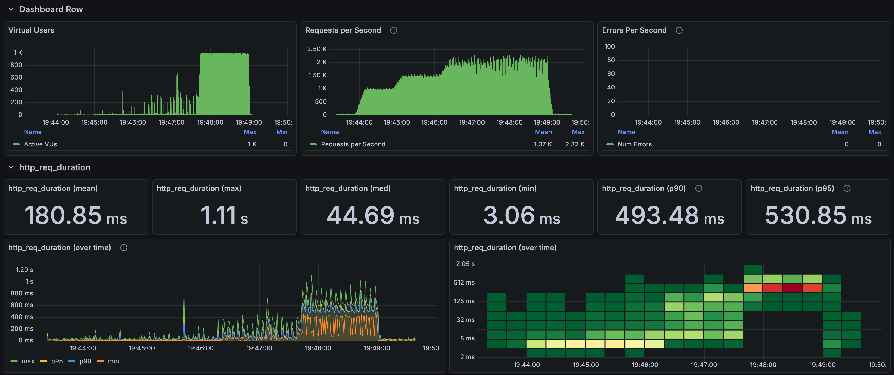

실제 연결 152개

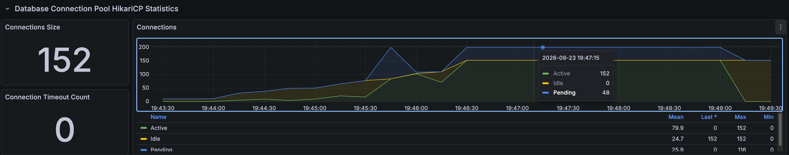

MySQL `max_connections=151`에서 실제 연결은 152개까지 관측됐고 exporter 로그에 `Error 1040: Too many connections`가 발생했다. 
관리 권한용 추가 연결을 포함해 152개에서 제한에 도달했다. 
[MySQL 연결 제한 문서](https://dev.mysql.com/doc/refman/8.0/en/too-many-connections.html)

Prometheus의 exporter `up=1`은 유지됐지만 DB 접속을 나타내는 `mysql_up=0`이 됐다. 
MySQL 지표 공백은 무부하가 아닌 수집 실패였다. 
서비스 연결을 늘릴 때 운영·관측 연결까지 포함한 DB 전체 연결 예산이 필요하다.

---

## 판단과 트레이드오프

로컬 비교 기준은 Hikari 50으로 둔다. 
풀 10의 대기는 컸고 50까지 증설하며 2,000 RPS 처리 상태가 개선됐지만, 초기 실행에도 drop 571건이 남았다. 
50→100에서는 3,000 RPS 처리량이 거의 늘지 않았고 200 설정은 DB 연결 제한에 도달했다.

대기 수가 줄어드는 것과 시스템 처리 용량이 늘어나는 것은 다르다. 
풀 증설 효과가 작아진 지점에서는 연결 수보다 연결 점유 시간과 공유 자원 사용을 함께 보는 쪽으로 조사 방향을 바꿨다. 
후속 요청 스레드 비교는 [Tomcat 실험](tomcat.md)에서 다룬다.

연결 예산에는 모든 앱 인스턴스의 풀 합계와 관리·관측 연결 여유를 포함해야 한다. 
서비스 풀을 DB 연결 제한까지 채우면 지표 수집 연결도 확보하지 못할 수 있다.
