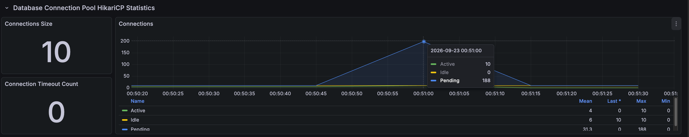
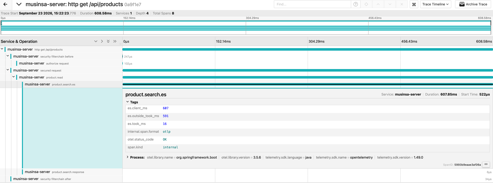
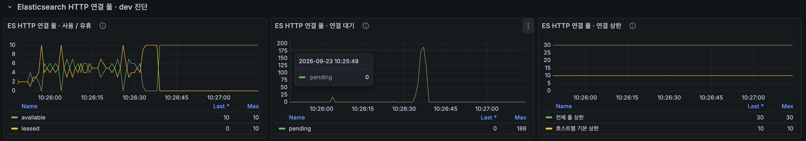
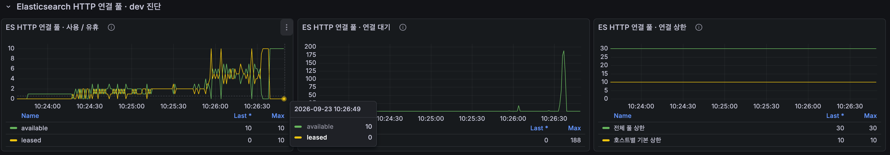
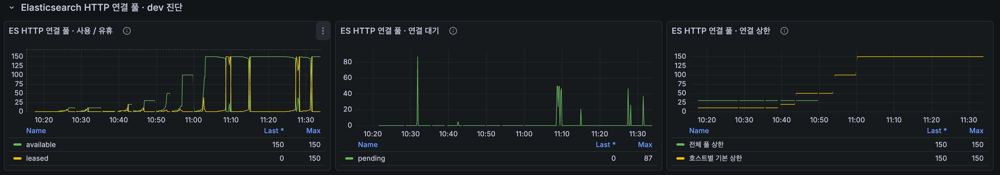
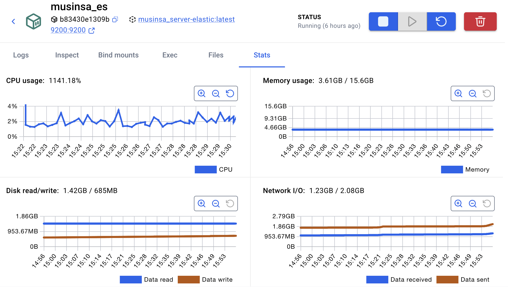
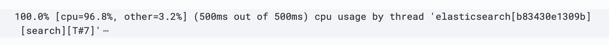
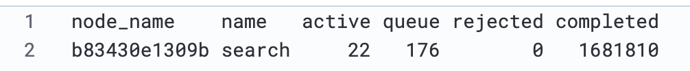
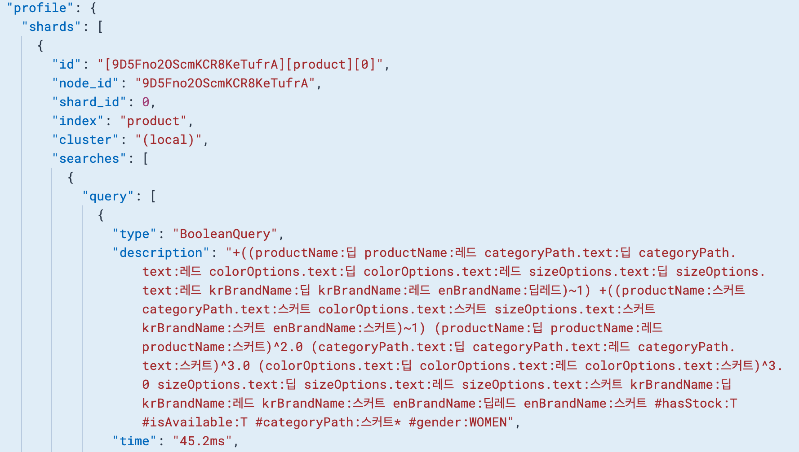

# 검색 고부하: 트랜잭션·HTTP 풀·ES 연산을 순서대로 좁히기

[English](../../en/troubleshooting/search-capacity.md) · [README](../../../README.ko.md) · [공통 측정 환경](../environment.md)

검색이 약 3분에 `dropped_iterations` 기준으로 중단됐다.<br>
처음에는 서비스 본문 진입 전 대기, 이후에는 ES 클라이언트 호출 지연이 크게 보였다.<br>
DB 트랜잭션 범위와 HTTP 연결 상한을 확인한 뒤 ES의 높은 CPU 사용과 검색 작업 큐까지 조사했다.

---

## 최초 진단의 조건과 부하 단계

네 검색어를 순환하고 Hikari 10·최대 VU 200·HTTP timeout 5초로 실행했다.<br>
10 RPS 30초 워밍업 뒤 50·100·250·500 RPS 각 30초, 750 RPS 60초, 1,000 RPS 120초를 계획하고 단계 사이 15초 ramp를 두었다.<br>
Jaeger 샘플링 1%, 초기 ES 관측은 10초 간격이었다.<br>
실제로는 500 RPS 증가 중 중단됐다.

| 구간 | 완료 요청 | 평균 | p95 |
| --- | --- | --- | --- |
| 50 RPS 유지 | 1,500 | 19.50ms | 46.62ms |
| 100 RPS 유지 | 3,000 | 19.01ms | 47.09ms |
| 250 RPS 유지 | 7,500 | 19.29ms | 48.13ms |
| 500 RPS 증가 중 중단 | 3,369 | 208.46ms | 618.87ms |

HTTP 실패는 0건이지만 drop 179건으로 자동 중단됐다.<br>
이 표는 최초 트랜잭션 조사 실행이며 이후 기준 고부하와 HTTP 풀 비교 실행에 합치지 않는다.

---

## 1. ES 검색이 DB 트랜잭션 안에 있던 문제

클래스의 `@Transactional(readOnly = true)`가 ES 검색에도 적용됐다.<br>
read-only는 트랜잭션을 생략한다는 뜻이 아니며 MySQL과 ES를 원자적으로 묶어 주지도 않는다.<br>
최초 예시 트레이스는 전체 623.08ms, 서비스 본문 진입까지 608.25ms, 본문 10.50ms, ES 호출 10.48ms였다.<br>
같은 실행의 Hikari active 최대는 10, pending 최대는 188이었다.

ES를 기다리는 동안 불필요하게 DB 연결을 점유하는 경로를 줄이기 위해 `searchProducts`에 `Propagation.NOT_SUPPORTED`를 적용했다.<br>
키워드가 없는 MySQL 조회의 트랜잭션은 저장소에서 유지하고 상세 조회도 트랜잭션을 유지했다.

| 비교 | 분리 전 | 분리 후 |
| --- | ---: | ---: |
| Hikari pending 최대 | 188 | 0 |
| ES HTTP pending 최대 | 해당 실행 비교값 미확인 | 185 |
| 250 RPS p95 | 48.13ms | 45.31ms |
| 500 RPS 증가 구간 p95 | 618.87ms | 513.87ms |
| 전체 drop | 179 | 55 |
| 1,000 RPS 유지 | 미도달 | 미도달 |

Hikari 대기는 사라졌지만 비슷한 규모의 대기가 기존 ES HTTP 풀에 남았다.<br>
검색 API만 호출한 이번 조건에서는 트랜잭션 분리 전후 모두 같은 부하 단계에서 중단됐다.<br>
따라서 다음 조사는 ES HTTP 연결 획득과 서버 처리 시간에 집중했다.

초기 Hikari active·pending



<br>

### 최초 요청과 ES 상태를 함께 해석

| 관측 | 기록값 |
| --- | --- |
| HTTP 전체 | 623.08ms |
| 서비스 본문 진입까지 | 608.25ms |
| 서비스 본문 | 10.50ms |
| ES 호출 | 10.48ms |
| 같은 실행 Hikari active / pending 최대 | 10 / 188 |

Jaeger 표본에서는 서비스 본문보다 진입 전 대기가 길었고, 같은 실행에서 Hikari active가 상한에 도달하며 pending이 늘었다.<br>
이 두 관측을 연결해 트랜잭션 범위를 점검했다.

중단 직전 10초 간격 ES 표본은 프로세스 CPU 65%·검색 queue 2·누적 rejected 0·힙 58%였고 해당 실행 Old GC 누적은 0이었다.<br>
이후 짧은 피크와 대기 변화를 확인하기 위해 수집 간격을 줄였다.

---

## 2. client·took·outside를 분리

| 태그 | 측정 범위 |
| --- | --- |
| `es.client_ms` | Spring Data 검색 호출 시작부터 반환까지; 연결 획득·전송·서버 처리·응답 변환 포함 |
| `es.took_ms` | ES 응답의 서버 측 경과 시간; 검색 작업 큐 대기·노드 간 통신도 포함 |
| `es.outside_took_ms` | client − took; 연결 대기·전송·응답 직렬화와 클라이언트 처리 등이 섞인 차이 |

`took`은 순수 CPU 시간과 다르다.<br>
측정 범위는 [ES Search API 문서](https://www.elastic.co/docs/api/doc/elasticsearch/operation/operation-search)를 참고했다.

클라이언트 시간과 took 분리 표본



이 표본은 HTTP 608.58ms, ES 스팬 607.85ms이고 태그는 607 = 16 + 591ms다.<br>
ES가 보고한 처리 시간 16ms보다 호출 바깥 구간 591ms가 길어, 풀 메트릭과 함께 클라이언트 경로의 대기를 조사했다.<br>
이 이미지는 세 태그의 측정 범위를 보여 준다.

---

## 3. HTTP 풀을 계측하고 상한을 늘림

호스트별 상한을 10→20→30→50→100→125→150으로 조정하며 확인했다.<br>
아래 표는 설정별 결과를 집계한 실행이다.<br>
30 단계에는 호스트별 50·전체 30으로 실효 상한이 30이었던 실행이 포함된다.

Spring dev에서 기존 풀의 leased·available·pending을 계측하고 수집 간격을 1초로 줄였다.<br>
화면 새로고침보다 테스트 중 이력을 남기는 것이 중요했다.<br>
`es_http_pool_pending`은 호스트별 pending의 합계로, 연결 생성 중 요청도 포함할 수 있다.

ES HTTP 연결 풀 · pending 최대 188



이 화면의 ES HTTP pending 최대는 188이었다.<br>
아래는 초기 풀 관측과 여러 차례 상한을 변경한 실행의 추이다.

초기 ES HTTP 풀



여러 실행의 ES HTTP 풀 상한 변경



상한 변경 화면은 여러 실행의 개요로 최종 150/150, leased 최대 150·pending 최대 87이다.<br>
종료 후 available 150·leased 0은 연결이 풀로 반환된 상태다.<br>
설정별 비교 수치는 아래 표로 정리했다.

| Tomcat | ES 호스트별/전체 | leased/pending 최대 | 전체 p95 | drop |
| ---: | --- | --- | ---: | ---: |
| 200 | 10/30 | 10/188 | 118.46ms | 132 |
| 300 | 10/30 | 10/157 | 214.40ms | 31 |
| 200 | 20/30 | 20/175 | 288.50ms | 162 |
| 200 | 50/30 | 30/166 | 173.89ms | 55 |
| 200 | 50/50 | 50/133 | 295.43ms | 97 |
| 200 | 100/100 | 100/15 | 127.67ms | 12 |
| 200 | 150/150 | 150/30 | 114.33ms | 18 |

각 설정 1회이며 모두 HTTP 실패는 0, 마지막 응답은 약 172~176초에 기록됐다.<br>
p95는 워밍업·ramp까지 포함한 전체 값이다.<br>
풀 최대값은 종료 직후 2~3초 정리 구간도 포함하고 최대 시점은 서로 다를 수 있다.<br>
앞의 트랜잭션 비교나 [7분 기준 검색](../load-tests/product-search.md)과 별도 실행이다.

호스트별 값만 50으로 바꿨을 때 전체 30에 막힌 것이 실제 계측으로 확인됐다.<br>
50/50→100/100은 연결 대기와 drop이 줄었지만, 150/150에서도 조기 중단이 남았다.<br>
풀 확대 이후에는 ES 내부 처리 비용으로 조사 범위를 옮겼다.

---

## 4. 중단 조건을 완화하고 내부를 관측

기존 drop 기준은 다음과 같았다.

```javascript
dropped_iterations: [{
  threshold: 'count==0',
  abortOnFail: true,
  delayAbortEval: '30s',
}]
```

30초는 첫 drop 이후가 아닌 테스트 시작부터 중단 평가를 유예하는 시간이다.<br>
drop은 VU가 없어 시작하지 못한 iteration이며 ES rejected가 아니다.

별도 진단에서는 drop 기준만 `['count==0']`으로 바꿔 즉시 중단하지 않도록 했다.<br>
150/150에서 약 252.24초, 응답 43,200건·drop 23,419건이 기록됐다.<br>
시스템 CPU 약 99.9%와 큰 팬 소음 때문에 실험자가 수동 중단했다.

docker stats의 ES CPU



ES CPU 약 1141%는 여러 코어를 합한 약 11.4코어 사용량이다.<br>
스레드 개수가 아니며 시스템 CPU 백분율과 직접 합산하지 않는다.

<br>

### Hot threads와 검색 작업 큐

```http
GET /_nodes/hot_threads?type=cpu&threads=10&ignore_idle_threads=true
GET /_cat/thread_pool/search?v&h=node_name,name,active,queue,rejected,completed
```

검색 스레드 CPU 표본



검색 스레드풀 표본



Hot threads의 search T#7은 500ms 표본 중 cpu 96.8%·other 3.2%였다.<br>
스택에서 `ConjunctionDISI.nextDoc`, `Weight$DefaultBulkScorer`, `FieldComparator$RelevanceComparator`, `SinglePassGroupingCollector` 경로를 확인했다.<br>
옵션 문서를 매칭하고 점수를 계산하며 상품별 대표를 고르는 작업이 실행되고 있었다.

| 검색 풀 값 | 해석 |
| --- | --- |
| active 22 | 실행 중인 내부 검색 작업 22개; 당시 풀의 실행 슬롯을 사용 중 |
| queue 176 | 실행 슬롯을 기다리는 내부 작업 176개; HTTP 요청 수와 일대일 대응하지 않음 |
| rejected 0 | 해당 누적 카운터에 거절이 없음; 대기나 지연이 없다는 뜻은 아님 |
| completed 1,681,810 | 노드의 누적 완료 작업; 이번 테스트 요청 수나 RPS가 아님 |

active 22는 검색 작업 22개가 실행 중이라는 뜻이고 queue 176은 실행 슬롯을 기다리는 작업 수다.<br>
높은 CPU·응답 지연과 함께 이 큐를 확인해, HTTP 연결을 늘린 뒤에도 ES 내부에 처리 대기가 남는 것을 확인했다.

---

## 5. Profile: 다중 필드 매칭과 점수 계산 확인

딥 레드 스커트 BooleanQuery Profile



한 샤드의 `BooleanQuery`에 45.2ms가 기록됐다.<br>
`딥 레드 스커트`의 조건이 여러 텍스트 필드로 확장되고 전체 검색어 가중치 조건도 추가된다.<br>
여러 필드의 일치 문서와 점수를 조합하는 작업이 있으므로, 필드·중복 조건·가중치를 단순화하는 대안을 검토할 근거다.<br>
모든 토큰이 모든 필드에 동시에 맞아야 한다거나 전체 문서를 순차 스캔한다는 뜻은 아니다.

45.2ms는 Profile이 보고한 해당 샤드의 query 노드 시간이다.<br>
collector는 `QueryPhaseCollector → MultiCollector`로 표시돼 collapse 단독 시간은 제공되지 않았다.<br>
[Profile 측정 범위](https://www.elastic.co/docs/reference/elasticsearch/rest-apis/search-profile)

다음 비교는 동일 검색어에서 collapse 유무와 필드·가중치 조건을 바꾸며 client/took와 검색 결과를 함께 확인하는 것이다.<br>
상품 단위 모델로 바꾸는 [nested 대안과 페이지네이션 선택](search-pagination.md)도 연결해 검토한다.

---

## 판단과 남은 선택

DB 트랜잭션 범위를 축소해 Hikari 대기를 없애고, HTTP 풀을 늘려 연결 대기를 줄였다.<br>
이후에도 ES의 검색 작업 큐와 높은 CPU 사용이 남았다.<br>
다음 개선 대상은 옵션 문서에 대한 다중 필드 매칭·점수·그룹 처리와 로컬 공유 자원이다.

검색 필드·조건 축소는 속도를 개선할 여지가 있지만 결과 누락·순위 변화를 만들 수 있다.<br>
대표 검색어 정답과 함께 속도와 검색 품질의 트레이드오프를 비교해야 한다.<br>
Nested는 상품 중복 제거용 collapse를 없앨 후보지만, 비용을 그대로 색인으로 옮기는 것은 아니다.<br>
부모·옵션 검색과 갱신 시 재색인 비용이 남는다.<br>
현 단계 측정은 마무리하고 이 비교를 다음 작업으로 남겼다.
